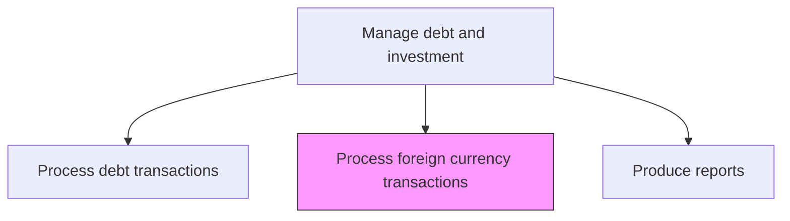
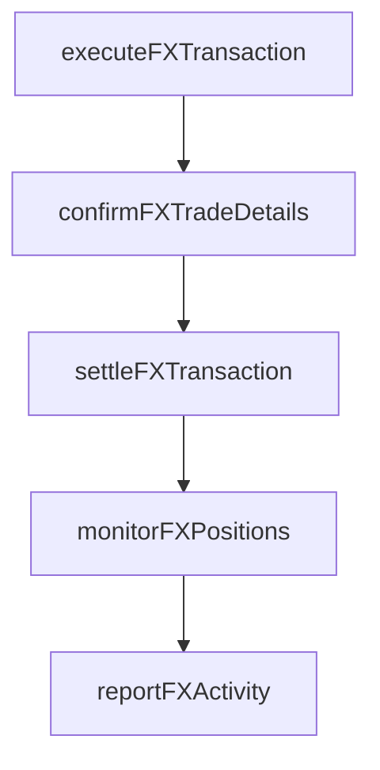

# Process and oversee foreign currency transactions

> Business-as-Code definition for foreign currency transaction processing. Models the execution, settlement, and monitoring of spot, forward, and swap foreign exchange transactions to support international operations and manage currency risk.

## Overview

Processing foreign currency transactions covers the execution, settlement, and monitoring of spot, forward, and swap foreign exchange transactions that support international operations and currency risk management. FX dealers execute trades through approved counterparties, confirm exchange rates and value dates, and ensure timely settlement of currency deliveries. Ongoing position monitoring tracks open FX exposures against policy limits and records mark-to-market valuations, while regular reporting captures transaction volumes, realized gains and losses, and execution quality metrics.

## Process Hierarchy



## GraphDL

```yaml
process:
  object: And Oversee Foreign Currency Transactions
  actor: FXDealer
  result: FXTransactionConfirmation
```

## Actions

| Action | Description |
|--------|-------------|
| executeFXTransaction | Place foreign exchange orders for spot, forward, or swap transactions |
| confirmFXTradeDetails | Verify exchange rates, value dates, and settlement instructions |
| settleFXTransaction | Process delivery of currencies on value date |
| monitorFXPositions | Track open foreign exchange positions and mark-to-market values |
| reportFXActivity | Generate reports on FX transaction volumes and gains/losses |

## Events

| Event | Description |
|-------|-------------|
| fxTransactionExecuted | Foreign exchange order placed with counterparty |
| fxTradeDetailsConfirmed | Exchange rate and settlement terms verified |
| fxTransactionSettled | Currency delivery processed on value date |
| fxPositionsMonitored | Open FX positions and valuations updated |
| fxActivityReported | FX transaction reports generated |

## Searches

| Search | Description |
|--------|-------------|
| getOpenFXPositions | Retrieve open foreign exchange positions by currency pair |
| getFXTransactionHistory | Query FX transaction history by currency, date, or counterparty |
| getFXGainLoss | Calculate realized and unrealized FX gains and losses |

## Process Flow



## RACI Matrix

| Activity | Responsible | Accountable | Consulted | Informed |
|----------|-------------|-------------|-----------|----------|
| executeFXTransaction | FXDealer | Treasurer | IntermediaryRelationshipManager | CFO |
| confirmFXTradeDetails | TreasuryOperationsAnalyst | FXDealer | Counterparty | Treasurer |
| settleFXTransaction | TreasuryOperationsAnalyst | FXDealer | BankingPartner | Treasurer |
| monitorFXPositions | FXDealer | Treasurer | RiskManager | CFO |

## Related Processes

| Process | Relationship |
|---------|-------------|
| 9.7.5.5 Process debt and investment transactions | Parallel - FX transactions support investment operations |
| 9.7.6.3 Manage foreign exchange risk | Upstream - FX risk strategy drives transaction decisions |
| 9.7.5.7 Produce debt and investment reports | Downstream - FX gains/losses feed accounting reports |
| 9.10 Manage international funds/consolidation | Downstream - FX transactions support global operations |

## Related Departments

| Department | Role |
|-----------|------|
| Treasury | Executes and monitors foreign exchange transactions |
| Operations | Processes FX settlements |
| Accounting | Records FX gains, losses, and revaluation entries |

## Related Occupations

| Occupation | Involvement |
|-----------|-------------|
| FX Dealer | Executes foreign exchange transactions |
| Treasury Operations Analyst | Processes FX settlements and confirmations |

## KPIs

| KPI | Description | Unit |
|-----|-------------|------|
| FX Execution Spread | Average spread versus mid-market rate on FX transactions | bps |
| Settlement Success Rate | Percentage of FX transactions settling on value date | % |
| Net FX Gain/Loss | Total realized FX gains minus losses for the period | USD |

## Usage

```typescript
import { processAndOverseeForeignCurrencyTransactions } from '@headlessly/process-and-oversee-foreign-currency-transactions'

const fx = processAndOverseeForeignCurrencyTransactions()

const trade = await fx.executeFXTransaction({
  type: 'forward',
  buyCurrency: 'EUR',
  sellCurrency: 'USD',
  amount: 5000000,
  valueDate: '2025-06-15'
})

// Monitor open FX positions and mark-to-market valuations
const positions = await fx.monitorFXPositions({
  asOfDate: '2025-03-15',
  currencyPairs: ['EUR/USD', 'GBP/USD', 'JPY/USD'],
  includeUnrealized: true
})
```
