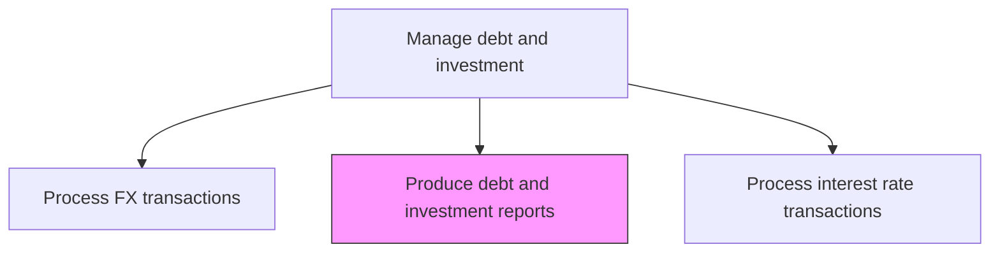
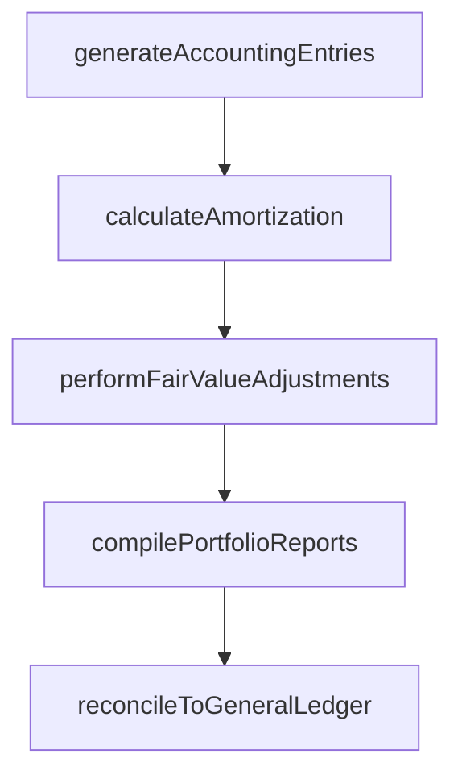

# Produce debt and investment accounting transaction reports

> Business-as-Code definition for debt and investment accounting and reporting. Models the generation of accounting entries, portfolio valuations, and management reports for all debt and investment transactions including amortization schedules and fair value adjustments.

## Overview

Producing debt and investment accounting transaction reports involves generating the journal entries, portfolio valuations, and management reports required for all debt and investment activities. This encompasses computing premium and discount amortization for debt instruments, performing fair value mark-to-market adjustments for the investment portfolio, and recording unrealized gains and losses. Reports are compiled on scheduled frequencies and reconciled against the general ledger to ensure accuracy, supporting both internal management decision-making and external financial statement disclosures.

## Process Hierarchy



## GraphDL

```yaml
produce:
  object: Debt And Investment Accounting Transaction Reports
  actor: DebtInvestmentAccountant
  result: DebtInvestmentReport
```

## Actions

| Action | Description |
|--------|-------------|
| generateAccountingEntries | Create journal entries for debt and investment transactions |
| calculateAmortization | Compute premium and discount amortization for debt instruments |
| performFairValueAdjustments | Mark investment portfolio to market and record unrealized gains/losses |
| compilePortfolioReports | Prepare debt and investment portfolio summary reports |
| reconcileToGeneralLedger | Verify debt and investment sub-ledger against general ledger balances |

## Events

| Event | Description |
|-------|-------------|
| accountingEntriesGenerated | Journal entries created for debt and investment transactions |
| amortizationCalculated | Premium and discount amortization computed |
| fairValueAdjustmentsPerformed | Portfolio marked to market with unrealized gains/losses |
| portfolioReportsCompiled | Debt and investment summary reports prepared |
| reconciledToGeneralLedger | Sub-ledger verified against GL balances |

## Searches

| Search | Description |
|--------|-------------|
| getDebtSchedule | Retrieve debt repayment and amortization schedule |
| getInvestmentPortfolioValuation | Query current portfolio market value and unrealized gains/losses |
| getAccountingEntries | List journal entries for debt and investment transactions by period |

## Process Flow



## RACI Matrix

| Activity | Responsible | Accountable | Consulted | Informed |
|----------|-------------|-------------|-----------|----------|
| generateAccountingEntries | DebtInvestmentAccountant | Controller | TreasuryDealer | Treasurer |
| calculateAmortization | DebtInvestmentAccountant | Controller | TreasuryDealer | Treasurer |
| performFairValueAdjustments | DebtInvestmentAccountant | Controller | ExternalAuditor | CFO |
| compilePortfolioReports | DebtInvestmentAccountant | Treasurer | Controller | CFO |
| reconcileToGeneralLedger | DebtInvestmentAccountant | Controller | GeneralLedgerAccountant | ExternalAuditor |

## Related Processes

| Process | Relationship |
|---------|-------------|
| 9.7.5.5 Process debt and investment transactions | Upstream - transactions generate accounting entries |
| 9.7.5.6 Process foreign currency transactions | Upstream - FX transactions require accounting treatment |
| 9.7.5.8 Process interest rate transactions | Upstream - swap valuations feed portfolio reporting |
| 9.3 Perform general accounting | Downstream - entries posted to general ledger |

## Related Departments

| Department | Role |
|-----------|------|
| Treasury | Provides transaction data for accounting |
| Accounting | Records entries and maintains general ledger |
| External Audit | Reviews debt and investment accounting treatment |

## Related Occupations

| Occupation | Involvement |
|-----------|-------------|
| Debt/Investment Accountant | Creates accounting entries and portfolio reports |
| Controller | Reviews and approves accounting treatment |

## KPIs

| KPI | Description | Unit |
|-----|-------------|------|
| Reporting Timeliness | Percentage of reports delivered by scheduled deadline | % |
| Accounting Accuracy | Percentage of entries posted without correction | % |
| Reconciliation Variance | Dollar amount of unreconciled differences | USD |

## Usage

```typescript
import { produceDebtAndInvestmentAccountingTransactionReports } from '@headlessly/produce-debt-and-investment-accounting-transaction-reports'

const reporting = produceDebtAndInvestmentAccountingTransactionReports()

const report = await reporting.compilePortfolioReports({
  period: '2025-Q1',
  reportTypes: ['portfolio-summary', 'amortization-schedule', 'mark-to-market'],
  format: 'pdf'
})

// Reconcile debt and investment sub-ledger against general ledger
const reconciliation = await reporting.reconcileToGeneralLedger({
  period: '2025-03',
  accounts: ['investments', 'debt-instruments', 'accrued-interest'],
  toleranceUSD: 100
})
```
