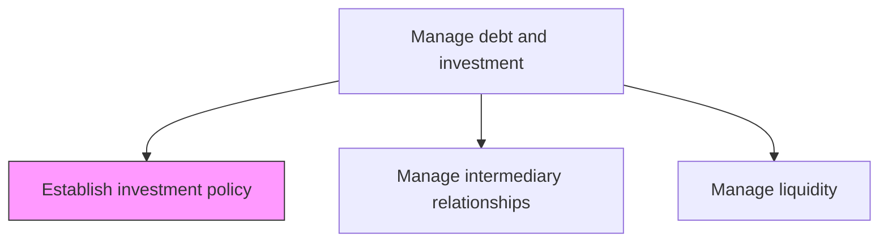
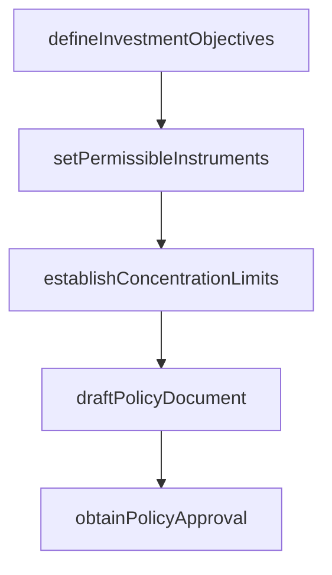

# Establish investment policy

> Business-as-Code definition for investment policy establishment. Models the development, approval, and publication of corporate investment guidelines governing permissible instruments, credit quality requirements, concentration limits, and return objectives.

## Overview

Establishing investment policy involves developing, approving, and publishing the corporate investment guidelines that govern how the organization deploys surplus cash and manages its investment portfolio. The policy defines permissible instrument types, minimum credit quality requirements, concentration limits by issuer and sector, maximum maturity constraints, and return objectives prioritized by safety, liquidity, and yield. The investment policy statement is formally approved by the board or investment committee and reviewed periodically to reflect changes in market conditions, regulatory requirements, and organizational risk appetite.

## Process Hierarchy



## GraphDL

```yaml
establish:
  object: Investment Policy
  actor: InvestmentPolicyManager
  result: InvestmentPolicyStatement
```

## Actions

| Action | Description |
|--------|-------------|
| defineInvestmentObjectives | Establish return, liquidity, and safety objectives for the investment portfolio |
| setPermissibleInstruments | Specify approved instrument types and credit quality minimums |
| establishConcentrationLimits | Define maximum exposure limits by issuer, sector, and maturity |
| draftPolicyDocument | Prepare formal investment policy statement for board approval |
| obtainPolicyApproval | Submit investment policy to board or investment committee for approval |

## Events

| Event | Description |
|-------|-------------|
| investmentObjectivesDefined | Portfolio return and risk objectives established |
| permissibleInstrumentsSet | Approved instruments and credit requirements specified |
| concentrationLimitsEstablished | Issuer and sector exposure limits defined |
| policyDocumentDrafted | Investment policy statement prepared |
| policyApprovalObtained | Investment policy approved by governing body |

## Searches

| Search | Description |
|--------|-------------|
| getCurrentPolicy | Retrieve active investment policy statement |
| getPolicyHistory | Query investment policy version history and amendments |
| getPermissibleInstruments | List approved investment instruments and criteria |

## Process Flow



## RACI Matrix

| Activity | Responsible | Accountable | Consulted | Informed |
|----------|-------------|-------------|-----------|----------|
| defineInvestmentObjectives | InvestmentPolicyManager | Treasurer | CFO | Board |
| setPermissibleInstruments | InvestmentPolicyManager | Treasurer | RiskManager | CFO |
| establishConcentrationLimits | InvestmentPolicyManager | Treasurer | CreditExposureAnalyst | RiskManager |
| draftPolicyDocument | InvestmentPolicyManager | Treasurer | LegalCounsel | ComplianceOfficer |
| obtainPolicyApproval | Treasurer | CFO | LegalCounsel | Board |

## Related Processes

| Process | Relationship |
|---------|-------------|
| 9.7.5.2 Manage financial intermediary relationships | Downstream - policy governs intermediary selection criteria |
| 9.7.5.3 Manage liquidity | Downstream - policy defines liquidity requirements for investments |
| 9.7.5.4 Manage issuer exposure | Downstream - policy establishes concentration limits |
| 9.7.1 Manage treasury policies and procedures | Parent - investment policy is part of treasury governance |

## Related Departments

| Department | Role |
|-----------|------|
| Treasury | Develops and maintains investment policy |
| Risk Management | Advises on risk parameters and concentration limits |
| Legal | Reviews policy for regulatory compliance |

## Related Occupations

| Occupation | Involvement |
|-----------|-------------|
| Investment Policy Manager | Drafts and maintains investment policy |
| Treasurer | Sponsors and enforces investment policy |

## KPIs

| KPI | Description | Unit |
|-----|-------------|------|
| Policy Compliance Rate | Percentage of investment transactions compliant with policy | % |
| Policy Review Frequency | Interval between investment policy reviews | Months |
| Concentration Limit Utilization | Highest issuer exposure as percentage of limit | % |

## Usage

```typescript
import { establishInvestmentPolicy } from '@headlessly/establish-investment-policy'

const policy = establishInvestmentPolicy()

const statement = await policy.draftPolicyDocument({
  objectives: { safety: 'primary', liquidity: 'secondary', yield: 'tertiary' },
  minCreditRating: 'A-',
  maxMaturity: '5-year'
})

// Define concentration limits by issuer and sector
const limits = await policy.establishConcentrationLimits({
  maxSingleIssuer: 0.05,
  maxSectorExposure: 0.25,
  maxMaturityBucket: { '0-1yr': 0.40, '1-3yr': 0.35, '3-5yr': 0.25 }
})
```
