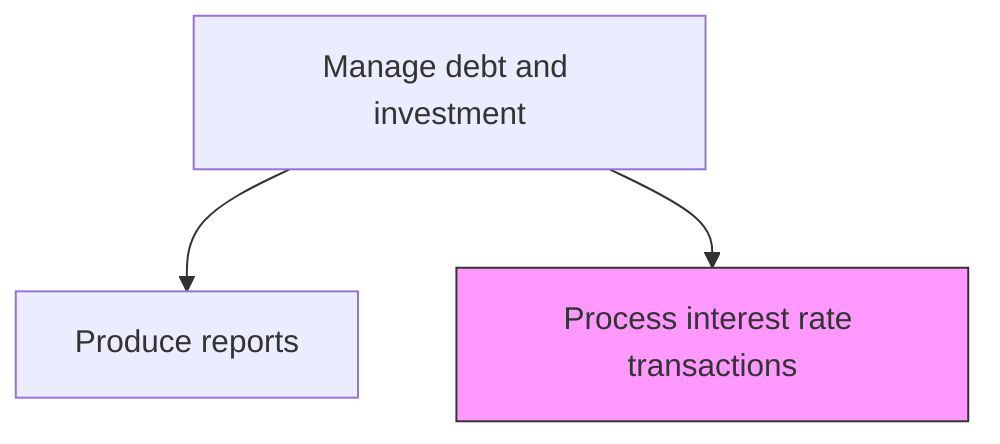
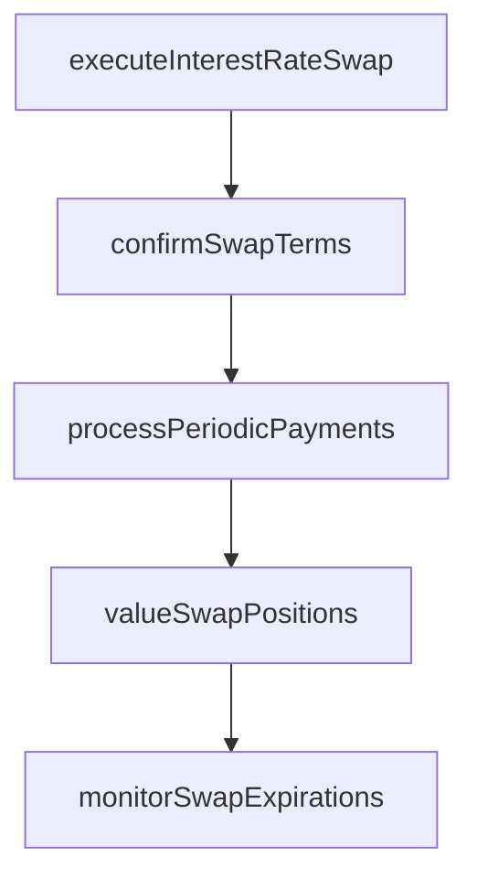

# Process and oversee interest rate transactions

> Business-as-Code definition for interest rate transaction processing. Models the execution, valuation, and oversight of interest rate swaps, caps, floors, and other derivative instruments used to manage exposure to interest rate fluctuations.

## Overview

Processing and overseeing interest rate transactions covers the full lifecycle of interest rate swaps, caps, floors, and other derivative instruments used to manage exposure to interest rate fluctuations. This includes executing swap agreements with counterparties, confirming notional amounts and fixed/floating rate terms, processing periodic coupon payment settlements, and marking derivative positions to market. Treasury monitors swap maturities to plan rollovers or unwinds, ensuring the interest rate derivative portfolio remains aligned with the organization's risk management strategy and debt structure.

## Process Hierarchy



## GraphDL

```yaml
process:
  object: And Oversee Interest Rate Transactions
  actor: InterestRateDealer
  result: InterestRateTransactionConfirmation
```

## Actions

| Action | Description |
|--------|-------------|
| executeInterestRateSwap | Place interest rate swap or derivative orders with counterparties |
| confirmSwapTerms | Verify notional amounts, fixed/floating rates, and payment schedules |
| processPeriodicPayments | Calculate and settle periodic swap coupon payments |
| valueSwapPositions | Mark interest rate derivative positions to market |
| monitorSwapExpirations | Track swap maturities and plan rollovers or unwinds |

## Events

| Event | Description |
|-------|-------------|
| interestRateSwapExecuted | Interest rate derivative order placed with counterparty |
| swapTermsConfirmed | Derivative terms and payment schedule verified |
| periodicPaymentsProcessed | Swap coupon payments calculated and settled |
| swapPositionsValued | Derivative positions marked to market |
| swapExpirationsMonitored | Swap maturities and rollover schedule updated |

## Searches

| Search | Description |
|--------|-------------|
| getSwapPortfolio | Retrieve open interest rate derivative positions |
| getPaymentSchedule | Query periodic payment schedule for active swaps |
| getSwapValuation | Retrieve mark-to-market valuation of interest rate derivatives |

## Process Flow



## RACI Matrix

| Activity | Responsible | Accountable | Consulted | Informed |
|----------|-------------|-------------|-----------|----------|
| executeInterestRateSwap | InterestRateDealer | Treasurer | IntermediaryRelationshipManager | CFO |
| confirmSwapTerms | TreasuryOperationsAnalyst | InterestRateDealer | Counterparty | Treasurer |
| processPeriodicPayments | TreasuryOperationsAnalyst | InterestRateDealer | Controller | Treasurer |
| valueSwapPositions | InterestRateDealer | Treasurer | RiskManager | CFO |

## Related Processes

| Process | Relationship |
|---------|-------------|
| 9.7.5.5 Process debt and investment transactions | Parallel - interest rate derivatives complement debt management |
| 9.7.6.2 Manage interest rate risk | Upstream - risk assessment drives swap transactions |
| 9.7.5.7 Produce debt and investment reports | Downstream - swap valuations feed portfolio reporting |
| 9.7.6.6 Produce hedge accounting transactions and reports | Downstream - swaps require hedge accounting treatment |

## Related Departments

| Department | Role |
|-----------|------|
| Treasury | Executes and monitors interest rate derivatives |
| Risk Management | Monitors interest rate exposure and hedge effectiveness |
| Accounting | Records derivative entries and hedge accounting treatment |

## Related Occupations

| Occupation | Involvement |
|-----------|-------------|
| Interest Rate Dealer | Executes interest rate derivative transactions |
| Treasury Operations Analyst | Processes swap settlements and confirmations |

## KPIs

| KPI | Description | Unit |
|-----|-------------|------|
| Swap Portfolio Notional | Total notional value of outstanding interest rate swaps | USD |
| Hedge Effectiveness | Correlation between hedged item and hedging instrument changes | % |
| Settlement Accuracy | Percentage of swap payments processed without error | % |

## Usage

```typescript
import { processAndOverseeInterestRateTransactions } from '@headlessly/process-and-oversee-interest-rate-transactions'

const rates = processAndOverseeInterestRateTransactions()

const swap = await rates.executeInterestRateSwap({
  notional: 50000000,
  payFixed: 4.50,
  receiveFloating: 'SOFR+25bps',
  tenor: '5-year',
  paymentFrequency: 'semi-annual'
})

// Mark interest rate derivative positions to current market
const valuations = await rates.valueSwapPositions({
  asOfDate: '2025-03-15',
  portfolio: 'interest-rate-swaps',
  curveSource: 'bloomberg'
})
```
