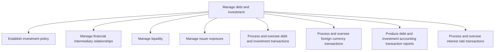
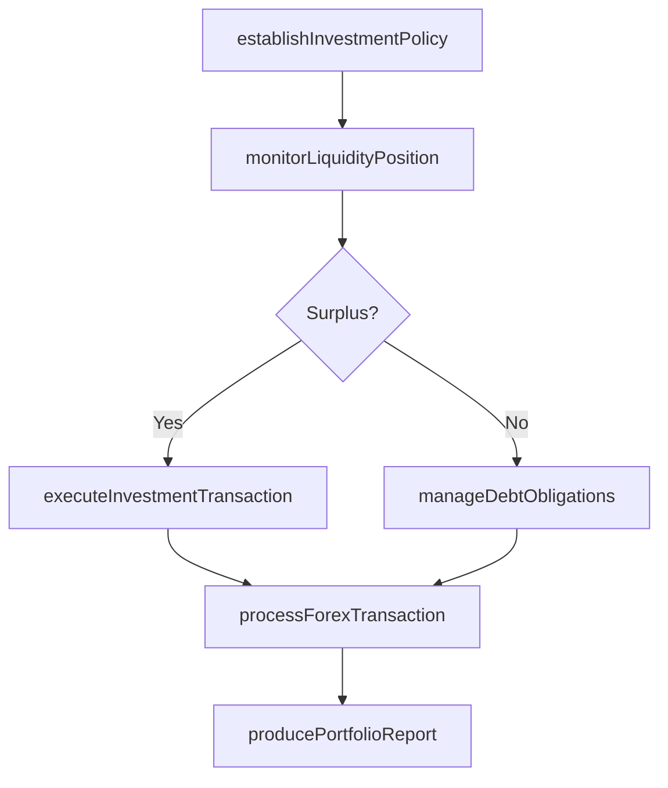

# Manage debt and investment

> Business-as-Code definition for debt and investment management. Models the establishment of investment policies, management of financial intermediary relationships, liquidity oversight, and processing of debt, investment, foreign currency, and interest rate transactions.

## Overview

Taking care of the organization's financial position. Manage its loans or debts from different sources and investments. Leverage the most profitable options to balance the financial position in the market.

## Process Hierarchy



## GraphDL

```yaml
manage:
  object: Debt And Investment
  actor: InvestmentManager
  result: DebtInvestmentPortfolio
```

## Actions

| Action | Description |
|--------|-------------|
| establishInvestmentPolicy | Define investment guidelines, risk tolerances, and approved instruments |
| executeInvestmentTransaction | Place or redeem investments per approved policy |
| manageDebtObligations | Track and service outstanding debt instruments |
| monitorLiquidityPosition | Assess available liquid assets against obligations |
| processForexTransaction | Execute foreign currency buy or sell orders |
| producePortfolioReport | Generate accounting reports for debt and investment positions |

## Events

| Event | Description |
|-------|-------------|
| investmentPolicyEstablished | Investment policy approved and published |
| investmentTransactionExecuted | Investment placed or redeemed |
| debtObligationServiced | Debt payment or covenant action completed |
| liquidityPositionMonitored | Liquidity assessment completed |
| forexTransactionProcessed | Foreign currency transaction executed |
| portfolioReportProduced | Debt and investment accounting report generated |

## Searches

| Search | Description |
|--------|-------------|
| getInvestmentPortfolio | Retrieve active investments by type, maturity, and yield |
| getDebtSchedule | List outstanding debt obligations and repayment timeline |
| getLiquidityMetrics | Query current liquidity ratios and coverage |
| getForexPositions | Retrieve open foreign currency positions and valuations |

## Process Flow



## RACI Matrix

| Activity | Responsible | Accountable | Consulted | Informed |
|----------|-------------|-------------|-----------|----------|
| establishInvestmentPolicy | InvestmentManager | Treasurer | CFO | Board |
| executeInvestmentTransaction | TreasuryTrader | InvestmentManager | RiskManager | Controller |
| manageDebtObligations | DebtAnalyst | Treasurer | LegalCounsel | CFO |
| producePortfolioReport | TreasuryAccountant | InvestmentManager | ExternalAuditor | Controller |

## Sub-Processes

| ID | Name | Description |
|----|------|-------------|
| 9.7.5.1 | Establish investment policy | Developing and instituting principles that the organization ill use in making investments. |
| 9.7.5.2 | Manage financial intermediary relationships | Maintaining smooth relations with financial investment banks that help availing loans and services. |
| 9.7.5.3 | Manage liquidity | Managing and maintaining enough liquidity in form of cash and cash equivalents in the business to me |
| 9.7.5.4 | Manage issuer exposure | Managing the exposure incurred by the issuer for providing credit to the borrower. |
| 9.7.5.5 | Process and oversee debt and investment transactions | Tracking loans taken and money invested in different options. Arrange and supervise loans from banks |
| 9.7.5.6 | Process and oversee foreign currency transactions | Arranging and supervising foreign exchange rate changes to avoid loss on foreign-currency transactio |
| 9.7.5.7 | Produce debt and investment accounting transaction reports | Creating transactions report of loans and investments. Prepare and maintain records of loans and inv |
| 9.7.5.8 | Process and oversee interest rate transactions | Supervising the interest paid or received by the organization. Arrange and supervise interest rate s |

## Related Processes

| Process | Relationship |
|---------|-------------|
| 9.7.3 Manage cash | Upstream - cash surplus drives investment activity |
| 9.7.6 Monitor and execute risk and hedging transactions | Parallel - hedging mitigates investment risk |
| 9.7.1 Manage treasury policies and procedures | Upstream - policies govern investment and debt decisions |

## Related Departments

| Department | Role |
|-----------|------|
| Treasury | Executes investment and debt management activities |
| Risk Management | Monitors portfolio risk and compliance with limits |
| Accounting | Records investment and debt transactions |
| Legal | Reviews debt agreements and investment contracts |

## Related Occupations

| Occupation | Involvement |
|-----------|-------------|
| Investment Manager | Oversees portfolio strategy and execution |
| Treasury Trader | Executes investment and FX transactions |
| Debt Analyst | Monitors debt covenants and repayment schedules |

## KPIs

| KPI | Description | Unit |
|-----|-------------|------|
| Portfolio Yield | Return on invested assets net of fees | % |
| Debt Service Coverage | Operating income relative to debt service obligations | Ratio |
| Liquidity Coverage Ratio | High-quality liquid assets as percentage of net cash outflows | % |
| FX Transaction Cost | Average cost of foreign currency transactions | Basis Points |

## Usage

```typescript
import { manageDebtAndInvestment } from '@headlessly/manage-debt-and-investment'

const portfolio = manageDebtAndInvestment()

// Execute a short-term investment
const investment = await portfolio.executeInvestmentTransaction({
  instrument: 'treasury-bill',
  amount: 10000000,
  maturity: '90-day',
  counterparty: 'JP Morgan'
})

// Monitor current liquidity position
const liquidity = await portfolio.monitorLiquidityPosition({
  entities: ['US-HQ', 'EU-Sub'],
  includeProjected: true
})
```
