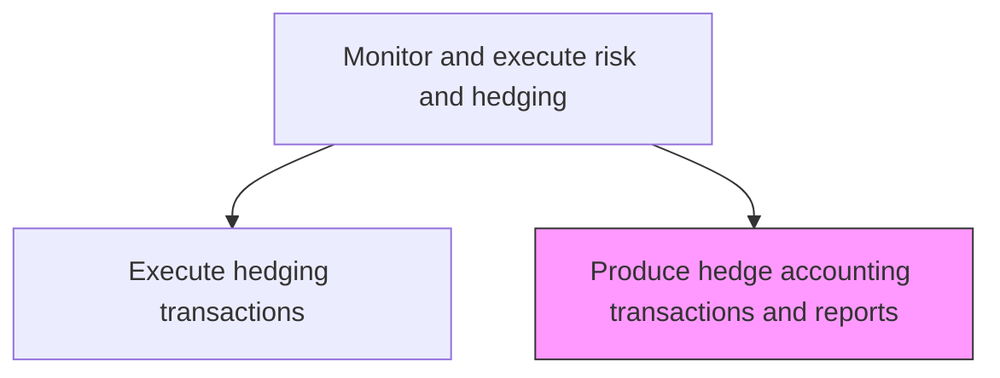
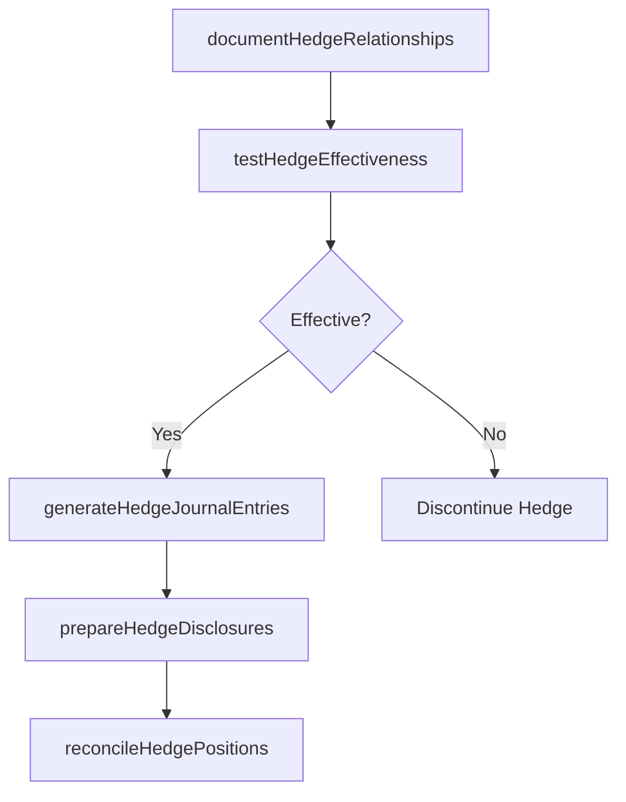

# Produce hedge accounting transactions and reports

> Business-as-Code definition for hedge accounting and reporting. Models the documentation, effectiveness testing, and financial reporting of hedging relationships under ASC 815 and IFRS 9, including journal entries for fair value and cash flow hedges.

## Overview

Producing hedge accounting transactions and reports covers the formal documentation, effectiveness testing, and financial reporting of hedging relationships under applicable accounting standards such as ASC 815 and IFRS 9. This includes preparing hedge designation documentation that establishes the risk being hedged, the hedging instrument, and the assessment methodology. Prospective and retrospective effectiveness tests are performed each reporting period, and journal entries are generated to record fair value changes, cash flow hedge deferrals, and settlement amounts. Hedge accounting disclosures are compiled for financial statement footnotes and reconciled against trading system positions to ensure accuracy.

## Process Hierarchy



## GraphDL

```yaml
produce:
  object: Hedge Accounting Transactions And Reports
  actor: HedgeAccountant
  result: HedgeAccountingReport
```

## Actions

| Action | Description |
|--------|-------------|
| documentHedgeRelationships | Prepare formal hedge designation documentation under accounting standards |
| testHedgeEffectiveness | Perform prospective and retrospective hedge effectiveness testing |
| generateHedgeJournalEntries | Create accounting entries for hedge fair value changes and settlements |
| prepareHedgeDisclosures | Compile hedge accounting disclosures for financial statement footnotes |
| reconcileHedgePositions | Verify hedge accounting records against trading system positions |

## Events

| Event | Description |
|-------|-------------|
| hedgeRelationshipsDocumented | Formal hedge designation documentation completed |
| hedgeEffectivenessTested | Prospective and retrospective effectiveness tests completed |
| hedgeJournalEntriesGenerated | Accounting entries for hedge activities created |
| hedgeDisclosuresPrepared | Financial statement hedge disclosures compiled |
| hedgePositionsReconciled | Hedge accounting records verified against trading systems |

## Searches

| Search | Description |
|--------|-------------|
| getHedgeDesignations | Retrieve active hedge relationship designations |
| getEffectivenessResults | Query hedge effectiveness test results by relationship |
| getHedgeJournalEntries | List hedge accounting journal entries by period |

## Process Flow



## RACI Matrix

| Activity | Responsible | Accountable | Consulted | Informed |
|----------|-------------|-------------|-----------|----------|
| documentHedgeRelationships | HedgeAccountant | Controller | TreasuryDealer | ExternalAuditor |
| testHedgeEffectiveness | HedgeAccountant | Controller | RiskManager | Treasurer |
| generateHedgeJournalEntries | HedgeAccountant | Controller | TreasuryDealer | Treasurer |
| prepareHedgeDisclosures | HedgeAccountant | Controller | ExternalAuditor | CFO |
| reconcileHedgePositions | HedgeAccountant | Controller | TreasuryOperationsAnalyst | ExternalAuditor |

## Related Processes

| Process | Relationship |
|---------|-------------|
| 9.7.6.5 Execute hedging transactions | Upstream - executed hedges require accounting treatment |
| 9.7.6.1 Develop risk management/hedging strategy | Upstream - strategy defines hedgeable exposures |
| 9.3 Perform general accounting | Downstream - hedge entries feed general ledger |
| 9.6 Report financial results | Downstream - hedge disclosures included in financial statements |

## Related Departments

| Department | Role |
|-----------|------|
| Treasury | Provides hedge transaction data |
| Accounting | Records hedge entries and prepares disclosures |
| External Audit | Reviews hedge accounting treatment and effectiveness |

## Related Occupations

| Occupation | Involvement |
|-----------|-------------|
| Hedge Accountant | Maintains hedge documentation and accounting |
| Controller | Reviews and approves hedge accounting treatment |

## KPIs

| KPI | Description | Unit |
|-----|-------------|------|
| Hedge Effectiveness Rate | Percentage of hedges passing effectiveness testing | % |
| Documentation Completeness | Percentage of hedge relationships with complete designation docs | % |
| Disclosure Accuracy | Percentage of hedge disclosures issued without restatement | % |

## Usage

```typescript
import { produceHedgeAccountingTransactionsAndReports } from '@headlessly/produce-hedge-accounting-transactions-and-reports'

const hedgeAccounting = produceHedgeAccountingTransactionsAndReports()

const report = await hedgeAccounting.testHedgeEffectiveness({
  hedgeId: 'FX-HEDGE-2025-001',
  testType: 'retrospective',
  period: '2025-Q1',
  method: 'dollar-offset'
})

// Generate hedge accounting journal entries for the period
const entries = await hedgeAccounting.generateHedgeJournalEntries({
  period: '2025-03',
  hedgeTypes: ['fair-value', 'cash-flow'],
  includeSettlements: true
})
```
