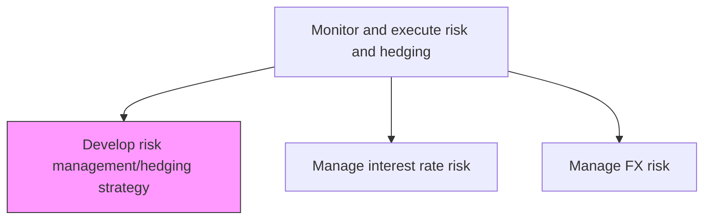
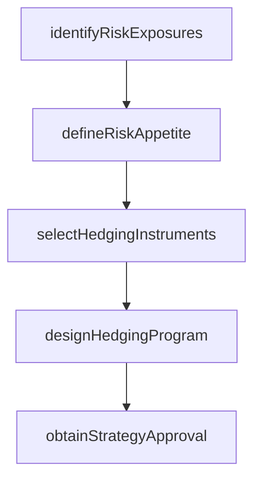

# Develop risk management/hedging strategy

> Business-as-Code definition for risk management and hedging strategy development. Models the assessment of financial risk exposures and the design of hedging programs using derivatives, futures, and options to mitigate interest rate, foreign exchange, and commodity price risks.

## Overview

Developing a risk management and hedging strategy involves assessing the organization's financial risk exposures across interest rate, foreign exchange, and commodity price categories, and designing structured hedging programs to mitigate those risks within approved tolerance levels. The process defines risk appetite thresholds, selects appropriate derivative instruments such as swaps, forwards, and options, and structures the overall hedging program with target hedge ratios, tenors, and rollover schedules. The completed strategy is presented to the treasury committee or board for formal approval and serves as the governing framework for all subsequent hedging execution activities.

## Process Hierarchy



## GraphDL

```yaml
develop:
  object: Risk Management/hedging Strategy
  actor: RiskStrategist
  result: HedgingStrategy
```

## Actions

| Action | Description |
|--------|-------------|
| identifyRiskExposures | Catalog financial risk exposures across interest rate, FX, and commodity positions |
| defineRiskAppetite | Establish acceptable risk tolerance levels for each exposure category |
| selectHedgingInstruments | Choose appropriate derivative instruments to mitigate identified risks |
| designHedgingProgram | Structure the hedging program with ratios, tenors, and rollover schedules |
| obtainStrategyApproval | Present hedging strategy to treasury committee for approval |

## Events

| Event | Description |
|-------|-------------|
| riskExposuresIdentified | Financial risk exposures cataloged across all categories |
| riskAppetiteDefined | Risk tolerance levels established and documented |
| hedgingInstrumentsSelected | Derivative instruments chosen for each exposure |
| hedgingProgramDesigned | Hedging program structured with all parameters |
| strategyApprovalObtained | Hedging strategy approved by treasury committee |

## Searches

| Search | Description |
|--------|-------------|
| getRiskExposures | Retrieve current financial risk exposures by category |
| getHedgingStrategy | Query active hedging strategy and program parameters |
| getStrategyPerformance | Retrieve hedging program effectiveness metrics |

## Process Flow



## RACI Matrix

| Activity | Responsible | Accountable | Consulted | Informed |
|----------|-------------|-------------|-----------|----------|
| identifyRiskExposures | RiskStrategist | Treasurer | RiskManager | CFO |
| defineRiskAppetite | RiskStrategist | Treasurer | CFO | Board |
| selectHedgingInstruments | RiskStrategist | Treasurer | TreasuryDealer | CFO |
| designHedgingProgram | RiskStrategist | Treasurer | RiskManager | TreasuryDealer |
| obtainStrategyApproval | Treasurer | CFO | LegalCounsel | Board |

## Related Processes

| Process | Relationship |
|---------|-------------|
| 9.7.6.2 Manage interest rate risk | Downstream - strategy defines interest rate hedging approach |
| 9.7.6.3 Manage foreign exchange risk | Downstream - strategy defines FX hedging approach |
| 9.7.6.4 Manage exposure risk | Downstream - strategy sets customer exposure risk appetite |
| 9.7.6.5 Execute hedging transactions | Downstream - strategy executed through transactions |

## Related Departments

| Department | Role |
|-----------|------|
| Treasury | Develops and executes hedging strategy |
| Risk Management | Provides risk assessment and exposure quantification |
| Finance | Consumes risk reports for financial planning |

## Related Occupations

| Occupation | Involvement |
|-----------|-------------|
| Risk Strategist | Designs hedging programs and selects instruments |
| Risk Manager | Quantifies risk exposures and tolerance levels |

## KPIs

| KPI | Description | Unit |
|-----|-------------|------|
| Hedge Coverage Ratio | Percentage of identified exposures covered by hedging instruments | % |
| Strategy Review Frequency | Interval between formal hedging strategy reviews | Months |
| Risk Appetite Utilization | Actual risk exposure as percentage of approved tolerance | % |

## Usage

```typescript
import { developRiskManagementHedgingStrategy } from '@headlessly/develop-risk-management-hedging-strategy'

const strategy = developRiskManagementHedgingStrategy()

const program = await strategy.designHedgingProgram({
  exposureCategories: ['interest-rate', 'fx', 'commodity'],
  hedgeRatio: 0.75,
  maxTenor: '5-year',
  approvedInstruments: ['swaps', 'forwards', 'options']
})

// Identify and quantify current risk exposures across all categories
const exposures = await strategy.identifyRiskExposures({
  asOfDate: '2025-03-15',
  categories: ['interest-rate', 'fx', 'commodity'],
  includeForecasted: true
})
```
