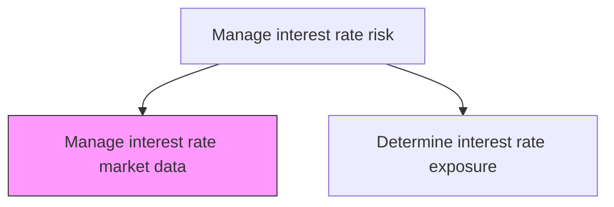
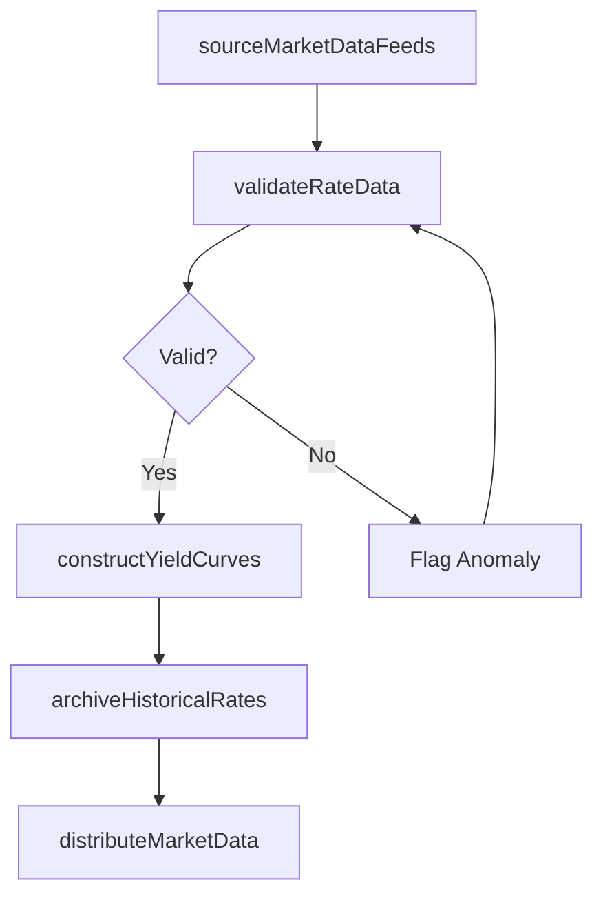

# Manage interest rate market data

> Business-as-Code definition for interest rate market data. Models the end-to-end process of manage interest rate market data as a programmable workflow.

## Overview

Managing interest rate market data involves sourcing, validating, and maintaining the benchmark yield curves, reference rates, and volatility surfaces that treasury uses to value interest rate exposures and derivative positions. This includes subscribing to real-time feeds from data vendors, constructing and interpolating yield curves across multiple tenors and currencies, and archiving historical rate snapshots for trend analysis and model backtesting. Accurate and timely market data is foundational to all downstream interest rate risk quantification and hedging decisions.

## Process Hierarchy



## GraphDL

```yaml
manage:
  object: Interest Rate Market Data
  actor: RiskManager
  result: InterestRateMarketDataReport
```

## Actions

| Action | Description |
|--------|-------------|
| sourceMarketDataFeeds | Subscribe to and ingest interest rate data from approved vendors and exchanges |
| validateRateData | Check incoming rate data for stale quotes, outliers, and missing tenors |
| constructYieldCurves | Build and interpolate yield curves from benchmark instrument rates |
| archiveHistoricalRates | Store validated rate snapshots for backtesting and trend analysis |
| distributeMarketData | Publish validated rates and curves to downstream risk and trading systems |

## Events

| Event | Description |
|-------|-------------|
| marketDataFeedsSourced | Interest rate data feeds ingested from approved vendors |
| rateDataValidated | Incoming rate data checked and anomalies flagged |
| yieldCurvesConstructed | Yield curves built and interpolated across required tenors |
| historicalRatesArchived | Validated rate snapshots stored for historical analysis |
| marketDataDistributed | Validated rates published to downstream systems |

## Searches

| Search | Description |
|--------|-------------|
| getInterestRateMarketData | Retrieve interest rate market data records filtered by status, date, or owner |
| findInterestRateMarketDataByPeriod | Search interest rate market data data for a specified date range |
| getInterestRateMarketDataSummary | Retrieve summary statistics and trends for interest rate market data |
| listInterestRateMarketDataHistory | Query the audit trail and change history for interest rate market data records |

## Process Flow



## RACI Matrix

| Activity | Responsible | Accountable | Consulted | Informed |
|----------|-------------|-------------|-----------|----------|
| sourceMarketDataFeeds | MarketDataAnalyst | RiskManager | ITInfrastructure | Treasurer |
| validateRateData | MarketDataAnalyst | RiskManager | TreasuryDealer | InterestRateDealer |
| constructYieldCurves | RiskAnalyst | RiskManager | QuantitativeAnalyst | Treasurer |
| distributeMarketData | MarketDataAnalyst | RiskManager | TreasuryOperationsAnalyst | TreasuryDealer |

## Related Processes

| Process | Relationship |
|---------|-------------|
| 9.7.6.2.2 Determine interest rate exposure for all markets | Downstream - exposure calculation consumes validated rate data |
| 9.7.6.2 Manage interest rate risk | Parent - governing process group |
| 9.7.5.8 Process interest rate transactions | Downstream - transaction pricing uses market data curves |
| 9.7.6.1 Develop risk management/hedging strategy | Downstream - strategy relies on market data for scenario analysis |

## Related Departments

| Department | Role |
|-----------|------|
| Treasury | Consumes market data for risk quantification and trading |
| Risk Management | Validates and distributes market data |
| Information Technology | Maintains market data infrastructure and vendor connections |

## Related Occupations

| Occupation | Involvement |
|-----------|-------------|
| Market Data Analyst | Sources, validates, and distributes interest rate data |
| Risk Analyst | Constructs yield curves and validates data quality |

## KPIs

| KPI | Description | Unit |
|-----|-------------|------|
| Data Feed Uptime | Percentage of time market data feeds are available and operational | % |
| Stale Data Rate | Percentage of rate data points flagged as stale or missing | % |
| Curve Construction Timeliness | Time from market close to yield curve availability | Minutes |
| Data Validation Error Rate | Percentage of data points requiring manual correction | % |

## Usage

```typescript
import { manageInterestRateMarketData } from '@headlessly/manage-interest-rate-market-data'

const client = manageInterestRateMarketData()

// Construct yield curves from validated benchmark rates
const curves = await client.constructYieldCurves({
  asOfDate: '2025-03-15',
  currencies: ['USD', 'EUR', 'GBP'],
  benchmarks: ['SOFR', 'EURIBOR', 'SONIA']
})

// Validate incoming rate data for anomalies
const validation = await client.validateRateData({
  feedId: 'bloomberg-rates',
  date: '2025-03-15',
  toleranceBps: 10
})
```
