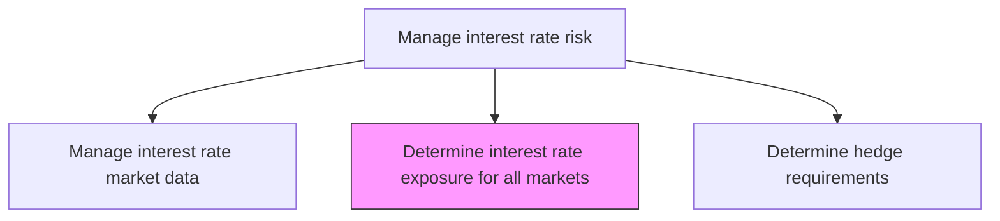
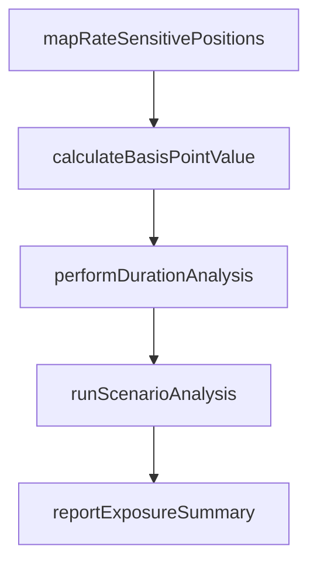

# Determine interest rate exposure for all markets

> Business-as-Code definition for interest rate exposure for all markets. Models the end-to-end process of determine interest rate exposure for all markets as a programmable workflow.

## Overview

Determining interest rate exposure for all markets quantifies the organization's sensitivity to interest rate movements across every currency and market in which it holds positions. This involves mapping all floating-rate assets and liabilities, fixed-rate instruments subject to repricing, and derivative positions to calculate net exposure by tenor bucket. Duration analysis, basis point value calculations, and scenario-based sensitivity modeling are performed to produce a comprehensive view of how parallel and non-parallel yield curve shifts would affect the organization's net interest income and economic value of equity.

## Process Hierarchy



## GraphDL

```yaml
determine:
  object: Interest Rate Exposure For All Markets
  actor: RiskManager
  result: InterestRateExposureForAllMarketsDetermination
```

## Actions

| Action | Description |
|--------|-------------|
| mapRateSensitivePositions | Identify all floating and fixed-rate assets, liabilities, and derivatives by market |
| calculateBasisPointValue | Compute the change in portfolio value for a one basis point rate shift |
| performDurationAnalysis | Calculate modified duration and convexity for each instrument and portfolio |
| runScenarioAnalysis | Model portfolio impact under parallel shifts, curve twists, and stress scenarios |
| reportExposureSummary | Produce interest rate exposure summary by currency, market, and tenor bucket |

## Events

| Event | Description |
|-------|-------------|
| rateSensitivePositionsMapped | All rate-sensitive instruments cataloged across markets |
| basisPointValueCalculated | Portfolio sensitivity to one basis point shift quantified |
| durationAnalysisPerformed | Duration and convexity metrics computed for all positions |
| scenarioAnalysisCompleted | Interest rate scenario impacts modeled and documented |
| exposureSummaryReported | Interest rate exposure summary delivered to management |

## Searches

| Search | Description |
|--------|-------------|
| getInterestRateExposureForAllMarkets | Retrieve interest rate exposure for all markets records filtered by status, date, or owner |
| findInterestRateExposureForAllMarketsByPeriod | Search interest rate exposure for all markets data for a specified date range |
| getInterestRateExposureForAllMarketsSummary | Retrieve summary statistics and trends for interest rate exposure for all markets |
| listInterestRateExposureForAllMarketsHistory | Query the audit trail and change history for interest rate exposure for all markets records |

## Process Flow



## RACI Matrix

| Activity | Responsible | Accountable | Consulted | Informed |
|----------|-------------|-------------|-----------|----------|
| mapRateSensitivePositions | RiskAnalyst | RiskManager | TreasuryDealer | Treasurer |
| calculateBasisPointValue | RiskAnalyst | RiskManager | QuantitativeAnalyst | InterestRateDealer |
| performDurationAnalysis | RiskAnalyst | RiskManager | TreasuryDealer | Treasurer |
| runScenarioAnalysis | RiskAnalyst | RiskManager | Treasurer | CFO |

## Related Processes

| Process | Relationship |
|---------|-------------|
| 9.7.6.2.1 Manage interest rate market data | Upstream - provides rate data for exposure calculations |
| 9.7.6.2.3 Determine interest rate hedge requirements | Downstream - exposure drives hedge sizing |
| 9.7.6.2 Manage interest rate risk | Parent - governing process group |
| 9.7.6.1 Develop risk management/hedging strategy | Upstream - strategy defines acceptable exposure thresholds |

## Related Departments

| Department | Role |
|-----------|------|
| Risk Management | Quantifies interest rate exposures and runs scenario analysis |
| Treasury | Provides position data and consumes exposure reports |
| Finance | Uses exposure data for earnings-at-risk projections |

## Related Occupations

| Occupation | Involvement |
|-----------|-------------|
| Risk Analyst | Performs exposure calculations and scenario modeling |
| Interest Rate Dealer | Provides market context for exposure assessment |

## KPIs

| KPI | Description | Unit |
|-----|-------------|------|
| Basis Point Value (BPV) | Dollar change in portfolio value per 1bp rate shift | USD |
| Portfolio Modified Duration | Weighted average modified duration of rate-sensitive portfolio | Years |
| Earnings at Risk | Maximum potential earnings impact from a 200bp parallel shift | USD |
| Exposure Report Timeliness | Percentage of exposure reports delivered within SLA | % |

## Usage

```typescript
import { determineInterestRateExposureForAllMarkets } from '@headlessly/determine-interest-rate-exposure-for-all-markets'

const client = determineInterestRateExposureForAllMarkets()

// Map all rate-sensitive positions across markets
const positions = await client.mapRateSensitivePositions({
  asOfDate: '2025-03-15',
  markets: ['USD', 'EUR', 'GBP'],
  includeDerivatives: true
})

// Run scenario analysis for yield curve shifts
const scenarios = await client.runScenarioAnalysis({
  asOfDate: '2025-03-15',
  scenarios: ['parallel+100bp', 'parallel-100bp', 'steepener', 'flattener']
})
```
