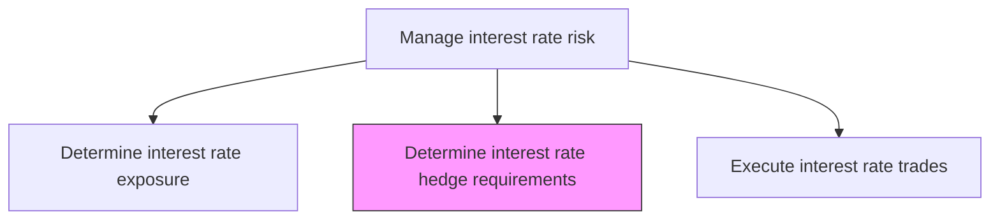
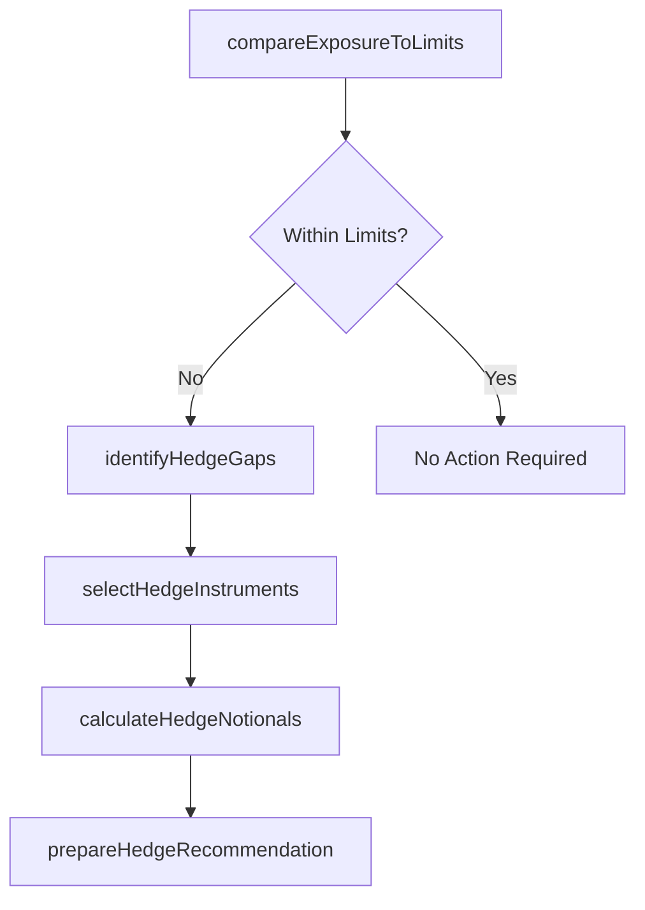

# Determine interest rate hedge requirements in accordance with risk policy

> Business-as-Code definition for interest rate hedge requirements in accordance with risk policy. Models the end-to-end process of determine interest rate hedge requirements in accordance with risk policy as a programmable workflow.

## Overview

Determining interest rate hedge requirements translates measured exposures into specific hedging actions aligned with the organization's approved risk policy. This task compares current net interest rate exposure by tenor bucket against policy-defined tolerance limits, identifies gaps where exposure exceeds acceptable thresholds, and calculates the notional amounts, instrument types, and tenors required to bring exposures within bounds. The output is a hedge requirement recommendation that specifies swaps, caps, or floors needed, which feeds directly into the trade execution process.

## Process Hierarchy



## GraphDL

```yaml
determine:
  object: Interest Rate Hedge Requirements In Accordance With Risk Policy
  actor: RiskManager
  result: InterestRateHedgeRequirementsInAccordanceWithRiskPolicyDetermination
```

## Actions

| Action | Description |
|--------|-------------|
| compareExposureToLimits | Evaluate current interest rate exposure against policy tolerance thresholds |
| identifyHedgeGaps | Determine tenor buckets and amounts where exposure exceeds policy limits |
| selectHedgeInstruments | Choose appropriate derivatives (swaps, caps, floors) to close identified gaps |
| calculateHedgeNotionals | Compute required notional amounts for each hedging instrument |
| prepareHedgeRecommendation | Document hedge requirements for trade execution approval |

## Events

| Event | Description |
|-------|-------------|
| exposureComparedToLimits | Current exposure evaluated against policy tolerance thresholds |
| hedgeGapsIdentified | Tenor buckets requiring hedging coverage determined |
| hedgeInstrumentsSelected | Derivative types chosen for each gap |
| hedgeNotionalsCalculated | Required notional amounts computed for hedging instruments |
| hedgeRecommendationPrepared | Hedge requirements documented and submitted for approval |

## Searches

| Search | Description |
|--------|-------------|
| getInterestRateHedgeRequirementsInAccordanceWithRiskPolicy | Retrieve interest rate hedge requirements in accordance with risk policy records filtered by status, date, or owner |
| findInterestRateHedgeRequirementsInAccordanceWithRiskPolicyByPeriod | Search interest rate hedge requirements in accordance with risk policy data for a specified date range |
| getInterestRateHedgeRequirementsInAccordanceWithRiskPolicySummary | Retrieve summary statistics and trends for interest rate hedge requirements in accordance with risk policy |
| listInterestRateHedgeRequirementsInAccordanceWithRiskPolicyHistory | Query the audit trail and change history for interest rate hedge requirements in accordance with risk policy records |

## Process Flow



## RACI Matrix

| Activity | Responsible | Accountable | Consulted | Informed |
|----------|-------------|-------------|-----------|----------|
| compareExposureToLimits | RiskAnalyst | RiskManager | Treasurer | CFO |
| identifyHedgeGaps | RiskAnalyst | RiskManager | InterestRateDealer | Treasurer |
| selectHedgeInstruments | RiskManager | Treasurer | InterestRateDealer | HedgeAccountant |
| prepareHedgeRecommendation | RiskManager | Treasurer | CFO | TreasuryDealer |

## Related Processes

| Process | Relationship |
|---------|-------------|
| 9.7.6.2.2 Determine interest rate exposure for all markets | Upstream - exposure data drives hedge requirement calculations |
| 9.7.6.2.4 Execute interest rate trades | Downstream - hedge requirements feed trade execution |
| 9.7.6.2 Manage interest rate risk | Parent - governing process group |
| 9.7.6.1 Develop risk management/hedging strategy | Upstream - risk policy defines tolerance limits |

## Related Departments

| Department | Role |
|-----------|------|
| Risk Management | Calculates hedge requirements against policy limits |
| Treasury | Approves hedge recommendations and executes trades |
| Accounting | Assesses hedge accounting eligibility for proposed instruments |

## Related Occupations

| Occupation | Involvement |
|-----------|-------------|
| Risk Analyst | Performs gap analysis and computes hedge notionals |
| Interest Rate Dealer | Advises on instrument selection and market liquidity |

## KPIs

| KPI | Description | Unit |
|-----|-------------|------|
| Hedge Coverage Ratio | Percentage of identified exposure covered by approved hedges | % |
| Policy Limit Utilization | Current exposure as percentage of policy maximum | % |
| Hedge Recommendation Cycle Time | Days from exposure assessment to approved hedge recommendation | Days |
| Unhedged Exposure Value | Dollar amount of interest rate exposure not covered by hedges | USD |

## Usage

```typescript
import { determineInterestRateHedgeRequirementsInAccordanceWithRiskPolicy } from '@headlessly/determine-interest-rate-hedge-requirements-in-accordance-with-risk-policy'

const client = determineInterestRateHedgeRequirementsInAccordanceWithRiskPolicy()

// Compare current exposure against policy limits
const gaps = await client.compareExposureToLimits({
  asOfDate: '2025-03-15',
  markets: ['USD', 'EUR'],
  tenorBuckets: ['0-1yr', '1-3yr', '3-5yr', '5yr+']
})

// Calculate notional amounts for required hedge instruments
const notionals = await client.calculateHedgeNotionals({
  gaps: gaps.openGaps,
  instruments: ['interest-rate-swap', 'cap'],
  hedgeRatio: 0.80
})
```
