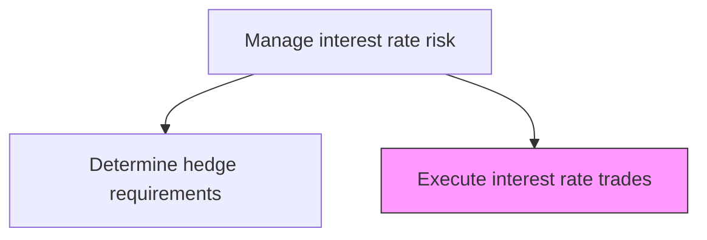
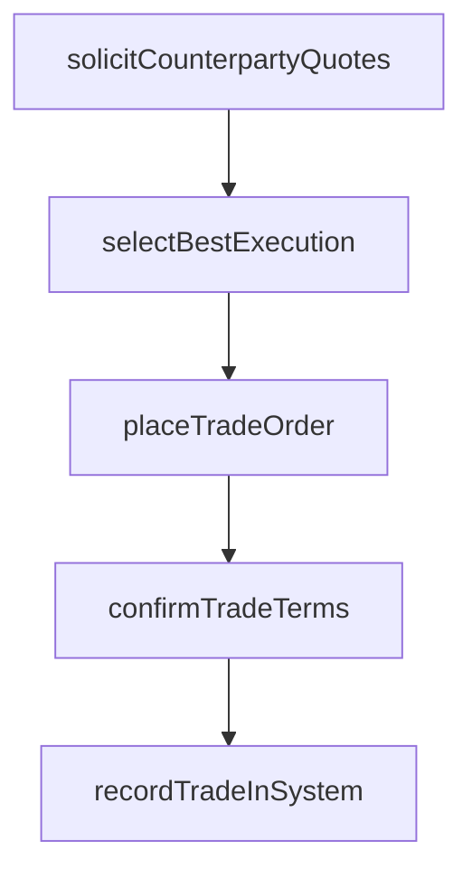

# Execute interest rate trades

> Business-as-Code definition for interest rate trades. Models the end-to-end process of execute interest rate trades as a programmable workflow.

## Overview

Executing interest rate trades involves placing swap, cap, floor, and other interest rate derivative orders with approved counterparties based on the hedge requirements determined by the risk team. The dealer solicits competitive quotes from multiple counterparties, selects the best pricing, and confirms trade terms including notional amounts, fixed and floating rate specifications, payment frequencies, and maturity dates. Post-execution, the trade is confirmed with the counterparty, recorded in the treasury management system, and handed off to operations for settlement processing.

## Process Hierarchy



## GraphDL

```yaml
execute:
  object: Interest Rate Trades
  actor: RiskManager
  result: InterestRateTradesExecutionRecord
```

## Actions

| Action | Description |
|--------|-------------|
| solicitCounterpartyQuotes | Request competitive pricing from approved counterparties for required trades |
| selectBestExecution | Evaluate quotes and select optimal counterparty based on pricing and credit |
| placeTradeOrder | Execute the interest rate derivative trade with selected counterparty |
| confirmTradeTerms | Verify trade details including rates, notionals, and payment schedules |
| recordTradeInSystem | Enter confirmed trade into treasury management system for downstream processing |

## Events

| Event | Description |
|-------|-------------|
| counterpartyQuotesSolicited | Competitive pricing requested from approved counterparties |
| bestExecutionSelected | Optimal counterparty chosen based on pricing and credit assessment |
| tradeOrderPlaced | Interest rate derivative order executed with counterparty |
| tradeTermsConfirmed | Trade details verified and agreed with counterparty |
| tradeRecordedInSystem | Confirmed trade entered into treasury management system |

## Searches

| Search | Description |
|--------|-------------|
| getInterestRateTrades | Retrieve interest rate trades records filtered by status, date, or owner |
| findInterestRateTradesByPeriod | Search interest rate trades data for a specified date range |
| getInterestRateTradesSummary | Retrieve summary statistics and trends for interest rate trades |
| listInterestRateTradesHistory | Query the audit trail and change history for interest rate trades records |

## Process Flow



## RACI Matrix

| Activity | Responsible | Accountable | Consulted | Informed |
|----------|-------------|-------------|-----------|----------|
| solicitCounterpartyQuotes | InterestRateDealer | Treasurer | IntermediaryRelationshipManager | RiskManager |
| selectBestExecution | InterestRateDealer | Treasurer | RiskManager | CFO |
| placeTradeOrder | InterestRateDealer | Treasurer | IntermediaryRelationshipManager | TreasuryOperationsAnalyst |
| confirmTradeTerms | TreasuryOperationsAnalyst | InterestRateDealer | Counterparty | Treasurer |

## Related Processes

| Process | Relationship |
|---------|-------------|
| 9.7.6.2.3 Determine interest rate hedge requirements | Upstream - hedge requirements define trade parameters |
| 9.7.6.2 Manage interest rate risk | Parent - governing process group |
| 9.7.5.8 Process interest rate transactions | Downstream - trades flow into transaction processing |
| 9.7.6.6 Produce hedge accounting transactions and reports | Downstream - executed trades require hedge designation |

## Related Departments

| Department | Role |
|-----------|------|
| Treasury | Executes interest rate derivative trades |
| Risk Management | Validates trades align with hedge requirements |
| Operations | Processes trade confirmations and settlements |

## Related Occupations

| Occupation | Involvement |
|-----------|-------------|
| Interest Rate Dealer | Solicits quotes and executes trades |
| Treasury Operations Analyst | Processes confirmations and system recording |

## KPIs

| KPI | Description | Unit |
|-----|-------------|------|
| Execution Spread | Achieved rate versus mid-market at time of execution | bps |
| Trade Confirmation Timeliness | Percentage of trades confirmed within one business day | % |
| Quote Competition | Average number of counterparty quotes obtained per trade | Count |
| Trade Execution Cycle Time | Time from hedge recommendation approval to trade execution | Hours |

## Usage

```typescript
import { executeInterestRateTrades } from '@headlessly/execute-interest-rate-trades'

const client = executeInterestRateTrades()

// Place an interest rate swap trade with selected counterparty
const trade = await client.placeTradeOrder({
  instrument: 'interest-rate-swap',
  notional: 25000000,
  payFixed: 4.35,
  receiveFloating: 'SOFR',
  tenor: '3-year',
  counterpartyId: 'JPM-001'
})

// Confirm trade terms with counterparty
const confirmation = await client.confirmTradeTerms({
  tradeId: trade.id,
  confirmationMethod: 'ISDA-confirm',
  deadline: '2025-03-16'
})
```
