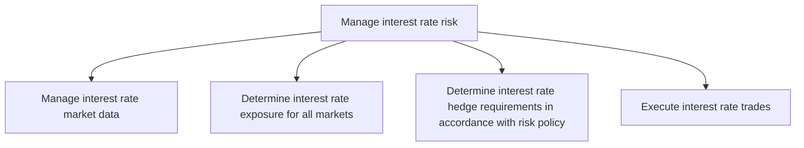
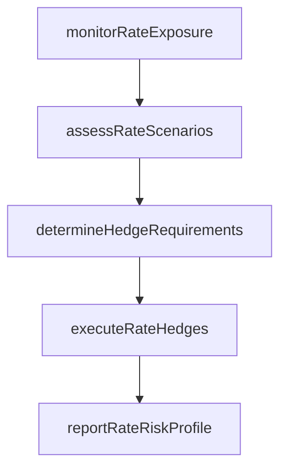

# Manage interest rate risk

> Business-as-Code definition for interest rate risk management. Models the monitoring of rate exposures across debt and investment portfolios, determination of hedge requirements, and execution of interest rate derivative transactions to manage rate sensitivity.

## Overview

Handling risks arising from changes in the interest rate.

## Process Hierarchy



## GraphDL

```yaml
manage:
  object: Interest Rate Risk
  actor: InterestRateRiskManager
  result: InterestRateRiskProfile
```

## Actions

| Action | Description |
|--------|-------------|
| monitorRateExposure | Track interest rate sensitivity across floating-rate debt and investments |
| assessRateScenarios | Model portfolio impact under various interest rate scenarios |
| determineHedgeRequirements | Calculate required hedge notional to achieve target rate exposure |
| executeRateHedges | Place interest rate swap, cap, or floor orders |
| reportRateRiskProfile | Generate interest rate risk exposure and hedge coverage reports |

## Events

| Event | Description |
|-------|-------------|
| rateExposureMonitored | Interest rate sensitivity tracked across portfolios |
| rateScenariosAssessed | Rate scenario impact analysis completed |
| hedgeRequirementsDetermined | Required hedge notional calculated |
| rateHedgesExecuted | Interest rate derivative orders placed |
| rateRiskProfileReported | Interest rate risk reports generated |

## Searches

| Search | Description |
|--------|-------------|
| getRateExposure | Retrieve current interest rate exposure by portfolio |
| getRateScenarioResults | Query rate scenario impact analysis results |
| getHedgeCoverage | Retrieve interest rate hedge coverage ratios |

## Process Flow



## RACI Matrix

| Activity | Responsible | Accountable | Consulted | Informed |
|----------|-------------|-------------|-----------|----------|
| monitorRateExposure | InterestRateRiskManager | Treasurer | TreasuryAnalyst | CFO |
| determineHedgeRequirements | InterestRateRiskManager | Treasurer | RiskManager | CFO |
| executeRateHedges | InterestRateDealer | Treasurer | InterestRateRiskManager | CFO |

## Sub-Processes

| ID | Name | Description |
|----|------|-------------|
| 9.7.6.2.1 | Manage interest rate market data | Collecting and storing data that pertains to interest rate markets. |
| 9.7.6.2.2 | Determine interest rate exposure for all markets | Identifying potential interest rate risks for all markets. |
| 9.7.6.2.3 | Determine interest rate hedge requirements in accordance with risk policy | Deciding the requirements on interest rate investments that are made by trading in futures or option |
| 9.7.6.2.4 | Execute interest rate trades | Performing trading on interest rates. |

## Related Processes

| Process | Relationship |
|---------|-------------|
| 9.7.6.1 Develop risk management/hedging strategy | Upstream - strategy defines rate hedging approach |
| 9.7.5.8 Process interest rate transactions | Downstream - trades executed per hedge requirements |
| 9.7.6.6 Produce hedge accounting transactions and reports | Downstream - hedges require accounting treatment |

## Related Departments

| Department | Role |
|-----------|------|
| Treasury | Manages interest rate risk exposures |
| Risk Management | Provides rate scenario analysis and modeling |
| Finance | Consumes rate risk reports for planning |

## Related Occupations

| Occupation | Involvement |
|-----------|-------------|
| Interest Rate Risk Manager | Monitors and manages rate exposures |
| Interest Rate Dealer | Executes rate derivative transactions |

## KPIs

| KPI | Description | Unit |
|-----|-------------|------|
| Rate Hedge Coverage | Percentage of floating-rate exposure hedged | % |
| Duration Gap | Difference between asset and liability duration | Years |
| Basis Point Value | Portfolio value change per 1 basis point rate move | USD |

## Usage

```typescript
import { manageInterestRateRisk } from '@headlessly/manage-interest-rate-risk'

const rateRisk = manageInterestRateRisk()

const exposure = await rateRisk.monitorRateExposure({
  portfolios: ['debt', 'investments'],
  rateShock: 100,
  includeDerivatives: true
})
```
