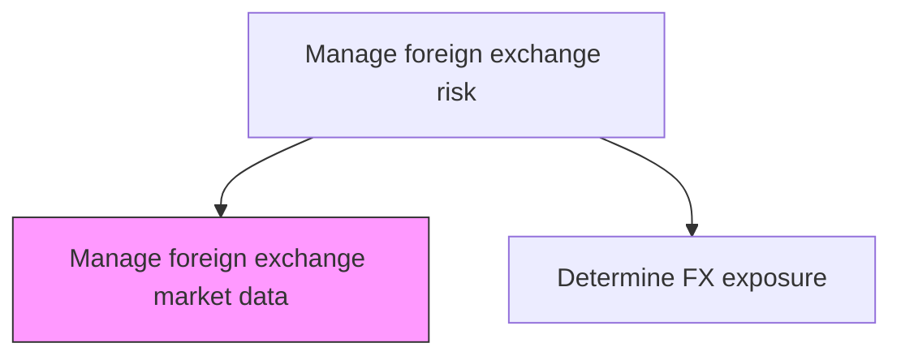
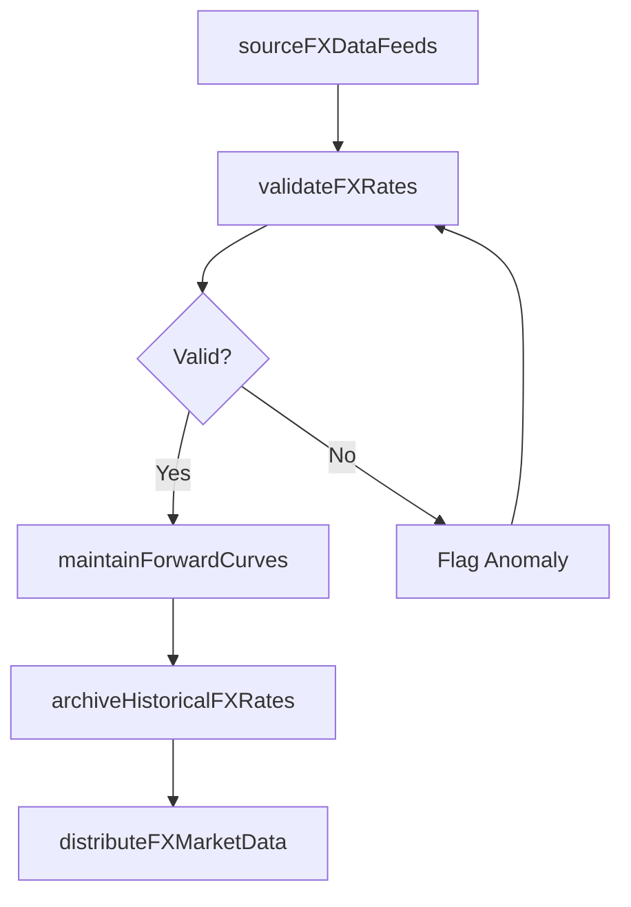

# Manage foreign exchange market data

> Business-as-Code definition for foreign exchange market data. Models the end-to-end process of manage foreign exchange market data as a programmable workflow.

## Overview

Managing foreign exchange market data involves sourcing, validating, and distributing real-time and closing exchange rates, forward points, and implied volatility surfaces for all currency pairs in which the organization transacts. This includes subscribing to data feeds from approved FX data vendors, validating spot and forward rates against multiple sources to detect stale or erroneous quotes, and maintaining historical rate archives for valuations and trend analysis. Accurate FX market data underpins exposure quantification, hedge valuation, and balance sheet translation for international operations.

## Process Hierarchy



## GraphDL

```yaml
manage:
  object: Foreign Exchange Market Data
  actor: RiskManager
  result: ForeignExchangeMarketDataReport
```

## Actions

| Action | Description |
|--------|-------------|
| sourceFXDataFeeds | Subscribe to and ingest spot, forward, and volatility data from FX vendors |
| validateFXRates | Cross-reference rates across vendors and flag stale or anomalous quotes |
| maintainForwardCurves | Build and update forward point curves for all active currency pairs |
| archiveHistoricalFXRates | Store validated daily closing rates for reporting and backtesting |
| distributeFXMarketData | Publish validated rates and curves to treasury and risk systems |

## Events

| Event | Description |
|-------|-------------|
| fxDataFeedsSourced | FX market data feeds ingested from approved vendors |
| fxRatesValidated | Exchange rates cross-referenced and anomalies flagged |
| forwardCurvesMaintained | Forward point curves constructed for all currency pairs |
| historicalFXRatesArchived | Daily closing rates stored for historical reference |
| fxMarketDataDistributed | Validated FX data published to downstream systems |

## Searches

| Search | Description |
|--------|-------------|
| getForeignExchangeMarketData | Retrieve foreign exchange market data records filtered by status, date, or owner |
| findForeignExchangeMarketDataByPeriod | Search foreign exchange market data data for a specified date range |
| getForeignExchangeMarketDataSummary | Retrieve summary statistics and trends for foreign exchange market data |
| listForeignExchangeMarketDataHistory | Query the audit trail and change history for foreign exchange market data records |

## Process Flow



## RACI Matrix

| Activity | Responsible | Accountable | Consulted | Informed |
|----------|-------------|-------------|-----------|----------|
| sourceFXDataFeeds | MarketDataAnalyst | RiskManager | ITInfrastructure | Treasurer |
| validateFXRates | MarketDataAnalyst | RiskManager | FXDealer | TreasuryOperationsAnalyst |
| maintainForwardCurves | RiskAnalyst | RiskManager | FXDealer | Treasurer |
| distributeFXMarketData | MarketDataAnalyst | RiskManager | TreasuryOperationsAnalyst | FXDealer |

## Related Processes

| Process | Relationship |
|---------|-------------|
| 9.7.6.3.2 Determine foreign exchange exposure for all currencies | Downstream - exposure calculation consumes validated FX data |
| 9.7.6.3 Manage foreign exchange risk | Parent - governing process group |
| 9.7.5.6 Process foreign currency transactions | Downstream - FX transaction pricing uses market data |
| 9.7.6.3.5 Manage foreign exchange balance sheet risk | Downstream - balance sheet translation uses closing rates |

## Related Departments

| Department | Role |
|-----------|------|
| Risk Management | Validates and distributes FX market data |
| Treasury | Consumes FX rates for trading and risk assessment |
| Information Technology | Maintains FX data feed infrastructure |

## Related Occupations

| Occupation | Involvement |
|-----------|-------------|
| Market Data Analyst | Sources, validates, and distributes FX rate data |
| FX Dealer | Provides market context and validates rate quality |

## KPIs

| KPI | Description | Unit |
|-----|-------------|------|
| FX Data Feed Uptime | Percentage of time FX data feeds are operational | % |
| Stale Rate Detection | Percentage of stale or missing FX rate quotes detected | % |
| Rate Validation Accuracy | Percentage of rates passing cross-vendor validation | % |
| Data Distribution Latency | Time from market data receipt to downstream system availability | Seconds |

## Usage

```typescript
import { manageForeignExchangeMarketData } from '@headlessly/manage-foreign-exchange-market-data'

const client = manageForeignExchangeMarketData()

// Validate FX rates across multiple vendor sources
const validation = await client.validateFXRates({
  date: '2025-03-15',
  currencyPairs: ['EUR/USD', 'GBP/USD', 'USD/JPY'],
  tolerancePips: 5
})

// Build forward curves for active currency pairs
const curves = await client.maintainForwardCurves({
  asOfDate: '2025-03-15',
  currencyPairs: ['EUR/USD', 'GBP/USD'],
  tenors: ['1M', '3M', '6M', '1Y']
})
```
