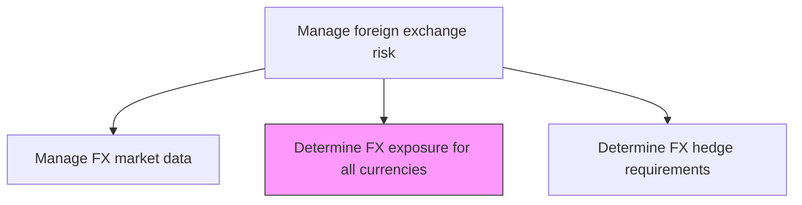
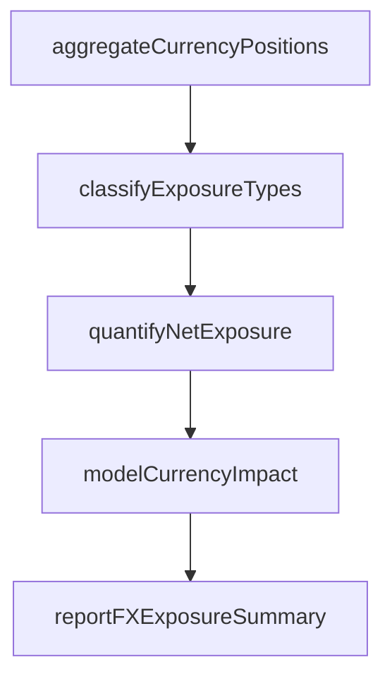

# Determine foreign exchange exposure for all currencies

> Business-as-Code definition for foreign exchange exposure for all currencies. Models the end-to-end process of determine foreign exchange exposure for all currencies as a programmable workflow.

## Overview

Determining foreign exchange exposure for all currencies involves aggregating and quantifying the organization's net currency positions across all business units, subsidiaries, and financial instruments. This includes mapping transactional exposures from forecasted receipts and payments in foreign currencies, translational exposures from consolidating foreign subsidiary financial statements, and economic exposures from competitive dynamics affected by currency movements. The process produces a comprehensive FX exposure report by currency pair that drives hedge requirement calculations and supports management visibility into total currency risk.

## Process Hierarchy



## GraphDL

```yaml
determine:
  object: Foreign Exchange Exposure For All Currencies
  actor: RiskManager
  result: ForeignExchangeExposureForAllCurrenciesDetermination
```

## Actions

| Action | Description |
|--------|-------------|
| aggregateCurrencyPositions | Collect net currency positions from all business units and subsidiaries |
| classifyExposureTypes | Categorize exposures as transactional, translational, or economic |
| quantifyNetExposure | Calculate net open position for each currency against the base currency |
| modelCurrencyImpact | Simulate portfolio impact under various exchange rate scenarios |
| reportFXExposureSummary | Generate FX exposure reports by currency, region, and exposure type |

## Events

| Event | Description |
|-------|-------------|
| currencyPositionsAggregated | Net currency positions collected from all operating entities |
| exposureTypesClassified | Exposures categorized by transaction, translation, and economic type |
| netExposureQuantified | Net open position calculated for each currency pair |
| currencyImpactModeled | Exchange rate scenario impacts simulated and documented |
| fxExposureSummaryReported | FX exposure reports delivered to management |

## Searches

| Search | Description |
|--------|-------------|
| getForeignExchangeExposureForAllCurrencies | Retrieve foreign exchange exposure for all currencies records filtered by status, date, or owner |
| findForeignExchangeExposureForAllCurrenciesByPeriod | Search foreign exchange exposure for all currencies data for a specified date range |
| getForeignExchangeExposureForAllCurrenciesSummary | Retrieve summary statistics and trends for foreign exchange exposure for all currencies |
| listForeignExchangeExposureForAllCurrenciesHistory | Query the audit trail and change history for foreign exchange exposure for all currencies records |

## Process Flow



## RACI Matrix

| Activity | Responsible | Accountable | Consulted | Informed |
|----------|-------------|-------------|-----------|----------|
| aggregateCurrencyPositions | RiskAnalyst | RiskManager | SubsidiaryControllers | Treasurer |
| classifyExposureTypes | RiskAnalyst | RiskManager | TreasuryAnalyst | FXDealer |
| quantifyNetExposure | RiskAnalyst | RiskManager | FXDealer | Treasurer |
| reportFXExposureSummary | RiskManager | Treasurer | CFO | Board |

## Related Processes

| Process | Relationship |
|---------|-------------|
| 9.7.6.3.1 Manage foreign exchange market data | Upstream - provides validated FX rates for exposure valuation |
| 9.7.6.3.3 Determine foreign exchange hedge requirements | Downstream - exposure data drives hedge sizing |
| 9.7.6.3 Manage foreign exchange risk | Parent - governing process group |
| 9.7.6.3.5 Manage foreign exchange balance sheet risk | Parallel - translational exposure feeds balance sheet risk |

## Related Departments

| Department | Role |
|-----------|------|
| Risk Management | Quantifies FX exposures across currencies and exposure types |
| Treasury | Provides position data and consumes exposure reports |
| International Operations | Reports subsidiary-level currency positions and forecasts |

## Related Occupations

| Occupation | Involvement |
|-----------|-------------|
| Risk Analyst | Performs currency exposure aggregation and scenario modeling |
| FX Dealer | Provides market context for exposure valuation |

## KPIs

| KPI | Description | Unit |
|-----|-------------|------|
| Net Open Position | Total unhedged FX exposure across all currencies | USD |
| Exposure Concentration | Largest single-currency exposure as percentage of total | % |
| Scenario VaR | Value at risk from a 10% adverse move in top currency exposures | USD |
| Exposure Report Currency Coverage | Percentage of active currencies included in exposure report | % |

## Usage

```typescript
import { determineForeignExchangeExposureForAllCurrencies } from '@headlessly/determine-foreign-exchange-exposure-for-all-currencies'

const client = determineForeignExchangeExposureForAllCurrencies()

// Aggregate net currency positions across all entities
const exposure = await client.aggregateCurrencyPositions({
  asOfDate: '2025-03-15',
  entities: ['US-parent', 'UK-subsidiary', 'DE-subsidiary'],
  baseCurrency: 'USD'
})

// Model impact of adverse currency movements
const scenarios = await client.modelCurrencyImpact({
  asOfDate: '2025-03-15',
  scenarios: ['EUR-10pct-decline', 'GBP-10pct-decline', 'broad-USD-strength']
})
```
