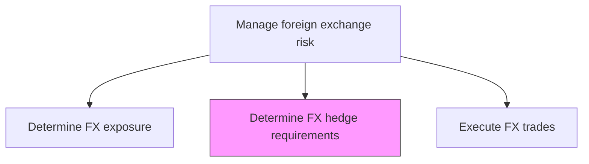
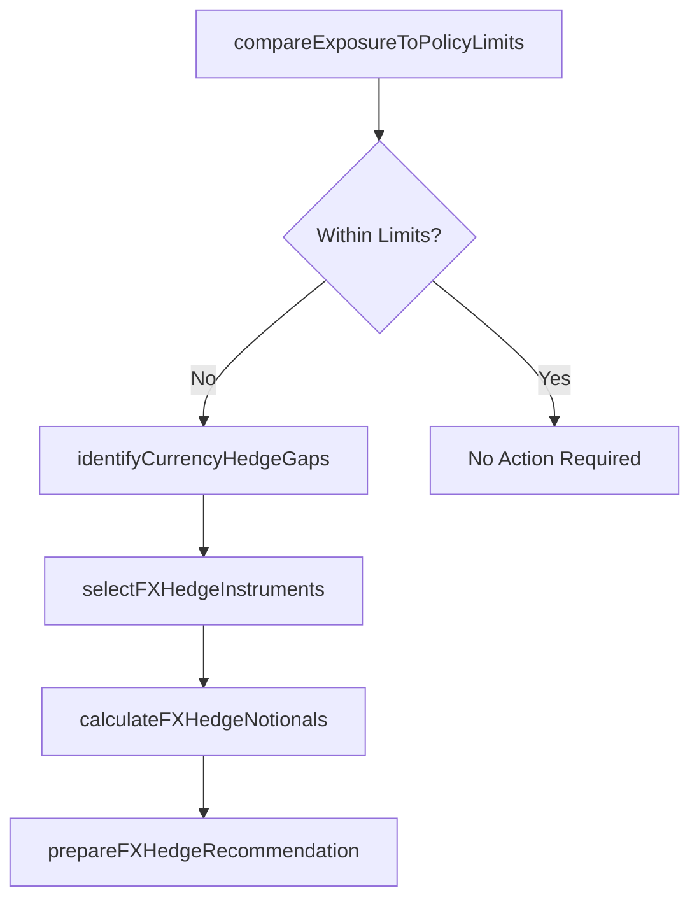

# Determine foreign exchange hedge requirements in accordance with risk policy

> Business-as-Code definition for foreign exchange hedge requirements in accordance with risk policy. Models the end-to-end process of determine foreign exchange hedge requirements in accordance with risk policy as a programmable workflow.

## Overview

Determining foreign exchange hedge requirements translates measured currency exposures into actionable hedge specifications that comply with the organization's risk policy. This task compares net FX exposure by currency pair against approved tolerance limits, identifies where exposures exceed policy thresholds, and specifies the forward contracts, options, or cross-currency swaps required to bring positions within acceptable bounds. The output includes recommended hedge notionals, tenors, and instrument types for each currency pair, structured to achieve the target hedge ratio defined in the risk management strategy while considering hedging costs and market liquidity.

## Process Hierarchy



## GraphDL

```yaml
determine:
  object: Foreign Exchange Hedge Requirements In Accordance With Risk Policy
  actor: RiskManager
  result: ForeignExchangeHedgeRequirementsInAccordanceWithRiskPolicyDetermination
```

## Actions

| Action | Description |
|--------|-------------|
| compareExposureToPolicyLimits | Evaluate net FX exposure by currency against policy tolerance thresholds |
| identifyCurrencyHedgeGaps | Determine currency pairs and amounts where exposure exceeds policy bounds |
| selectFXHedgeInstruments | Choose appropriate instruments (forwards, options, swaps) per currency pair |
| calculateFXHedgeNotionals | Compute required notional amounts by currency pair and tenor |
| prepareFXHedgeRecommendation | Document FX hedge requirements for trade execution approval |

## Events

| Event | Description |
|-------|-------------|
| exposureComparedToPolicyLimits | Net FX exposure evaluated against policy thresholds by currency |
| currencyHedgeGapsIdentified | Currency pairs requiring hedge coverage determined |
| fxHedgeInstrumentsSelected | Derivative instruments chosen for each currency pair |
| fxHedgeNotionalsCalculated | Required notional amounts computed for each hedge instrument |
| fxHedgeRecommendationPrepared | FX hedge requirements documented and submitted for approval |

## Searches

| Search | Description |
|--------|-------------|
| getForeignExchangeHedgeRequirementsInAccordanceWithRiskPolicy | Retrieve foreign exchange hedge requirements in accordance with risk policy records filtered by status, date, or owner |
| findForeignExchangeHedgeRequirementsInAccordanceWithRiskPolicyByPeriod | Search foreign exchange hedge requirements in accordance with risk policy data for a specified date range |
| getForeignExchangeHedgeRequirementsInAccordanceWithRiskPolicySummary | Retrieve summary statistics and trends for foreign exchange hedge requirements in accordance with risk policy |
| listForeignExchangeHedgeRequirementsInAccordanceWithRiskPolicyHistory | Query the audit trail and change history for foreign exchange hedge requirements in accordance with risk policy records |

## Process Flow



## RACI Matrix

| Activity | Responsible | Accountable | Consulted | Informed |
|----------|-------------|-------------|-----------|----------|
| compareExposureToPolicyLimits | RiskAnalyst | RiskManager | Treasurer | CFO |
| identifyCurrencyHedgeGaps | RiskAnalyst | RiskManager | FXDealer | Treasurer |
| selectFXHedgeInstruments | RiskManager | Treasurer | FXDealer | HedgeAccountant |
| prepareFXHedgeRecommendation | RiskManager | Treasurer | CFO | TreasuryDealer |

## Related Processes

| Process | Relationship |
|---------|-------------|
| 9.7.6.3.2 Determine foreign exchange exposure for all currencies | Upstream - exposure data drives hedge requirement calculations |
| 9.7.6.3.4 Execute foreign exchange trades | Downstream - hedge requirements feed FX trade execution |
| 9.7.6.3 Manage foreign exchange risk | Parent - governing process group |
| 9.7.6.1 Develop risk management/hedging strategy | Upstream - risk policy defines FX hedge ratio and limits |

## Related Departments

| Department | Role |
|-----------|------|
| Risk Management | Determines hedge requirements against policy limits |
| Treasury | Approves hedge recommendations and oversees execution |
| Accounting | Evaluates hedge accounting eligibility for proposed instruments |

## Related Occupations

| Occupation | Involvement |
|-----------|-------------|
| Risk Analyst | Performs gap analysis and computes hedge notionals by currency |
| FX Dealer | Advises on instrument selection and market liquidity conditions |

## KPIs

| KPI | Description | Unit |
|-----|-------------|------|
| FX Hedge Coverage Ratio | Percentage of FX exposure covered by approved hedges | % |
| Policy Limit Utilization | Current FX exposure as percentage of policy maximum by currency | % |
| Hedge Recommendation Cycle Time | Days from exposure assessment to approved FX hedge recommendation | Days |
| Unhedged FX Exposure | Dollar value of foreign currency exposure not covered by hedges | USD |

## Usage

```typescript
import { determineForeignExchangeHedgeRequirementsInAccordanceWithRiskPolicy } from '@headlessly/determine-foreign-exchange-hedge-requirements-in-accordance-with-risk-policy'

const client = determineForeignExchangeHedgeRequirementsInAccordanceWithRiskPolicy()

// Compare FX exposure against policy limits by currency pair
const gaps = await client.compareExposureToPolicyLimits({
  asOfDate: '2025-03-15',
  currencyPairs: ['EUR/USD', 'GBP/USD', 'JPY/USD'],
  hedgeRatioTarget: 0.75
})

// Calculate required hedge notionals for each currency
const notionals = await client.calculateFXHedgeNotionals({
  gaps: gaps.openGaps,
  instruments: ['forward', 'option'],
  maxTenor: '12M'
})
```
