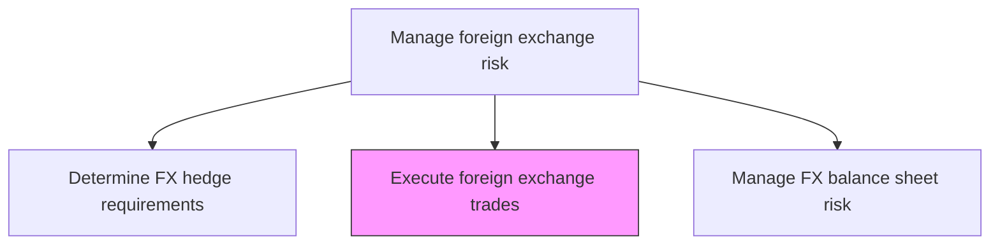
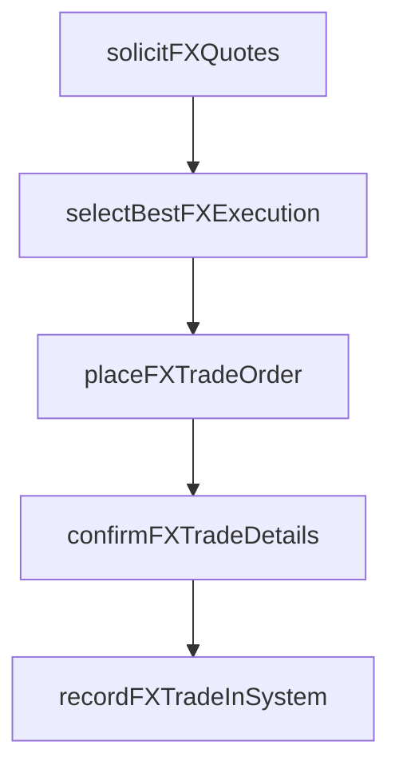

# Execute foreign exchange trades

> Business-as-Code definition for foreign exchange trades. Models the end-to-end process of execute foreign exchange trades as a programmable workflow.

## Overview

Executing foreign exchange trades involves placing spot, forward, option, and swap orders with approved FX counterparties to fulfill hedge requirements or support operational currency needs. The FX dealer solicits competitive quotes from multiple banks, selects the best execution based on pricing, credit exposure, and counterparty limits, and confirms trade details including exchange rates, notional amounts, value dates, and settlement instructions. Completed trades are recorded in the treasury management system and handed off to operations for settlement processing and to accounting for hedge designation.

## Process Hierarchy



## GraphDL

```yaml
execute:
  object: Foreign Exchange Trades
  actor: RiskManager
  result: ForeignExchangeTradesExecutionRecord
```

## Actions

| Action | Description |
|--------|-------------|
| solicitFXQuotes | Request competitive pricing from approved FX counterparties |
| selectBestFXExecution | Evaluate quotes and select optimal counterparty based on rate and credit |
| placeFXTradeOrder | Execute the foreign exchange trade with selected counterparty |
| confirmFXTradeDetails | Verify exchange rate, amounts, value date, and settlement instructions |
| recordFXTradeInSystem | Enter confirmed trade into treasury management system |

## Events

| Event | Description |
|-------|-------------|
| fxQuotesSolicited | Competitive FX pricing requested from approved counterparties |
| bestFXExecutionSelected | Optimal counterparty chosen based on rate and credit assessment |
| fxTradeOrderPlaced | Foreign exchange order executed with counterparty |
| fxTradeDetailsConfirmed | Trade terms verified and agreed with counterparty |
| fxTradeRecordedInSystem | Confirmed trade entered into treasury management system |

## Searches

| Search | Description |
|--------|-------------|
| getForeignExchangeTrades | Retrieve foreign exchange trades records filtered by status, date, or owner |
| findForeignExchangeTradesByPeriod | Search foreign exchange trades data for a specified date range |
| getForeignExchangeTradesSummary | Retrieve summary statistics and trends for foreign exchange trades |
| listForeignExchangeTradesHistory | Query the audit trail and change history for foreign exchange trades records |

## Process Flow



## RACI Matrix

| Activity | Responsible | Accountable | Consulted | Informed |
|----------|-------------|-------------|-----------|----------|
| solicitFXQuotes | FXDealer | Treasurer | IntermediaryRelationshipManager | RiskManager |
| selectBestFXExecution | FXDealer | Treasurer | RiskManager | CFO |
| placeFXTradeOrder | FXDealer | Treasurer | IntermediaryRelationshipManager | TreasuryOperationsAnalyst |
| confirmFXTradeDetails | TreasuryOperationsAnalyst | FXDealer | Counterparty | Treasurer |

## Related Processes

| Process | Relationship |
|---------|-------------|
| 9.7.6.3.3 Determine foreign exchange hedge requirements | Upstream - hedge requirements define trade parameters |
| 9.7.6.3.5 Manage foreign exchange balance sheet risk | Downstream - executed trades affect balance sheet positions |
| 9.7.6.3 Manage foreign exchange risk | Parent - governing process group |
| 9.7.5.6 Process foreign currency transactions | Downstream - trades flow into FX transaction processing |

## Related Departments

| Department | Role |
|-----------|------|
| Treasury | Executes FX trades and manages counterparty relationships |
| Risk Management | Validates trades align with hedge requirements and limits |
| Operations | Processes trade confirmations and settlement |

## Related Occupations

| Occupation | Involvement |
|-----------|-------------|
| FX Dealer | Solicits quotes and executes FX trades |
| Treasury Operations Analyst | Processes trade confirmations and system recording |

## KPIs

| KPI | Description | Unit |
|-----|-------------|------|
| FX Execution Spread | Achieved rate versus mid-market at time of execution | Pips |
| Trade Confirmation Timeliness | Percentage of FX trades confirmed within same business day | % |
| Quote Competition | Average number of counterparty quotes obtained per trade | Count |
| FX Trade Execution Cycle Time | Time from hedge approval to trade execution | Hours |

## Usage

```typescript
import { executeForeignExchangeTrades } from '@headlessly/execute-foreign-exchange-trades'

const client = executeForeignExchangeTrades()

// Place a forward FX trade with selected counterparty
const trade = await client.placeFXTradeOrder({
  type: 'forward',
  buyCurrency: 'EUR',
  sellCurrency: 'USD',
  notional: 5000000,
  valueDate: '2025-06-15',
  counterpartyId: 'CITI-001'
})

// Confirm trade details with counterparty
const confirmation = await client.confirmFXTradeDetails({
  tradeId: trade.id,
  confirmationMethod: 'SWIFT-MT300',
  deadline: '2025-03-16'
})
```
