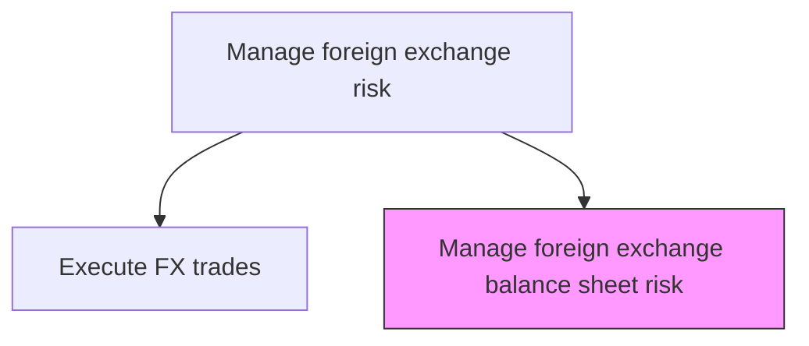
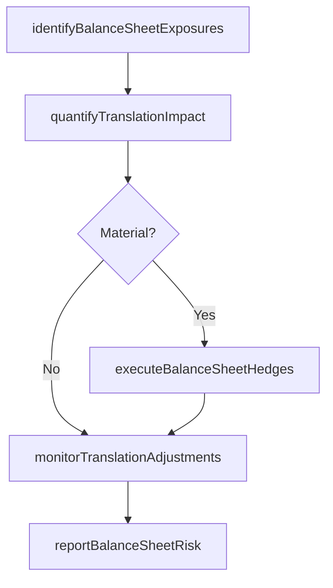

# Manage foreign exchange balance sheet risk

> Business-as-Code definition for foreign exchange balance sheet risk. Models the end-to-end process of manage foreign exchange balance sheet risk as a programmable workflow.

## Overview

Managing foreign exchange balance sheet risk addresses the translational exposure that arises when consolidating foreign subsidiary financial statements into the parent company's reporting currency. This includes identifying net asset and liability positions denominated in foreign currencies on the balance sheet, quantifying the impact of exchange rate movements on reported equity through cumulative translation adjustments, and executing balance sheet hedges to minimize period-over-period volatility in reported results. The process requires close coordination with subsidiary controllers to obtain accurate local-currency balance sheet data and with accounting to ensure proper treatment under ASC 830 or IAS 21.

## Process Hierarchy



## GraphDL

```yaml
manage:
  object: Foreign Exchange Balance Sheet Risk
  actor: RiskManager
  result: ForeignExchangeBalanceSheetRiskReport
```

## Actions

| Action | Description |
|--------|-------------|
| identifyBalanceSheetExposures | Map net foreign currency asset and liability positions on the balance sheet |
| quantifyTranslationImpact | Calculate potential impact of exchange rate movements on consolidated equity |
| executeBalanceSheetHedges | Place FX forwards or swaps to offset identified translational exposures |
| monitorTranslationAdjustments | Track cumulative translation adjustment movements in other comprehensive income |
| reportBalanceSheetRisk | Generate balance sheet FX risk reports for treasury and management review |

## Events

| Event | Description |
|-------|-------------|
| balanceSheetExposuresIdentified | Net foreign currency balance sheet positions mapped |
| translationImpactQuantified | Potential equity impact from exchange rate movements calculated |
| balanceSheetHedgesExecuted | FX hedges placed to offset translational exposures |
| translationAdjustmentsMonitored | CTA movements in other comprehensive income tracked |
| balanceSheetRiskReported | Balance sheet FX risk reports delivered to management |

## Searches

| Search | Description |
|--------|-------------|
| getForeignExchangeBalanceSheetRisk | Retrieve foreign exchange balance sheet risk records filtered by status, date, or owner |
| findForeignExchangeBalanceSheetRiskByPeriod | Search foreign exchange balance sheet risk data for a specified date range |
| getForeignExchangeBalanceSheetRiskSummary | Retrieve summary statistics and trends for foreign exchange balance sheet risk |
| listForeignExchangeBalanceSheetRiskHistory | Query the audit trail and change history for foreign exchange balance sheet risk records |

## Process Flow



## RACI Matrix

| Activity | Responsible | Accountable | Consulted | Informed |
|----------|-------------|-------------|-----------|----------|
| identifyBalanceSheetExposures | RiskAnalyst | RiskManager | SubsidiaryControllers | Treasurer |
| quantifyTranslationImpact | RiskAnalyst | RiskManager | Controller | CFO |
| executeBalanceSheetHedges | FXDealer | Treasurer | RiskManager | CFO |
| reportBalanceSheetRisk | RiskManager | Treasurer | Controller | CFO |

## Related Processes

| Process | Relationship |
|---------|-------------|
| 9.7.6.3.4 Execute foreign exchange trades | Upstream - trade execution supports balance sheet hedging |
| 9.7.6.3 Manage foreign exchange risk | Parent - governing process group |
| 9.10 Manage international funds/consolidation | Parallel - consolidation drives translational exposure |
| 9.7.6.3.2 Determine FX exposure for all currencies | Upstream - exposure data includes translational component |

## Related Departments

| Department | Role |
|-----------|------|
| Risk Management | Quantifies balance sheet translation exposure |
| Treasury | Executes balance sheet hedges |
| Accounting | Manages consolidation and cumulative translation adjustments |

## Related Occupations

| Occupation | Involvement |
|-----------|-------------|
| Risk Analyst | Quantifies translational exposure and monitors CTA movements |
| FX Dealer | Executes balance sheet hedging transactions |

## KPIs

| KPI | Description | Unit |
|-----|-------------|------|
| Balance Sheet Hedge Coverage | Percentage of translational exposure covered by hedges | % |
| CTA Volatility | Quarter-over-quarter change in cumulative translation adjustment | USD |
| Translation Impact on Equity | Impact of FX movements on consolidated shareholders equity | USD |
| Balance Sheet Exposure Accuracy | Variance between forecasted and actual balance sheet FX exposure | % |

## Usage

```typescript
import { manageForeignExchangeBalanceSheetRisk } from '@headlessly/manage-foreign-exchange-balance-sheet-risk'

const client = manageForeignExchangeBalanceSheetRisk()

// Identify net foreign currency balance sheet positions
const exposures = await client.identifyBalanceSheetExposures({
  asOfDate: '2025-03-31',
  subsidiaries: ['UK-subsidiary', 'DE-subsidiary', 'JP-subsidiary'],
  baseCurrency: 'USD'
})

// Quantify translation impact under exchange rate scenarios
const impact = await client.quantifyTranslationImpact({
  asOfDate: '2025-03-31',
  scenarios: ['EUR-5pct-decline', 'GBP-5pct-decline', 'JPY-5pct-decline']
})
```
