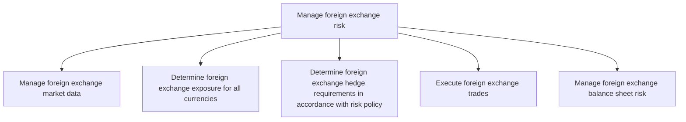
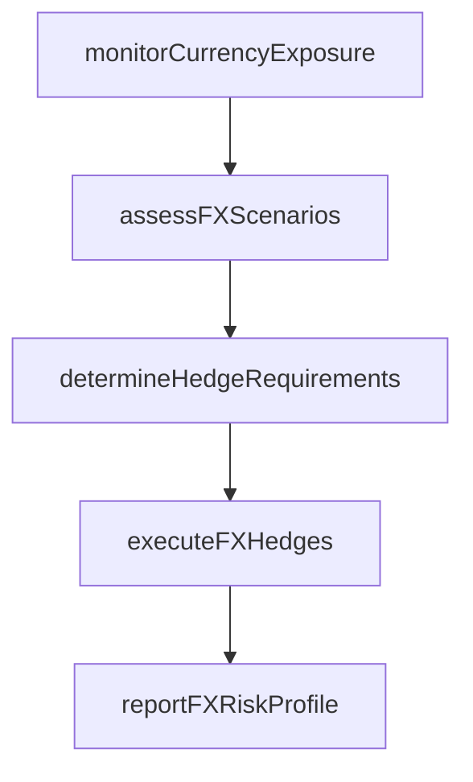

# Manage foreign exchange risk

> Business-as-Code definition for foreign exchange risk management. Models the monitoring of currency exposures, determination of FX hedge requirements, and execution of currency derivative transactions to protect against adverse exchange rate movements.

## Overview

Taking care of foreign-exchange risks.

## Process Hierarchy



## GraphDL

```yaml
manage:
  object: Foreign Exchange Risk
  actor: FXRiskManager
  result: FXRiskProfile
```

## Actions

| Action | Description |
|--------|-------------|
| monitorCurrencyExposure | Track net currency exposures across all entities and currencies |
| assessFXScenarios | Model portfolio impact under various exchange rate scenarios |
| determineHedgeRequirements | Calculate required hedge notional by currency pair |
| executeFXHedges | Place forward, option, or cross-currency swap orders |
| reportFXRiskProfile | Generate FX risk exposure and hedge coverage reports |

## Events

| Event | Description |
|-------|-------------|
| currencyExposureMonitored | Net currency exposures tracked across entities |
| fxScenariosAssessed | Exchange rate scenario analysis completed |
| fxHedgeRequirementsDetermined | Required FX hedge notional calculated by currency pair |
| fxHedgesExecuted | Currency derivative orders placed |
| fxRiskProfileReported | FX risk reports generated |

## Searches

| Search | Description |
|--------|-------------|
| getCurrencyExposure | Retrieve current currency exposure by entity and currency |
| getFXScenarioResults | Query exchange rate scenario analysis results |
| getFXHedgeCoverage | Retrieve FX hedge coverage by currency pair |

## Process Flow



## RACI Matrix

| Activity | Responsible | Accountable | Consulted | Informed |
|----------|-------------|-------------|-----------|----------|
| monitorCurrencyExposure | FXRiskManager | Treasurer | SubsidiaryControllers | CFO |
| determineHedgeRequirements | FXRiskManager | Treasurer | RiskManager | CFO |
| executeFXHedges | FXDealer | Treasurer | FXRiskManager | CFO |

## Sub-Processes

| ID | Name | Description |
|----|------|-------------|
| 9.7.6.3.1 | Manage foreign exchange market data | Handling and processing information about changes in foreign exchange rates. |
| 9.7.6.3.2 | Determine foreign exchange exposure for all currencies | Establishing potential foreign exchange risks for all currencies. |
| 9.7.6.3.3 | Determine foreign exchange hedge requirements in accordance with risk policy | Deciding the requirements on investments in foreign exchange made by trading in futures or options m |
| 9.7.6.3.4 | Execute foreign exchange trades | Executing all aspects for foreign exchange trade within foreign exchange market. This includes buyin |
| 9.7.6.3.5 | Manage foreign exchange balance sheet risk | Overseeing the foreign exchange balance sheet with an eye towards potential risk. Risks include chan |

## Related Processes

| Process | Relationship |
|---------|-------------|
| 9.7.6.1 Develop risk management/hedging strategy | Upstream - strategy defines FX hedging approach |
| 9.7.5.6 Process foreign currency transactions | Downstream - FX trades executed per hedge requirements |
| 9.10 Manage international funds/consolidation | Parallel - consolidation exposes translation risk |

## Related Departments

| Department | Role |
|-----------|------|
| Treasury | Manages foreign exchange risk exposures |
| Risk Management | Provides FX scenario analysis and modeling |
| International Finance | Identifies subsidiary currency exposures |

## Related Occupations

| Occupation | Involvement |
|-----------|-------------|
| FX Risk Manager | Monitors and manages currency exposures |
| FX Dealer | Executes currency derivative transactions |

## KPIs

| KPI | Description | Unit |
|-----|-------------|------|
| FX Hedge Coverage | Percentage of identified FX exposure hedged | % |
| Translation Risk Exposure | Unhedged foreign subsidiary net assets | USD |
| FX Gain/Loss Volatility | Standard deviation of quarterly FX gains and losses | USD |

## Usage

```typescript
import { manageForeignExchangeRisk } from '@headlessly/manage-foreign-exchange-risk'

const fxRisk = manageForeignExchangeRisk()

const exposure = await fxRisk.monitorCurrencyExposure({
  baseCurrency: 'USD',
  entities: ['EU-GmbH', 'UK-Ltd', 'JP-KK'],
  includeForecasted: true
})
```
