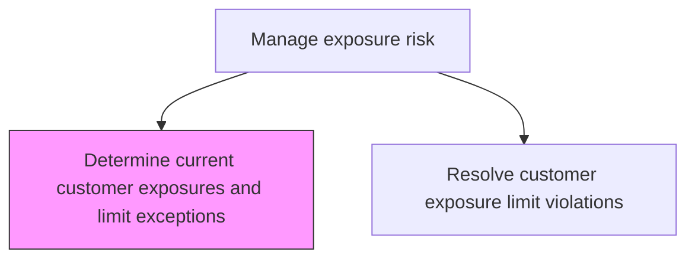
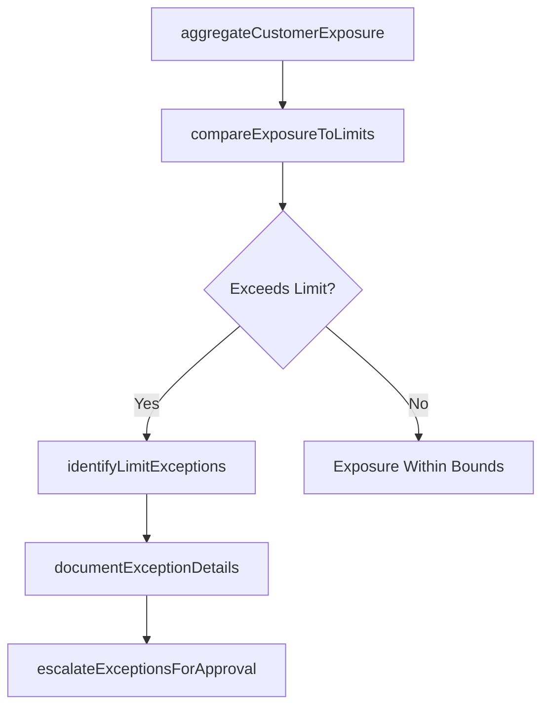

# Determine current customer exposures and limit exceptions

> Business-as-Code definition for current customer exposures and limit exceptions. Models the end-to-end process of determine current customer exposures and limit exceptions as a programmable workflow.

## Overview

Determining current customer exposures and limit exceptions involves calculating the total credit exposure to each customer or counterparty across all product lines and transaction types, then comparing these against approved credit limits. This includes aggregating outstanding receivables, derivative mark-to-market values, contingent liabilities, and committed facilities to produce a consolidated exposure view per customer. Where exposures exceed or approach approved limits, the process identifies and documents limit exceptions for escalation to credit officers and senior management for resolution or temporary limit approval.

## Process Hierarchy



## GraphDL

```yaml
determine:
  object: Current Customer Exposures And Limit Exceptions
  actor: RiskManager
  result: CurrentCustomerExposuresAndLimitExceptionsDetermination
```

## Actions

| Action | Description |
|--------|-------------|
| aggregateCustomerExposure | Consolidate exposure across all products, derivatives, and commitments per customer |
| compareExposureToLimits | Check each customer's total exposure against approved credit limits |
| identifyLimitExceptions | Flag customers whose exposure approaches or exceeds approved thresholds |
| documentExceptionDetails | Record exception circumstances, amounts, and recommended actions |
| escalateExceptionsForApproval | Submit limit exceptions to credit committee for review and temporary approval |

## Events

| Event | Description |
|-------|-------------|
| customerExposureAggregated | Total exposure consolidated across all products for each customer |
| exposureComparedToLimits | Customer exposures checked against approved credit limits |
| limitExceptionsIdentified | Customers approaching or exceeding limits flagged |
| exceptionDetailsDocumented | Exception circumstances and recommended actions recorded |
| exceptionsEscalatedForApproval | Limit exceptions submitted to credit committee for review |

## Searches

| Search | Description |
|--------|-------------|
| getCurrentCustomerExposuresAndLimitExceptions | Retrieve current customer exposures and limit exceptions records filtered by status, date, or owner |
| findCurrentCustomerExposuresAndLimitExceptionsByPeriod | Search current customer exposures and limit exceptions data for a specified date range |
| getCurrentCustomerExposuresAndLimitExceptionsSummary | Retrieve summary statistics and trends for current customer exposures and limit exceptions |
| listCurrentCustomerExposuresAndLimitExceptionsHistory | Query the audit trail and change history for current customer exposures and limit exceptions records |

## Process Flow



## RACI Matrix

| Activity | Responsible | Accountable | Consulted | Informed |
|----------|-------------|-------------|-----------|----------|
| aggregateCustomerExposure | CreditAnalyst | CreditRiskManager | TreasuryDealer | Treasurer |
| compareExposureToLimits | CreditAnalyst | CreditRiskManager | AccountManager | Treasurer |
| identifyLimitExceptions | CreditAnalyst | CreditRiskManager | LegalCounsel | CFO |
| escalateExceptionsForApproval | CreditRiskManager | Treasurer | CFO | Board |

## Related Processes

| Process | Relationship |
|---------|-------------|
| 9.7.6.4.2 Resolve customer exposure limit violations | Downstream - exceptions requiring resolution are escalated |
| 9.7.6.4 Manage exposure risk | Parent - governing process group |
| 9.7.6.4.4 Perform annual customer credit reviews | Parallel - annual reviews update credit limits used here |
| 9.7.6.1 Develop risk management/hedging strategy | Upstream - strategy defines customer exposure tolerance |

## Related Departments

| Department | Role |
|-----------|------|
| Credit Risk | Calculates customer exposures and identifies limit exceptions |
| Treasury | Provides transaction and derivative exposure data |
| Sales/Account Management | Provides customer relationship context for exceptions |

## Related Occupations

| Occupation | Involvement |
|-----------|-------------|
| Credit Analyst | Aggregates exposure and identifies limit exceptions |
| Credit Risk Manager | Reviews and escalates limit exceptions |

## KPIs

| KPI | Description | Unit |
|-----|-------------|------|
| Limit Exception Count | Number of customer exposure limit exceptions per period | Count |
| Exposure-to-Limit Ratio | Average customer exposure as percentage of approved limit | % |
| Exception Escalation Timeliness | Percentage of exceptions escalated within one business day | % |
| Customer Coverage Rate | Percentage of active customers with current exposure calculations | % |

## Usage

```typescript
import { determineCurrentCustomerExposuresAndLimitExceptions } from '@headlessly/determine-current-customer-exposures-and-limit-exceptions'

const client = determineCurrentCustomerExposuresAndLimitExceptions()

// Aggregate total exposure for a customer across all products
const exposure = await client.aggregateCustomerExposure({
  customerId: 'CUST-2025-0451',
  asOfDate: '2025-03-15',
  includeContingent: true
})

// Compare all customer exposures against limits and flag exceptions
const exceptions = await client.compareExposureToLimits({
  asOfDate: '2025-03-15',
  alertThreshold: 0.85,
  customerSegment: 'corporate'
})
```
