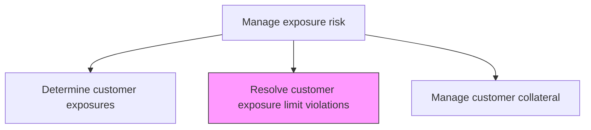
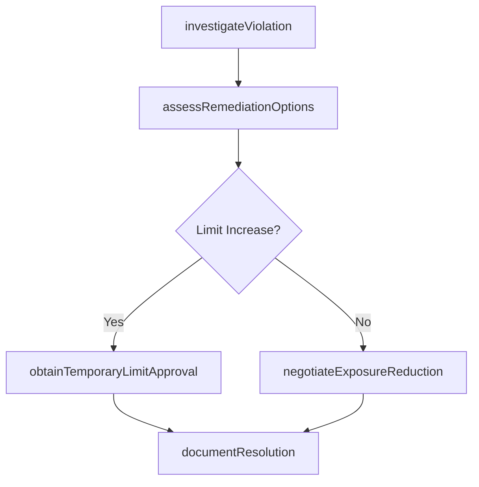

# Resolve customer exposure limit violations

> Business-as-Code definition for customer exposure limit violations. Models the end-to-end process of resolve customer exposure limit violations as a programmable workflow.

## Overview

Resolving customer exposure limit violations involves investigating and remediating situations where a customer's total credit exposure has exceeded approved limits. This may involve negotiating position reductions, obtaining temporary limit increases from the credit committee, requesting additional collateral, or restricting new transactions until exposure returns to compliant levels. Each violation is tracked through a formal case workflow that documents the root cause, remediation actions taken, timeline for resolution, and approval of any temporary limit exceptions. The goal is to bring all customer exposures back within approved policy bounds while maintaining productive business relationships.

## Process Hierarchy



## GraphDL

```yaml
resolve:
  object: Customer Exposure Limit Violations
  actor: RiskManager
  result: CustomerExposureLimitViolationsResolution
```

## Actions

| Action | Description |
|--------|-------------|
| investigateViolation | Determine root cause and circumstances of the limit breach |
| assessRemediationOptions | Evaluate available resolution paths including position reduction and limit increase |
| negotiateExposureReduction | Work with customer and business teams to reduce exposure to compliant levels |
| obtainTemporaryLimitApproval | Seek credit committee approval for temporary limit increase if warranted |
| documentResolution | Record remediation actions, timeline, and final resolution outcome |

## Events

| Event | Description |
|-------|-------------|
| violationInvestigated | Root cause and circumstances of limit breach determined |
| remediationOptionsAssessed | Available resolution paths evaluated and recommended |
| exposureReductionNegotiated | Customer exposure reduction plan agreed and initiated |
| temporaryLimitApproved | Credit committee approved temporary limit increase |
| resolutionDocumented | Remediation actions and final resolution recorded |

## Searches

| Search | Description |
|--------|-------------|
| getCustomerExposureLimitViolations | Retrieve customer exposure limit violations records filtered by status, date, or owner |
| findCustomerExposureLimitViolationsByPeriod | Search customer exposure limit violations data for a specified date range |
| getCustomerExposureLimitViolationsSummary | Retrieve summary statistics and trends for customer exposure limit violations |
| listCustomerExposureLimitViolationsHistory | Query the audit trail and change history for customer exposure limit violations records |

## Process Flow



## RACI Matrix

| Activity | Responsible | Accountable | Consulted | Informed |
|----------|-------------|-------------|-----------|----------|
| investigateViolation | CreditAnalyst | CreditRiskManager | AccountManager | Treasurer |
| assessRemediationOptions | CreditRiskManager | Treasurer | LegalCounsel | CFO |
| negotiateExposureReduction | AccountManager | CreditRiskManager | TreasuryDealer | Treasurer |
| obtainTemporaryLimitApproval | CreditRiskManager | Treasurer | CFO | Board |

## Related Processes

| Process | Relationship |
|---------|-------------|
| 9.7.6.4.1 Determine current customer exposures and limit exceptions | Upstream - exceptions trigger violation resolution |
| 9.7.6.4.3 Manage customer collateral | Downstream - additional collateral may be required for resolution |
| 9.7.6.4 Manage exposure risk | Parent - governing process group |
| 9.7.6.4.4 Perform annual customer credit reviews | Parallel - reviews may update limits that resolve violations |

## Related Departments

| Department | Role |
|-----------|------|
| Credit Risk | Investigates violations and recommends remediation |
| Sales/Account Management | Negotiates exposure reduction with customers |
| Legal | Advises on contractual rights and enforcement options |

## Related Occupations

| Occupation | Involvement |
|-----------|-------------|
| Credit Risk Manager | Leads violation investigation and remediation |
| Account Manager | Manages customer relationship during resolution |

## KPIs

| KPI | Description | Unit |
|-----|-------------|------|
| Violation Resolution Time | Average days to resolve a customer exposure limit violation | Days |
| Repeat Violation Rate | Percentage of customers with recurring limit violations | % |
| Temporary Limit Approval Rate | Percentage of temporary limit requests approved by credit committee | % |
| Post-Resolution Compliance | Percentage of resolved violations remaining within limits after 30 days | % |

## Usage

```typescript
import { resolveCustomerExposureLimitViolations } from '@headlessly/resolve-customer-exposure-limit-violations'

const client = resolveCustomerExposureLimitViolations()

// Investigate a customer exposure limit violation
const investigation = await client.investigateViolation({
  customerId: 'CUST-2025-0451',
  violationId: 'VIOL-2025-0089',
  breachAmount: 2500000
})

// Assess remediation options for the violation
const options = await client.assessRemediationOptions({
  violationId: 'VIOL-2025-0089',
  options: ['position-reduction', 'temporary-limit-increase', 'additional-collateral']
})
```
