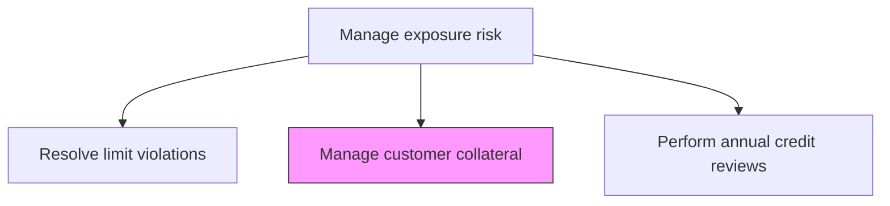
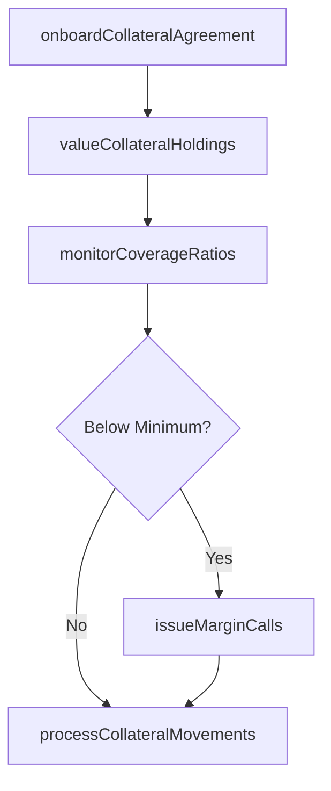

# Manage customer collateral

> Business-as-Code definition for customer collateral. Models the end-to-end process of manage customer collateral as a programmable workflow.

## Overview

Managing customer collateral involves tracking, valuing, and administering the securities, cash deposits, letters of credit, and other assets pledged by customers to secure credit exposures. This includes onboarding new collateral agreements, performing regular mark-to-market valuations of pledged assets, monitoring collateral coverage ratios against minimum thresholds, and issuing margin calls when coverage falls below required levels. The process also handles collateral substitutions, returns upon exposure reduction, and liquidation procedures when customers default on obligations. Effective collateral management reduces the organization's net credit exposure and supports regulatory capital optimization.

## Process Hierarchy



## GraphDL

```yaml
manage:
  object: Customer Collateral
  actor: RiskManager
  result: CustomerCollateralReport
```

## Actions

| Action | Description |
|--------|-------------|
| onboardCollateralAgreement | Establish collateral terms and document pledging arrangements with customer |
| valueCollateralHoldings | Perform mark-to-market valuation of all pledged collateral assets |
| monitorCoverageRatios | Track collateral coverage against minimum required thresholds |
| issueMarginCalls | Request additional collateral when coverage falls below minimum levels |
| processCollateralMovements | Handle collateral substitutions, additions, and returns |

## Events

| Event | Description |
|-------|-------------|
| collateralAgreementOnboarded | Collateral terms established and pledging arrangements documented |
| collateralHoldingsValued | Mark-to-market valuation of pledged assets completed |
| coverageRatiosMonitored | Collateral coverage checked against minimum thresholds |
| marginCallIssued | Additional collateral requested from undercollateralized customer |
| collateralMovementsProcessed | Collateral substitutions, additions, or returns completed |

## Searches

| Search | Description |
|--------|-------------|
| getCustomerCollateral | Retrieve customer collateral records filtered by status, date, or owner |
| findCustomerCollateralByPeriod | Search customer collateral data for a specified date range |
| getCustomerCollateralSummary | Retrieve summary statistics and trends for customer collateral |
| listCustomerCollateralHistory | Query the audit trail and change history for customer collateral records |

## Process Flow



## RACI Matrix

| Activity | Responsible | Accountable | Consulted | Informed |
|----------|-------------|-------------|-----------|----------|
| onboardCollateralAgreement | CollateralAnalyst | CreditRiskManager | LegalCounsel | AccountManager |
| valueCollateralHoldings | CollateralAnalyst | CreditRiskManager | Custodian | Treasurer |
| monitorCoverageRatios | CollateralAnalyst | CreditRiskManager | CreditAnalyst | Treasurer |
| issueMarginCalls | CreditRiskManager | Treasurer | AccountManager | CFO |

## Related Processes

| Process | Relationship |
|---------|-------------|
| 9.7.6.4.2 Resolve customer exposure limit violations | Upstream - violations may require additional collateral |
| 9.7.6.4.4 Perform annual customer credit reviews | Parallel - credit reviews may change collateral requirements |
| 9.7.6.4 Manage exposure risk | Parent - governing process group |
| 9.7.6.4.1 Determine current customer exposures | Upstream - exposure data drives collateral coverage calculations |

## Related Departments

| Department | Role |
|-----------|------|
| Credit Risk | Monitors collateral coverage and issues margin calls |
| Legal | Drafts and reviews collateral agreements and security interests |
| Custody/Operations | Holds and safeguards pledged collateral assets |

## Related Occupations

| Occupation | Involvement |
|-----------|-------------|
| Collateral Analyst | Values collateral and monitors coverage ratios |
| Credit Risk Manager | Approves margin calls and collateral liquidation |

## KPIs

| KPI | Description | Unit |
|-----|-------------|------|
| Collateral Coverage Ratio | Total collateral value as percentage of total exposure | % |
| Margin Call Response Time | Average days for customers to satisfy margin calls | Days |
| Undercollateralized Exposure | Total exposure not covered by adequate collateral | USD |
| Collateral Valuation Frequency | Number of times collateral is revalued per month | Count |

## Usage

```typescript
import { manageCustomerCollateral } from '@headlessly/manage-customer-collateral'

const client = manageCustomerCollateral()

// Value all pledged collateral for a customer
const valuation = await client.valueCollateralHoldings({
  customerId: 'CUST-2025-0451',
  asOfDate: '2025-03-15',
  includeHaircuts: true
})

// Monitor coverage ratios and identify undercollateralized accounts
const coverage = await client.monitorCoverageRatios({
  asOfDate: '2025-03-15',
  minimumCoverage: 1.05,
  customerSegment: 'corporate'
})
```
