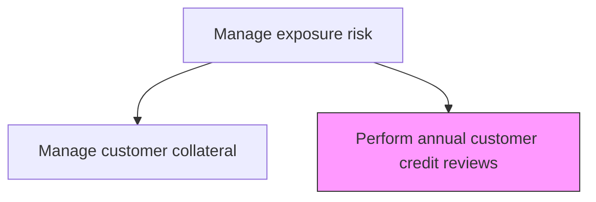
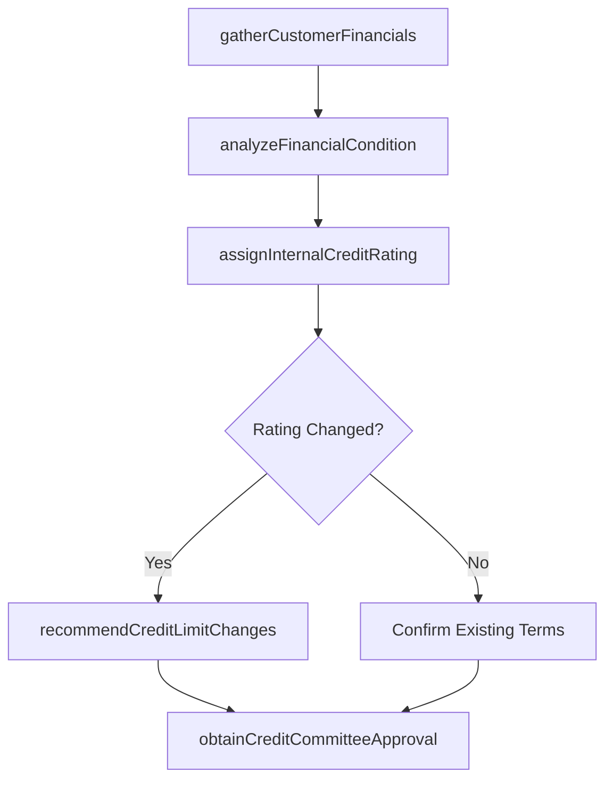

# Perform annual customer credit reviews

> Business-as-Code definition for annual customer credit reviews. Models the end-to-end process of perform annual customer credit reviews as a programmable workflow.

## Overview

Performing annual customer credit reviews involves a comprehensive reassessment of each customer's creditworthiness, financial condition, and payment history to determine whether current credit limits and terms remain appropriate. The review analyzes updated financial statements, external credit ratings, industry conditions, and the customer's payment track record to produce a revised internal credit rating and limit recommendation. Reviews may result in limit increases for improving credits, limit reductions or enhanced collateral requirements for deteriorating credits, or continuation of existing terms. Completed reviews are documented and approved by the credit committee to maintain a current and defensible credit portfolio.

## Process Hierarchy



## GraphDL

```yaml
perform:
  object: Annual Customer Credit Reviews
  actor: RiskManager
  result: AnnualCustomerCreditReviewsReport
```

## Actions

| Action | Description |
|--------|-------------|
| gatherCustomerFinancials | Collect updated financial statements, credit reports, and payment history |
| analyzeFinancialCondition | Evaluate customer financial ratios, trends, and industry benchmarks |
| assignInternalCreditRating | Determine revised internal credit rating based on financial analysis |
| recommendCreditLimitChanges | Propose limit increases, reductions, or collateral requirement changes |
| obtainCreditCommitteeApproval | Submit credit review and recommendations for committee approval |

## Events

| Event | Description |
|-------|-------------|
| customerFinancialsGathered | Updated financial statements and credit data collected |
| financialConditionAnalyzed | Customer financial ratios and trends evaluated |
| internalCreditRatingAssigned | Revised internal credit rating determined |
| creditLimitChangesRecommended | Limit and terms changes proposed based on review findings |
| creditCommitteeApprovalObtained | Credit review and recommendations approved by committee |

## Searches

| Search | Description |
|--------|-------------|
| getAnnualCustomerCreditReviews | Retrieve annual customer credit reviews records filtered by status, date, or owner |
| findAnnualCustomerCreditReviewsByPeriod | Search annual customer credit reviews data for a specified date range |
| getAnnualCustomerCreditReviewsSummary | Retrieve summary statistics and trends for annual customer credit reviews |
| listAnnualCustomerCreditReviewsHistory | Query the audit trail and change history for annual customer credit reviews records |

## Process Flow



## RACI Matrix

| Activity | Responsible | Accountable | Consulted | Informed |
|----------|-------------|-------------|-----------|----------|
| gatherCustomerFinancials | CreditAnalyst | CreditRiskManager | AccountManager | Treasurer |
| analyzeFinancialCondition | CreditAnalyst | CreditRiskManager | ExternalRatingAgency | Treasurer |
| assignInternalCreditRating | CreditRiskManager | Treasurer | CreditAnalyst | CFO |
| obtainCreditCommitteeApproval | CreditRiskManager | Treasurer | CFO | Board |

## Related Processes

| Process | Relationship |
|---------|-------------|
| 9.7.6.4.3 Manage customer collateral | Upstream - collateral requirements may change based on review |
| 9.7.6.4.1 Determine current customer exposures | Parallel - exposure data informs credit review context |
| 9.7.6.4 Manage exposure risk | Parent - governing process group |
| 9.7.6.4.2 Resolve customer exposure limit violations | Downstream - revised limits may resolve existing violations |

## Related Departments

| Department | Role |
|-----------|------|
| Credit Risk | Performs credit analysis and assigns internal ratings |
| Sales/Account Management | Provides customer relationship context and business rationale |
| Finance | Supplies industry benchmarks and economic outlook |

## Related Occupations

| Occupation | Involvement |
|-----------|-------------|
| Credit Analyst | Performs financial analysis and prepares review documentation |
| Credit Risk Manager | Assigns ratings and presents recommendations to committee |

## KPIs

| KPI | Description | Unit |
|-----|-------------|------|
| Review Completion Rate | Percentage of scheduled annual reviews completed on time | % |
| Rating Migration Rate | Percentage of customers with credit rating changes during review | % |
| Average Review Cycle Time | Days from review initiation to committee approval | Days |
| Limit Change Rate | Percentage of reviews resulting in credit limit changes | % |

## Usage

```typescript
import { performAnnualCustomerCreditReviews } from '@headlessly/perform-annual-customer-credit-reviews'

const client = performAnnualCustomerCreditReviews()

// Analyze financial condition for a customer credit review
const analysis = await client.analyzeFinancialCondition({
  customerId: 'CUST-2025-0451',
  financialYear: 2024,
  benchmarkIndustry: 'manufacturing'
})

// Assign revised internal credit rating based on analysis
const rating = await client.assignInternalCreditRating({
  customerId: 'CUST-2025-0451',
  financialAnalysisId: analysis.id,
  previousRating: 'BBB+',
  reviewDate: '2025-03-15'
})
```
