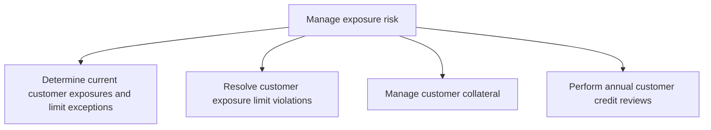
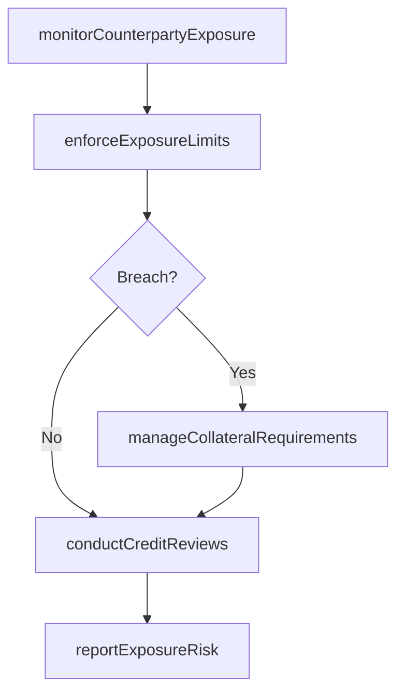

# Manage exposure risk

> Business-as-Code definition for counterparty and credit exposure risk management. Models the monitoring of customer and counterparty credit exposures, enforcement of exposure limits, management of collateral, and periodic credit reviews.

## Overview

Taking care of exposure risks. Maintain financial investments in particular investments or a portfolios that could be risky for the organization.

## Process Hierarchy



## GraphDL

```yaml
manage:
  object: Exposure Risk
  actor: CreditRiskManager
  result: ExposureRiskProfile
```

## Actions

| Action | Description |
|--------|-------------|
| monitorCounterpartyExposure | Track credit exposure to customers and financial counterparties |
| enforceExposureLimits | Apply and monitor counterparty credit limits |
| manageCollateralRequirements | Determine and collect collateral against credit exposures |
| conductCreditReviews | Perform periodic creditworthiness assessments of counterparties |
| reportExposureRisk | Generate credit exposure reports for risk committee review |

## Events

| Event | Description |
|-------|-------------|
| counterpartyExposureMonitored | Credit exposure to counterparties tracked and updated |
| exposureLimitsEnforced | Counterparty credit limits applied and monitored |
| collateralRequirementsManaged | Collateral determined and collected against exposures |
| creditReviewsConducted | Counterparty creditworthiness assessments completed |
| exposureRiskReported | Credit exposure reports generated for review |

## Searches

| Search | Description |
|--------|-------------|
| getCounterpartyExposure | Retrieve current credit exposure by counterparty |
| getExposureLimitUtilization | Query exposure limit utilization by counterparty |
| getCollateralPositions | List collateral held against counterparty exposures |

## Process Flow



## RACI Matrix

| Activity | Responsible | Accountable | Consulted | Informed |
|----------|-------------|-------------|-----------|----------|
| monitorCounterpartyExposure | CreditRiskManager | Treasurer | TreasuryAnalyst | CFO |
| enforceExposureLimits | CreditRiskManager | Treasurer | SalesTeam | CFO |
| conductCreditReviews | CreditAnalyst | CreditRiskManager | ExternalRatingAgency | Treasurer |

## Sub-Processes

| ID | Name | Description |
|----|------|-------------|
| 9.7.6.4.1 | Determine current customer exposures and limit exceptions | Establishing ongoing risks that the customers face, and the exceptions to exceeded limits. |
| 9.7.6.4.2 | Resolve customer exposure limit violations | Settling cases that involve violations of customer exposure limit. |
| 9.7.6.4.3 | Manage customer collateral | Handling customer securities to recover loans that are not paid back. |
| 9.7.6.4.4 | Perform annual customer credit reviews | Conducting reviews to assess customer credit on a yearly basis. Introduce changes or make recommenda |

## Related Processes

| Process | Relationship |
|---------|-------------|
| 9.7.6.1 Develop risk management/hedging strategy | Upstream - strategy defines exposure risk limits |
| 9.7.5.4 Manage issuer exposure | Parallel - complements investment issuer exposure management |
| 9.7.7 Manage financial fraud/dispute cases | Supporting - exposure monitoring detects unusual patterns |

## Related Departments

| Department | Role |
|-----------|------|
| Treasury | Manages counterparty credit exposure |
| Risk Management | Sets credit limits and conducts reviews |
| Sales | Impacted by customer credit limit decisions |

## Related Occupations

| Occupation | Involvement |
|-----------|-------------|
| Credit Risk Manager | Oversees counterparty exposure management |
| Credit Analyst | Performs credit reviews and assessments |

## KPIs

| KPI | Description | Unit |
|-----|-------------|------|
| Exposure Limit Compliance | Percentage of counterparties within approved limits | % |
| Collateral Coverage Ratio | Collateral held as percentage of total unsecured exposure | % |
| Credit Review Completion | Percentage of annual credit reviews completed on time | % |

## Usage

```typescript
import { manageExposureRisk } from '@headlessly/manage-exposure-risk'

const exposureRisk = manageExposureRisk()

const report = await exposureRisk.monitorCounterpartyExposure({
  counterpartyTypes: ['customer', 'bank', 'dealer'],
  includeDerivatives: true,
  thresholdUtilization: 0.80
})
```
