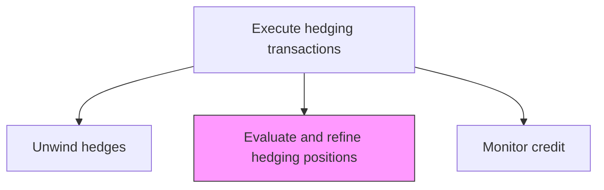
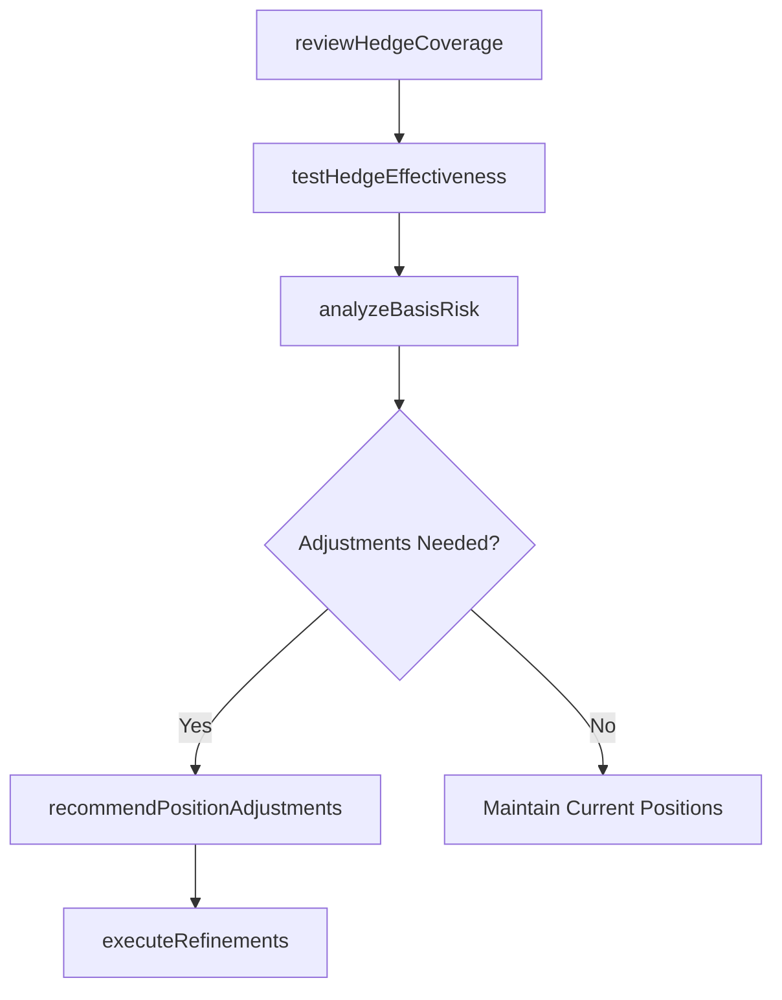

# Evaluate and refine hedging positions

> Business-as-Code definition for refine hedging positions. Models the end-to-end process of evaluate and refine hedging positions as a programmable workflow.

## Overview

Evaluating and refining hedging positions involves ongoing assessment of existing derivative hedges to determine whether they remain aligned with the underlying physical exposures and current market conditions. This includes comparing current hedge coverage ratios against targets, testing hedge effectiveness using dollar-offset or regression methods, analyzing basis risk between the hedge instrument and the hedged item, and recommending adjustments such as rolling forward maturing contracts, resizing positions to match changed exposures, or switching to more cost-effective instruments. The refinement process ensures the hedge portfolio remains optimally positioned to mitigate risk while minimizing unnecessary hedging costs.

## Process Hierarchy



## GraphDL

```yaml
evaluate:
  object: And Refine Hedging Positions
  actor: RiskManager
  result: RefineHedgingPositionsAssessment
```

## Actions

| Action | Description |
|--------|-------------|
| reviewHedgeCoverage | Compare current hedge positions against target coverage ratios |
| testHedgeEffectiveness | Evaluate statistical correlation between hedge and hedged item performance |
| analyzeBasisRisk | Assess pricing differences between hedge instrument and underlying exposure |
| recommendPositionAdjustments | Propose hedge resizing, rollovers, or instrument changes |
| executeRefinements | Implement approved position adjustments through new or modified trades |

## Events

| Event | Description |
|-------|-------------|
| hedgeCoverageReviewed | Current hedge positions compared against target coverage ratios |
| hedgeEffectivenessTested | Statistical effectiveness assessment completed |
| basisRiskAnalyzed | Pricing basis between hedge and underlying exposure evaluated |
| positionAdjustmentsRecommended | Hedge resizing or instrument changes proposed |
| refinementsExecuted | Approved position adjustments implemented |

## Searches

| Search | Description |
|--------|-------------|
| getRefineHedgingPositions | Retrieve refine hedging positions records filtered by status, date, or owner |
| findRefineHedgingPositionsByPeriod | Search refine hedging positions data for a specified date range |
| getRefineHedgingPositionsSummary | Retrieve summary statistics and trends for refine hedging positions |
| listRefineHedgingPositionsHistory | Query the audit trail and change history for refine hedging positions records |

## Process Flow



## RACI Matrix

| Activity | Responsible | Accountable | Consulted | Informed |
|----------|-------------|-------------|-----------|----------|
| reviewHedgeCoverage | RiskAnalyst | RiskManager | TreasuryDealer | Treasurer |
| testHedgeEffectiveness | RiskAnalyst | RiskManager | QuantitativeAnalyst | HedgeAccountant |
| analyzeBasisRisk | RiskAnalyst | RiskManager | TreasuryDealer | Treasurer |
| recommendPositionAdjustments | RiskManager | Treasurer | TreasuryDealer | CFO |

## Related Processes

| Process | Relationship |
|---------|-------------|
| 9.7.6.5.3 Unwind hedges | Upstream - unwound positions may need replacement |
| 9.7.6.5.5 Monitor credit | Downstream - refined positions affect counterparty credit exposure |
| 9.7.6.5 Execute hedging transactions | Parent - governing process group |
| 9.7.6.5.1 Measure physical positions | Upstream - physical position changes drive hedge refinements |

## Related Departments

| Department | Role |
|-----------|------|
| Risk Management | Evaluates effectiveness and recommends adjustments |
| Treasury | Executes approved hedge refinement trades |
| Accounting | Assesses impact of refinements on hedge accounting designations |

## Related Occupations

| Occupation | Involvement |
|-----------|-------------|
| Risk Analyst | Performs effectiveness testing and basis risk analysis |
| Treasury Dealer | Executes refinement trades in the market |

## KPIs

| KPI | Description | Unit |
|-----|-------------|------|
| Hedge Effectiveness Ratio | Statistical correlation between hedge and hedged item changes | Ratio |
| Basis Risk | Average pricing difference between hedge instrument and underlying | bps |
| Coverage Drift | Deviation of actual hedge coverage from target ratio | % |
| Refinement Frequency | Number of hedge position adjustments per quarter | Count |

## Usage

```typescript
import { evaluateAndRefineHedgingPositions } from '@headlessly/evaluate-and-refine-hedging-positions'

const client = evaluateAndRefineHedgingPositions()

// Review hedge coverage ratios against targets
const review = await client.reviewHedgeCoverage({
  asOfDate: '2025-03-15',
  portfolio: 'commodity-hedges',
  targetCoverage: 0.80
})

// Test hedge effectiveness using regression method
const effectiveness = await client.testHedgeEffectiveness({
  hedgeId: 'HEDGE-2025-OIL-001',
  method: 'regression',
  lookbackPeriod: '6-months',
  minimumR2: 0.80
})
```
