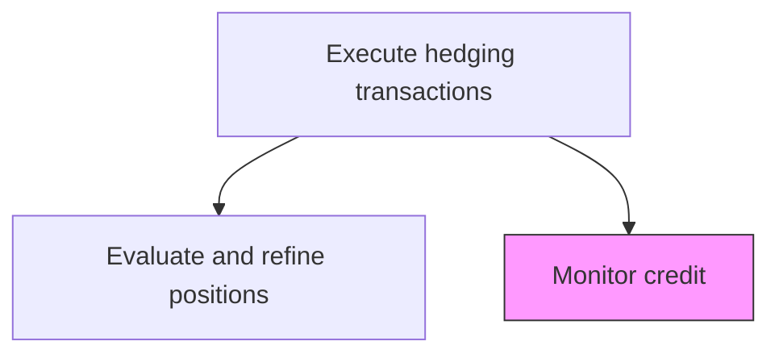
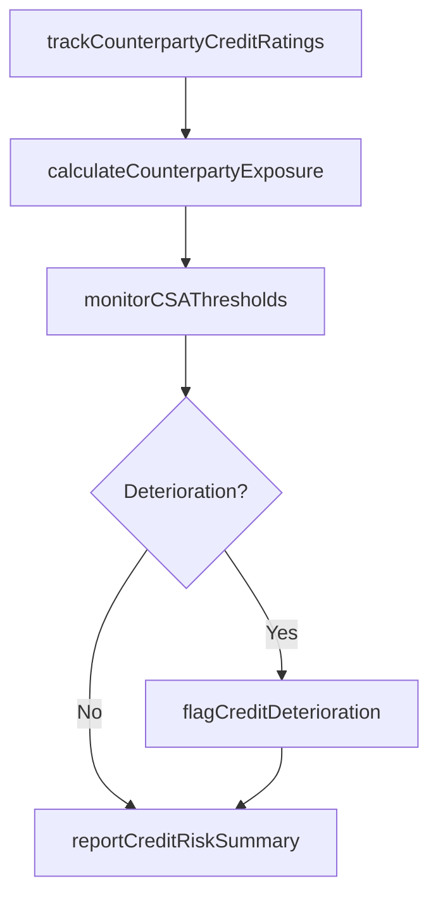

# Monitor credit

> Business-as-Code definition for credit. Models the end-to-end process of monitor credit as a programmable workflow.

## Overview

Monitoring credit within the hedging transaction context involves tracking the creditworthiness of derivative counterparties to ensure the organization's hedge positions do not create unacceptable counterparty credit risk. This includes reviewing external credit ratings and CDS spreads for each counterparty, calculating current and potential future credit exposure from outstanding derivative positions, monitoring compliance with ISDA credit support annex thresholds, and flagging counterparties showing signs of credit deterioration. Proactive credit monitoring enables treasury to reduce exposure to weakening counterparties before default, through position reduction, collateral calls, or counterparty substitution.

## Process Hierarchy



## GraphDL

```yaml
monitor:
  object: Credit
  actor: RiskManager
  result: CreditDashboard
```

## Actions

| Action | Description |
|--------|-------------|
| trackCounterpartyCreditRatings | Monitor external credit ratings and CDS spreads for derivative counterparties |
| calculateCounterpartyExposure | Compute current and potential future exposure for each counterparty |
| monitorCSAThresholds | Check derivative positions against ISDA credit support annex thresholds |
| flagCreditDeterioration | Identify counterparties showing adverse credit signals |
| reportCreditRiskSummary | Generate counterparty credit risk dashboard for management review |

## Events

| Event | Description |
|-------|-------------|
| counterpartyCreditRatingsTracked | External ratings and CDS spreads reviewed for counterparties |
| counterpartyExposureCalculated | Current and potential future exposure computed per counterparty |
| csaThresholdsMonitored | Derivative positions checked against credit support annex limits |
| creditDeteriorationFlagged | Counterparty showing adverse credit signals identified and escalated |
| creditRiskSummaryReported | Counterparty credit risk dashboard delivered to management |

## Searches

| Search | Description |
|--------|-------------|
| getCredit | Retrieve credit records filtered by status, date, or owner |
| findCreditByPeriod | Search credit data for a specified date range |
| getCreditSummary | Retrieve summary statistics and trends for credit |
| listCreditHistory | Query the audit trail and change history for credit records |

## Process Flow



## RACI Matrix

| Activity | Responsible | Accountable | Consulted | Informed |
|----------|-------------|-------------|-----------|----------|
| trackCounterpartyCreditRatings | CreditAnalyst | CreditRiskManager | ExternalRatingAgency | Treasurer |
| calculateCounterpartyExposure | RiskAnalyst | RiskManager | TreasuryDealer | Treasurer |
| monitorCSAThresholds | CreditAnalyst | CreditRiskManager | LegalCounsel | TreasuryDealer |
| flagCreditDeterioration | CreditRiskManager | Treasurer | CFO | Board |

## Related Processes

| Process | Relationship |
|---------|-------------|
| 9.7.6.5.4 Evaluate and refine hedging positions | Upstream - position changes affect counterparty exposure |
| 9.7.6.5 Execute hedging transactions | Parent - governing process group |
| 9.7.6.4 Manage exposure risk | Parallel - counterparty credit monitoring complements exposure management |
| 9.7.5.2 Manage financial intermediary relationships | Parallel - credit status affects intermediary panel composition |

## Related Departments

| Department | Role |
|-----------|------|
| Credit Risk | Monitors counterparty credit ratings and calculates exposure |
| Treasury | Manages derivative positions and counterparty relationships |
| Legal | Reviews ISDA agreements and credit support annex terms |

## Related Occupations

| Occupation | Involvement |
|-----------|-------------|
| Credit Analyst | Tracks ratings and monitors credit support annex thresholds |
| Risk Analyst | Calculates counterparty exposure from derivative positions |

## KPIs

| KPI | Description | Unit |
|-----|-------------|------|
| Counterparty Rating Distribution | Percentage of derivative exposure with investment-grade counterparties | % |
| Peak Potential Exposure | Maximum projected future counterparty exposure at 95% confidence | USD |
| CSA Threshold Utilization | Current exposure as percentage of CSA collateral threshold | % |
| Credit Deterioration Alerts | Number of counterparties flagged for credit deterioration per quarter | Count |

## Usage

```typescript
import { monitorCredit } from '@headlessly/monitor-credit'

const client = monitorCredit()

// Track credit ratings and CDS spreads for derivative counterparties
const ratings = await client.trackCounterpartyCreditRatings({
  asOfDate: '2025-03-15',
  counterpartyIds: ['GS-001', 'JPM-002', 'CITI-003'],
  includeMarketIndicators: true
})

// Calculate current and potential future exposure per counterparty
const exposure = await client.calculateCounterpartyExposure({
  asOfDate: '2025-03-15',
  portfolio: 'all-derivatives',
  confidenceLevel: 0.95,
  horizon: '1-year'
})
```
