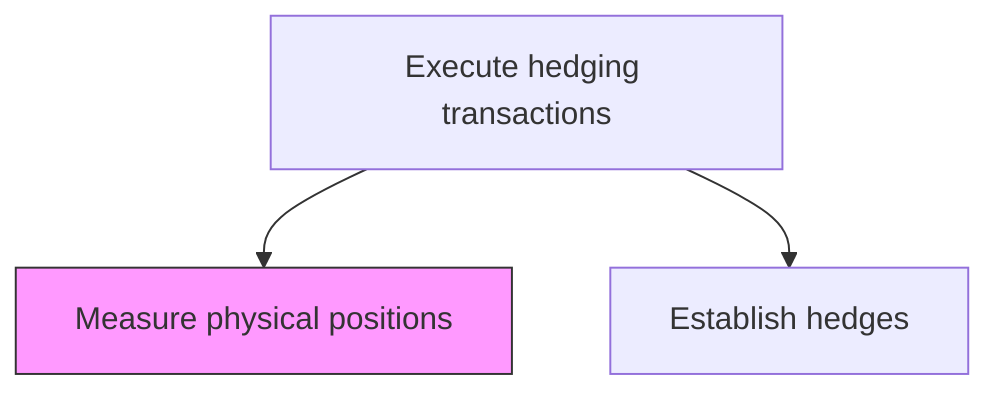
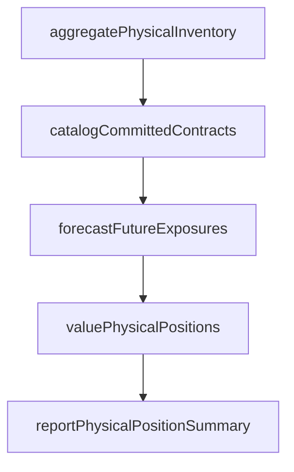

# Measure physical positions

> Business-as-Code definition for physical positions. Models the end-to-end process of measure physical positions as a programmable workflow.

## Overview

Measuring physical positions involves quantifying the organization's underlying exposures in commodities, currencies, or other physical assets that need to be hedged using derivative instruments. This includes aggregating inventory volumes, committed purchase and sale contracts, forecasted production or consumption, and any other physical commitments that create market price risk. Accurate measurement of physical positions is the essential first step in the hedging process, providing the baseline against which derivative hedges are sized and the reference for ongoing hedge effectiveness evaluation.

## Process Hierarchy



## GraphDL

```yaml
measure:
  object: Physical Positions
  actor: RiskManager
  result: PhysicalPositionsMeasurement
```

## Actions

| Action | Description |
|--------|-------------|
| aggregatePhysicalInventory | Collect current inventory volumes and values across all locations |
| catalogCommittedContracts | Identify and quantify all committed purchase and sale contracts |
| forecastFutureExposures | Project anticipated physical positions from production and consumption plans |
| valuePhysicalPositions | Mark physical positions to current market prices |
| reportPhysicalPositionSummary | Generate comprehensive physical position report for hedging analysis |

## Events

| Event | Description |
|-------|-------------|
| physicalInventoryAggregated | Current inventory volumes and values collected |
| committedContractsCataloged | All committed purchase and sale contracts quantified |
| futureExposuresForecasted | Anticipated physical positions projected from operational plans |
| physicalPositionsValued | Physical positions marked to current market prices |
| physicalPositionSummaryReported | Comprehensive position report generated for hedging analysis |

## Searches

| Search | Description |
|--------|-------------|
| getPhysicalPositions | Retrieve physical positions records filtered by status, date, or owner |
| findPhysicalPositionsByPeriod | Search physical positions data for a specified date range |
| getPhysicalPositionsSummary | Retrieve summary statistics and trends for physical positions |
| listPhysicalPositionsHistory | Query the audit trail and change history for physical positions records |

## Process Flow



## RACI Matrix

| Activity | Responsible | Accountable | Consulted | Informed |
|----------|-------------|-------------|-----------|----------|
| aggregatePhysicalInventory | RiskAnalyst | RiskManager | SupplyChainManager | Treasurer |
| catalogCommittedContracts | RiskAnalyst | RiskManager | ProcurementManager | TreasuryDealer |
| forecastFutureExposures | RiskAnalyst | RiskManager | OperationsPlanner | Treasurer |
| reportPhysicalPositionSummary | RiskManager | Treasurer | CFO | TreasuryDealer |

## Related Processes

| Process | Relationship |
|---------|-------------|
| 9.7.6.5.2 Establish hedges | Downstream - physical position data drives hedge sizing |
| 9.7.6.5 Execute hedging transactions | Parent - governing process group |
| 9.7.6.1 Develop risk management/hedging strategy | Upstream - strategy defines which physical positions to hedge |
| 9.7.6.5.4 Evaluate and refine hedging positions | Downstream - physical changes trigger hedge adjustments |

## Related Departments

| Department | Role |
|-----------|------|
| Risk Management | Measures and values physical positions for hedging |
| Operations/Supply Chain | Provides inventory and contract data |
| Treasury | Consumes position data for hedge execution decisions |

## Related Occupations

| Occupation | Involvement |
|-----------|-------------|
| Risk Analyst | Aggregates and values physical positions |
| Supply Chain Analyst | Provides inventory and committed contract data |

## KPIs

| KPI | Description | Unit |
|-----|-------------|------|
| Position Measurement Timeliness | Percentage of physical positions measured by scheduled deadline | % |
| Forecast Accuracy | Variance between forecasted and actual physical position volumes | % |
| Position Data Completeness | Percentage of physical exposures captured in position reporting | % |
| Valuation Freshness | Age of market prices used for physical position valuation | Hours |

## Usage

```typescript
import { measurePhysicalPositions } from '@headlessly/measure-physical-positions'

const client = measurePhysicalPositions()

// Aggregate physical inventory across all locations
const inventory = await client.aggregatePhysicalInventory({
  asOfDate: '2025-03-15',
  commodities: ['crude-oil', 'natural-gas', 'copper'],
  locations: ['US-Gulf', 'EU-ARA', 'Asia-Pacific']
})

// Value physical positions at current market prices
const valuation = await client.valuePhysicalPositions({
  asOfDate: '2025-03-15',
  pricingSource: 'platts',
  includeForwardCommitments: true
})
```
