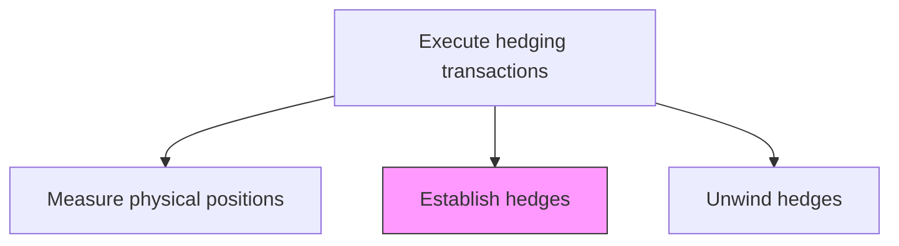
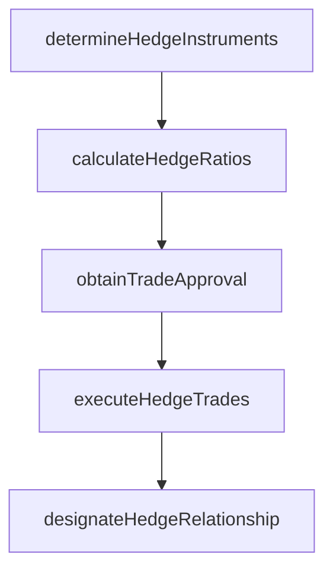

# Establish hedges

> Business-as-Code definition for hedges. Models the end-to-end process of establish hedges as a programmable workflow.

## Overview

Establishing hedges involves selecting and executing derivative trades that offset the physical position exposures measured in the prior step. This includes determining the optimal hedge instruments (futures, forwards, swaps, or options), calculating the hedge ratio and notional amounts required to achieve the target coverage, obtaining trade execution approval, and placing orders with approved counterparties or exchanges. Each new hedge is formally designated under hedge accounting standards, with documentation linking the hedging instrument to the specific hedged item and defining the effectiveness assessment methodology.

## Process Hierarchy



## GraphDL

```yaml
establish:
  object: Hedges
  actor: RiskManager
  result: HedgesFramework
```

## Actions

| Action | Description |
|--------|-------------|
| determineHedgeInstruments | Select derivative types and tenors appropriate for the underlying exposure |
| calculateHedgeRatios | Compute notional amounts and hedge ratios to achieve target coverage |
| obtainTradeApproval | Submit hedge trade details to treasury for execution authorization |
| executeHedgeTrades | Place derivative orders with approved counterparties or exchanges |
| designateHedgeRelationship | Formally document hedge designation under accounting standards |

## Events

| Event | Description |
|-------|-------------|
| hedgeInstrumentsDetermined | Derivative types and tenors selected for the exposure |
| hedgeRatiosCalculated | Notional amounts and coverage ratios computed |
| tradeApprovalObtained | Hedge trade authorized for execution |
| hedgeTradesExecuted | Derivative orders placed with counterparties or exchanges |
| hedgeRelationshipDesignated | Hedge formally designated under accounting standards |

## Searches

| Search | Description |
|--------|-------------|
| getHedges | Retrieve hedges records filtered by status, date, or owner |
| findHedgesByPeriod | Search hedges data for a specified date range |
| getHedgesSummary | Retrieve summary statistics and trends for hedges |
| listHedgesHistory | Query the audit trail and change history for hedges records |

## Process Flow



## RACI Matrix

| Activity | Responsible | Accountable | Consulted | Informed |
|----------|-------------|-------------|-----------|----------|
| determineHedgeInstruments | RiskManager | Treasurer | TreasuryDealer | CFO |
| calculateHedgeRatios | RiskAnalyst | RiskManager | QuantitativeAnalyst | Treasurer |
| executeHedgeTrades | TreasuryDealer | Treasurer | IntermediaryRelationshipManager | RiskManager |
| designateHedgeRelationship | HedgeAccountant | Controller | RiskManager | ExternalAuditor |

## Related Processes

| Process | Relationship |
|---------|-------------|
| 9.7.6.5.1 Measure physical positions | Upstream - physical position data drives hedge sizing |
| 9.7.6.5.3 Unwind hedges | Downstream - established hedges may need unwinding |
| 9.7.6.5 Execute hedging transactions | Parent - governing process group |
| 9.7.6.6 Produce hedge accounting transactions and reports | Downstream - hedge designations require accounting treatment |

## Related Departments

| Department | Role |
|-----------|------|
| Treasury | Executes hedge trades and manages counterparty relationships |
| Risk Management | Determines hedge instruments and coverage ratios |
| Accounting | Documents hedge designations for accounting treatment |

## Related Occupations

| Occupation | Involvement |
|-----------|-------------|
| Treasury Dealer | Executes derivative trades for hedging |
| Risk Analyst | Calculates hedge ratios and selects instruments |

## KPIs

| KPI | Description | Unit |
|-----|-------------|------|
| Hedge Establishment Cycle Time | Days from position measurement to hedge execution | Days |
| Target Coverage Achievement | Actual hedge coverage versus target hedge ratio | % |
| Hedge Cost | Total premium and transaction costs for establishing hedges | USD |
| Designation Completeness | Percentage of hedges with complete accounting designation docs | % |

## Usage

```typescript
import { establishHedges } from '@headlessly/establish-hedges'

const client = establishHedges()

// Calculate hedge ratios and notionals for physical positions
const hedgePlan = await client.calculateHedgeRatios({
  physicalPositionId: 'POS-2025-OIL-Q2',
  targetCoverage: 0.80,
  instruments: ['futures', 'swaps']
})

// Execute hedge trades based on approved plan
const trades = await client.executeHedgeTrades({
  hedgePlanId: hedgePlan.id,
  exchange: 'CME',
  counterpartyId: 'GS-001',
  executionStyle: 'limit'
})
```
