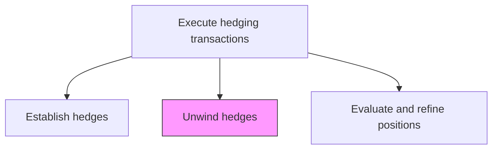
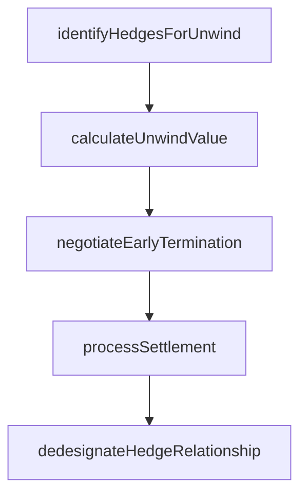

# Unwind hedges

> Business-as-Code definition for hedges. Models the end-to-end process of unwind hedges as a programmable workflow.

## Overview

Unwinding hedges involves closing out or terminating existing derivative positions when the underlying physical exposure has been reduced, the hedge is no longer effective, or market conditions warrant early termination. This includes determining which hedges to unwind based on changes in the physical position or hedging strategy, calculating the mark-to-market settlement value, negotiating early termination with counterparties, and processing the cash settlement. Hedge accounting dedesignation must be handled in coordination with accounting to ensure proper recognition of gains or losses upon unwind, including reclassification from other comprehensive income for cash flow hedges.

## Process Hierarchy



## GraphDL

```yaml
unwind:
  object: Hedges
  actor: RiskManager
  result: HedgesRecord
```

## Actions

| Action | Description |
|--------|-------------|
| identifyHedgesForUnwind | Determine which hedge positions should be closed based on exposure changes |
| calculateUnwindValue | Compute mark-to-market settlement value for each hedge to be terminated |
| negotiateEarlyTermination | Agree on termination terms and settlement with counterparties |
| processSettlement | Execute cash settlement for unwound hedge positions |
| dedesignateHedgeRelationship | Remove hedge accounting designation and process gain/loss recognition |

## Events

| Event | Description |
|-------|-------------|
| hedgesIdentifiedForUnwind | Hedge positions selected for termination based on exposure analysis |
| unwindValueCalculated | Mark-to-market settlement value computed for hedges to be terminated |
| earlyTerminationNegotiated | Termination terms and settlement agreed with counterparties |
| settlementProcessed | Cash settlement completed for unwound hedge positions |
| hedgeRelationshipDedesignated | Hedge accounting designation removed and gains/losses recognized |

## Searches

| Search | Description |
|--------|-------------|
| getHedges | Retrieve hedges records filtered by status, date, or owner |
| findHedgesByPeriod | Search hedges data for a specified date range |
| getHedgesSummary | Retrieve summary statistics and trends for hedges |
| listHedgesHistory | Query the audit trail and change history for hedges records |

## Process Flow



## RACI Matrix

| Activity | Responsible | Accountable | Consulted | Informed |
|----------|-------------|-------------|-----------|----------|
| identifyHedgesForUnwind | RiskManager | Treasurer | TreasuryDealer | CFO |
| calculateUnwindValue | RiskAnalyst | RiskManager | QuantitativeAnalyst | Treasurer |
| negotiateEarlyTermination | TreasuryDealer | Treasurer | IntermediaryRelationshipManager | RiskManager |
| dedesignateHedgeRelationship | HedgeAccountant | Controller | RiskManager | ExternalAuditor |

## Related Processes

| Process | Relationship |
|---------|-------------|
| 9.7.6.5.2 Establish hedges | Upstream - established hedges are candidates for unwinding |
| 9.7.6.5.4 Evaluate and refine hedging positions | Upstream - position evaluation may trigger unwind decisions |
| 9.7.6.5 Execute hedging transactions | Parent - governing process group |
| 9.7.6.6 Produce hedge accounting transactions and reports | Downstream - unwind requires dedesignation accounting entries |

## Related Departments

| Department | Role |
|-----------|------|
| Treasury | Executes hedge unwind trades with counterparties |
| Risk Management | Identifies hedges for termination and calculates values |
| Accounting | Processes hedge dedesignation and gain/loss recognition |

## Related Occupations

| Occupation | Involvement |
|-----------|-------------|
| Treasury Dealer | Negotiates early termination and processes settlements |
| Hedge Accountant | Handles hedge dedesignation and accounting entries |

## KPIs

| KPI | Description | Unit |
|-----|-------------|------|
| Unwind Execution Cost | Spread between theoretical and actual unwind settlement value | bps |
| Unwind Settlement Timeliness | Percentage of unwinds settled within two business days | % |
| Net Unwind Gain/Loss | Total realized gains minus losses from hedge unwinds | USD |
| Dedesignation Timeliness | Days from unwind to completed hedge accounting dedesignation | Days |

## Usage

```typescript
import { unwindHedges } from '@headlessly/unwind-hedges'

const client = unwindHedges()

// Identify hedges that should be unwound due to exposure changes
const candidates = await client.identifyHedgesForUnwind({
  asOfDate: '2025-03-15',
  reasons: ['exposure-reduced', 'ineffective', 'strategy-change'],
  portfolio: 'commodity-hedges'
})

// Calculate mark-to-market unwind values
const values = await client.calculateUnwindValue({
  hedgeIds: candidates.map(c => c.hedgeId),
  pricingDate: '2025-03-15',
  curveSource: 'bloomberg'
})
```
