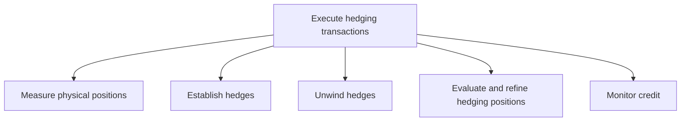
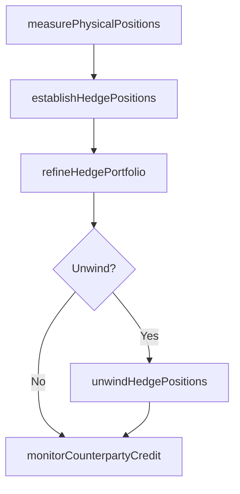

# Execute hedging transactions

> Business-as-Code definition for hedging transaction execution. Models the measurement of physical positions, establishment and unwinding of derivative hedges, ongoing hedge refinement, and credit monitoring for hedging counterparties.

## Overview

Implementing hedging strategy in attempt to alleviate risk. This will include all options, depravities, and futures contracts agreed upon in Develop risk management/hedging strategy [12974].

## Process Hierarchy



## GraphDL

```yaml
execute:
  object: Hedging Transactions
  actor: HedgingTrader
  result: HedgePosition
```

## Actions

| Action | Description |
|--------|-------------|
| measurePhysicalPositions | Quantify the underlying physical or financial positions being hedged |
| establishHedgePositions | Initiate new derivative positions to offset identified exposures |
| unwindHedgePositions | Close out existing hedge positions when no longer needed |
| refineHedgePortfolio | Adjust hedge ratios and instrument selection based on effectiveness |
| monitorCounterpartyCredit | Track creditworthiness of hedging counterparties |

## Events

| Event | Description |
|-------|-------------|
| physicalPositionsMeasured | Underlying positions quantified for hedging purposes |
| hedgePositionsEstablished | New derivative hedge positions initiated |
| hedgePositionsUnwound | Existing hedge positions closed out |
| hedgePortfolioRefined | Hedge ratios and instruments adjusted |
| counterpartyCreditMonitored | Hedging counterparty creditworthiness reviewed |

## Searches

| Search | Description |
|--------|-------------|
| getPhysicalPositions | Retrieve underlying positions subject to hedging |
| getHedgePortfolio | Query current derivative hedge positions |
| getCounterpartyCreditStatus | Retrieve credit status of hedging counterparties |

## Process Flow



## RACI Matrix

| Activity | Responsible | Accountable | Consulted | Informed |
|----------|-------------|-------------|-----------|----------|
| measurePhysicalPositions | HedgingTrader | Treasurer | RiskManager | CFO |
| establishHedgePositions | HedgingTrader | Treasurer | RiskStrategist | CFO |
| monitorCounterpartyCredit | CreditAnalyst | HedgingTrader | RiskManager | Treasurer |

## Sub-Processes

| ID | Name | Description |
|----|------|-------------|
| 9.7.6.5.1 | Measure physical positions | Evaluating investments made in some market to offset the risks of investing in a contrary or opposin |
| 9.7.6.5.2 | Establish hedges | Determining which hedge options to execute. |
| 9.7.6.5.3 | Unwind hedges | Closing out a position or cashing in derivatives early. |
| 9.7.6.5.4 | Evaluate and refine hedging positions | Examining options in the market for hedging investments. Select an option. |
| 9.7.6.5.5 | Monitor credit | Revising credit reports periodically for accurateness and changes that could be suggestive of duplic |

## Related Processes

| Process | Relationship |
|---------|-------------|
| 9.7.6.1 Develop risk management/hedging strategy | Upstream - strategy defines hedging approach |
| 9.7.6.6 Produce hedge accounting transactions and reports | Downstream - executed hedges require accounting |
| 9.7.6.2 Manage interest rate risk | Parallel - rate hedges executed through this process |

## Related Departments

| Department | Role |
|-----------|------|
| Treasury | Executes and manages hedging transactions |
| Risk Management | Monitors hedge effectiveness and counterparty credit |
| Accounting | Records hedge transactions and accounting treatment |

## Related Occupations

| Occupation | Involvement |
|-----------|-------------|
| Hedging Trader | Executes derivative hedge transactions |
| Credit Analyst | Monitors hedging counterparty creditworthiness |

## KPIs

| KPI | Description | Unit |
|-----|-------------|------|
| Hedge Effectiveness | Percentage change correlation between hedge and hedged item | % |
| Hedge Ratio Accuracy | Actual hedge ratio versus target hedge ratio deviation | % |
| Counterparty Credit Utilization | Hedge exposure as percentage of counterparty credit limit | % |

## Usage

```typescript
import { executeHedgingTransactions } from '@headlessly/execute-hedging-transactions'

const hedging = executeHedgingTransactions()

const position = await hedging.establishHedgePositions({
  exposureType: 'fx-revenue',
  notional: 25000000,
  instrument: 'forward',
  currencyPair: 'EUR/USD',
  tenor: '6-month'
})
```
