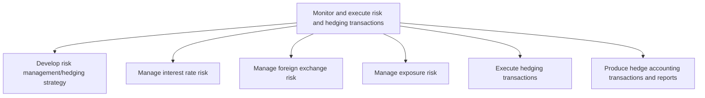
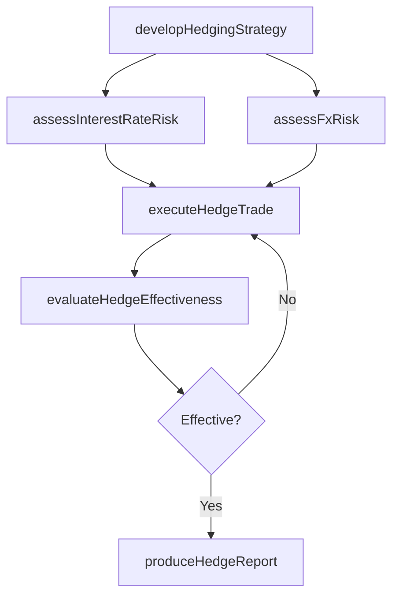

# Monitor and execute risk and hedging transactions

> Business-as-Code definition for financial risk monitoring and hedging execution. Models the development of hedging strategies, management of interest rate and foreign exchange risk, exposure monitoring, hedge execution, and hedge accounting reporting.

## Overview

Performing transactions that limit investment risk with the help of derivatives, such as options and futures contracts. Manage interest rates, foreign exchange, and exposure risks. Develop and execute hedging transactions. Evaluate and refine hedging positions. Produce hedge accounting transactions and reports. Monitor credit.

## Process Hierarchy



## GraphDL

```yaml
monitor:
  object: And Execute Risk And Hedging Transactions
  actor: RiskManager
  result: HedgingPosition
```

## Actions

| Action | Description |
|--------|-------------|
| developHedgingStrategy | Formulate risk management approach and hedging guidelines |
| assessInterestRateRisk | Evaluate exposure to interest rate fluctuations |
| assessFxRisk | Measure foreign exchange exposure across currencies |
| executeHedgeTrade | Place derivative contracts to offset identified risks |
| evaluateHedgeEffectiveness | Test whether hedging instruments adequately offset exposure |
| produceHedgeReport | Generate hedge accounting entries and compliance reports |

## Events

| Event | Description |
|-------|-------------|
| hedgingStrategyDeveloped | Risk management and hedging strategy approved |
| interestRateRiskAssessed | Interest rate exposure evaluation completed |
| fxRiskAssessed | Foreign exchange exposure analysis completed |
| hedgeTradeExecuted | Derivative contract placed for risk mitigation |
| hedgeEffectivenessEvaluated | Hedge effectiveness test completed |
| hedgeReportProduced | Hedge accounting report generated |

## Searches

| Search | Description |
|--------|-------------|
| getOpenHedges | List active hedging positions by instrument and exposure type |
| getRiskExposure | Query current risk exposure by category and entity |
| getHedgeEffectivenessResults | Retrieve effectiveness testing results by hedging relationship |
| getDerivativePortfolio | List derivative instruments with mark-to-market valuations |

## Process Flow



## RACI Matrix

| Activity | Responsible | Accountable | Consulted | Informed |
|----------|-------------|-------------|-----------|----------|
| developHedgingStrategy | RiskManager | Treasurer | CFO | Board |
| assessInterestRateRisk | RiskAnalyst | RiskManager | TreasuryTrader | Controller |
| executeHedgeTrade | TreasuryTrader | RiskManager | LegalCounsel | Treasurer |
| produceHedgeReport | TreasuryAccountant | Controller | ExternalAuditor | CFO |

## Sub-Processes

| ID | Name | Description |
|----|------|-------------|
| 9.7.6.1 | Develop risk management/hedging strategy | Taking an investment position to offset exposure to certain risks. This may include purchasing oppos |
| 9.7.6.2 | Manage interest rate risk | Handling risks arising from changes in the interest rate. |
| 9.7.6.3 | Manage foreign exchange risk | Taking care of foreign-exchange risks. |
| 9.7.6.4 | Manage exposure risk | Taking care of exposure risks. Maintain financial investments in particular investments or a portfol |
| 9.7.6.5 | Execute hedging transactions | Implementing hedging strategy in attempt to alleviate risk. This will include all options, depraviti |
| 9.7.6.6 | Produce hedge accounting transactions and reports | Preparing and documenting accounts and records of all hedging investment transactions to reduce risk |

## Related Processes

| Process | Relationship |
|---------|-------------|
| 9.7.5 Manage debt and investment | Upstream - investment portfolio generates risk exposure |
| 9.7.3 Manage cash | Parallel - cash flow uncertainty drives hedging needs |
| 9.10 Manage international funds/consolidation | Parallel - FX exposure from international operations |

## Related Departments

| Department | Role |
|-----------|------|
| Risk Management | Develops hedging strategy and monitors exposure |
| Treasury | Executes hedging trades and manages positions |
| Accounting | Records hedge accounting entries and effectiveness tests |
| Legal | Reviews derivative agreements and ISDA documentation |

## Related Occupations

| Occupation | Involvement |
|-----------|-------------|
| Financial Risk Manager | Develops risk strategy and monitors exposure limits |
| Treasury Trader | Executes derivative and hedging transactions |
| Hedge Accounting Specialist | Manages hedge documentation and effectiveness testing |

## KPIs

| KPI | Description | Unit |
|-----|-------------|------|
| Hedge Effectiveness Ratio | Percentage of risk offset achieved by hedge instruments | % |
| Value at Risk | Maximum expected loss at a given confidence level | Currency |
| Hedge Coverage Ratio | Percentage of identified exposures with active hedges | % |
| Derivative P&L | Net profit or loss on derivative positions | Currency |

## Usage

```typescript
import { monitorAndExecuteRiskAndHedgingTransactions } from '@headlessly/monitor-and-execute-risk-and-hedging-transactions'

const risk = monitorAndExecuteRiskAndHedgingTransactions()

// Assess current FX risk exposure
const fxExposure = await risk.assessFxRisk({
  currencies: ['EUR', 'GBP', 'JPY'],
  horizon: '90-day',
  confidenceLevel: 0.95
})

// Execute a forward contract to hedge EUR exposure
const hedge = await risk.executeHedgeTrade({
  instrument: 'fx-forward',
  currencyPair: 'EUR/USD',
  notional: 5000000,
  settlementDate: '2025-06-30'
})
```
