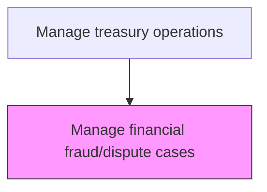
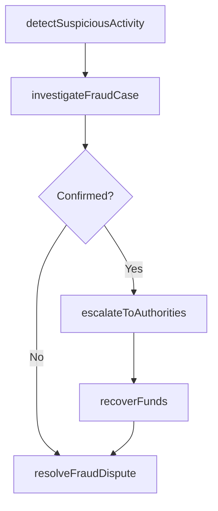

# Manage financial fraud/dispute cases

> Business-as-Code definition for financial fraud and dispute case management. Models the detection, investigation, resolution, and reporting of suspected financial fraud and payment disputes within treasury operations.

## Overview

Managing financial fraud and dispute cases covers the end-to-end lifecycle of detecting, investigating, resolving, and reporting suspected financial fraud and payment disputes within treasury operations. This includes monitoring transaction patterns using rule-based and anomaly detection systems, conducting detailed forensic investigations when suspicious activity is flagged, determining case outcomes through evidence analysis, and applying corrective actions such as transaction reversals or account freezes. Confirmed fraud cases are escalated to law enforcement and regulatory authorities, while fund recovery efforts are initiated to reclaim misappropriated assets.

## Process Hierarchy



## GraphDL

```yaml
manage:
  object: Financial Fraud/dispute Cases
  actor: FraudInvestigator
  result: CaseResolution
```

## Actions

| Action | Description |
|--------|-------------|
| detectSuspiciousActivity | Identify potentially fraudulent transactions through monitoring |
| investigateFraudCase | Conduct detailed investigation of suspected fraud |
| resolveFraudDispute | Determine outcome and apply corrective actions |
| escalateToAuthorities | Report confirmed fraud to law enforcement or regulators |
| recoverFunds | Initiate recovery of misappropriated funds |

## Events

| Event | Description |
|-------|-------------|
| suspiciousActivityDetected | Potentially fraudulent transaction flagged |
| fraudCaseInvestigated | Fraud investigation completed |
| fraudDisputeResolved | Case outcome determined and actions applied |
| caseEscalatedToAuthorities | Confirmed fraud reported to authorities |
| fundsRecovered | Misappropriated funds reclaimed |

## Searches

| Search | Description |
|--------|-------------|
| getOpenCases | List active fraud and dispute cases by status |
| getCaseHistory | Retrieve investigation history for a specific case |
| getFraudMetrics | Query fraud detection and resolution statistics |

## Process Flow



## RACI Matrix

| Activity | Responsible | Accountable | Consulted | Informed |
|----------|-------------|-------------|-----------|----------|
| detectSuspiciousActivity | FraudAnalyst | FraudInvestigator | ITSecurity | Treasurer |
| investigateFraudCase | FraudInvestigator | Treasurer | LegalCounsel | CFO |
| resolveFraudDispute | FraudInvestigator | Treasurer | LegalCounsel | ComplianceOfficer |
| escalateToAuthorities | FraudInvestigator | CFO | LegalCounsel | Board |
| recoverFunds | FraudInvestigator | Treasurer | LegalCounsel | CFO |

## Related Processes

| Process | Relationship |
|---------|-------------|
| 9.7.3 Manage cash | Upstream - cash transactions are monitored for fraud |
| 9.8 Manage internal controls | Parallel - fraud prevention is part of the control framework |
| 9.7.5.5 Process debt and investment transactions | Upstream - investment transactions monitored for fraud patterns |
| 9.7.5.6 Process foreign currency transactions | Upstream - FX transactions monitored for suspicious activity |

## Related Departments

| Department | Role |
|-----------|------|
| Treasury | Detects and investigates financial fraud |
| Legal | Advises on regulatory reporting and litigation |
| Security | Supports fraud investigation and evidence preservation |

## Related Occupations

| Occupation | Involvement |
|-----------|-------------|
| Fraud Investigator | Leads financial fraud investigations |
| Fraud Analyst | Monitors transactions for suspicious patterns |

## KPIs

| KPI | Description | Unit |
|-----|-------------|------|
| Fraud Detection Rate | Percentage of actual fraud cases detected by monitoring | % |
| Case Resolution Time | Average days to resolve a fraud or dispute case | Days |
| Fund Recovery Rate | Percentage of misappropriated funds recovered | % |
| False Positive Rate | Percentage of flagged transactions confirmed as non-fraudulent | % |

## Usage

```typescript
import { manageFinancialFraudDisputeCases } from '@headlessly/manage-financial-fraud-dispute-cases'

const fraud = manageFinancialFraudDisputeCases()

const investigation = await fraud.investigateFraudCase({
  caseId: 'FRD-2025-0023',
  suspectedAmount: 150000,
  transactionIds: ['PMT-2025-08821', 'PMT-2025-08934']
})

// Detect suspicious activity using transaction monitoring rules
const alerts = await fraud.detectSuspiciousActivity({
  monitoringPeriod: '2025-03',
  rules: ['duplicate-payments', 'unusual-amounts', 'unauthorized-recipients'],
  threshold: 'medium'
})
```
