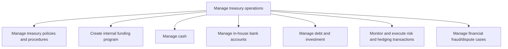
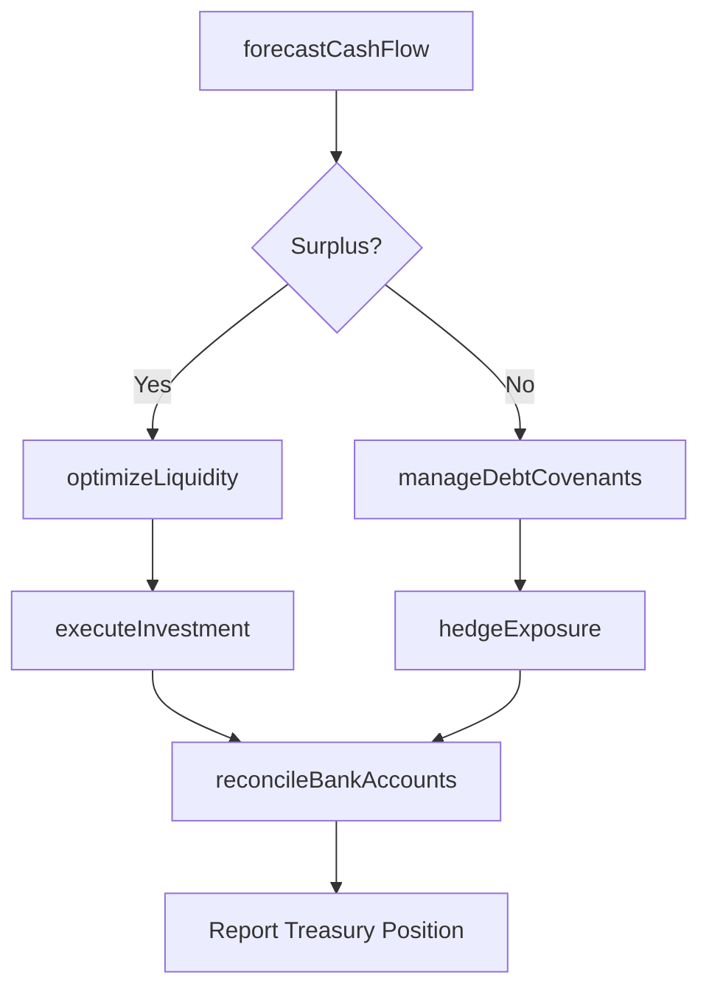

# Manage treasury operations

> Business-as-Code definition for corporate treasury management. Models the end-to-end processes for managing cash, investments, debt, risk hedging, and banking relationships to optimize organizational liquidity and financial stability.

## Overview

Managing business's investments in trading in bonds, currencies, financial derivatives, etc. Manage the financial assets and holdings of the organization. Optimize the organization's liquidity. Invest excess cash. Reduce financial risks.

## Process Hierarchy



## GraphDL

```yaml
manage:
  object: Treasury Operations
  actor: Treasurer
  result: TreasuryPosition
```

## Actions

| Action | Description |
|--------|-------------|
| forecastCashFlow | Project future cash inflows and outflows across all entities |
| optimizeLiquidity | Allocate surplus cash to maximize returns while maintaining reserves |
| executeInvestment | Place or redeem short-term and long-term investment instruments |
| hedgeExposure | Initiate derivative or forward contracts to mitigate financial risk |
| reconcileBankAccounts | Match treasury records against bank statements for accuracy |
| manageDebtCovenants | Monitor and ensure compliance with loan agreement terms |

## Events

| Event | Description |
|-------|-------------|
| cashFlowForecasted | Cash flow projection completed for the period |
| liquidityOptimized | Surplus cash allocated to optimal instruments |
| investmentExecuted | Investment transaction placed or redeemed |
| exposureHedged | Risk hedging position established or adjusted |
| bankAccountsReconciled | Treasury-to-bank reconciliation completed |
| debtCovenantsReviewed | Loan covenant compliance review finalized |

## Searches

| Search | Description |
|--------|-------------|
| getCashPosition | Retrieve current consolidated cash position across all accounts |
| getInvestmentPortfolio | List active investments by type, maturity, and yield |
| getDebtSchedule | Retrieve outstanding debt obligations and repayment schedule |
| getHedgingPositions | List open hedging contracts and mark-to-market values |
| getBankRelationships | Query banking partners with fee structures and services |

## Process Flow



## RACI Matrix

| Activity | Responsible | Accountable | Consulted | Informed |
|----------|-------------|-------------|-----------|----------|
| forecastCashFlow | TreasuryAnalyst | Treasurer | Controller | CFO |
| optimizeLiquidity | Treasurer | CFO | InvestmentAdvisor | Board |
| executeInvestment | TreasuryAnalyst | Treasurer | RiskManager | Finance |
| hedgeExposure | RiskManager | Treasurer | LegalCounsel | CFO |
| reconcileBankAccounts | TreasuryAccountant | Treasurer | ExternalAuditor | Controller |

## Sub-Processes

| ID | Name | Description |
|----|------|-------------|
| 9.7.1 | Manage treasury policies and procedures | Managing rules and regulations for investments in trading in bonds, currencies, financial derivative |
| 9.7.2 | Create internal funding program | Designing and implementing intercompany financing structures to fund business unit capital needs. |
| 9.7.3 | Manage cash | Taking care of all cash-related activities in the business. Manage and reconcile cash positions. Man |
| 9.7.4 | Manage in-house bank accounts | Managing financial services provided by an in-house bank structure in the corporation that is operat |
| 9.7.5 | Manage debt and investment | Taking care of the organization's financial position. Manage its loans or debts from different sourc |
| 9.7.6 | Monitor and execute risk and hedging transactions | Performing transactions that limit investment risk with the help of derivatives, such as options and |
| 9.7.7 | Manage financial fraud/dispute cases | Handling cases that involve financial fraud. Resolve disputes. |

## Related Processes

| Process | Relationship |
|---------|-------------|
| 9.6 Process accounts payable and expense reimbursements | Upstream - cash disbursements feed treasury |
| 9.5 Process accounts receivable | Upstream - cash collections feed cash position |
| 9.8 Manage internal controls | Parallel - controls govern treasury operations |
| 9.10 Manage international funds/consolidation | Downstream - treasury supports cross-border funds |

## Related Departments

| Department | Role |
|-----------|------|
| Treasury | Primary owner of cash, investment, and risk management |
| Finance | Provides budgets and financial data for forecasting |
| Risk Management | Advises on hedging strategies and exposure limits |
| Legal | Reviews debt covenants and derivative agreements |
| Accounting | Records treasury transactions and reconciliations |

## Related Occupations

| Occupation | Involvement |
|-----------|-------------|
| Treasurer | Strategic oversight and decision-making |
| Treasury Analyst | Cash forecasting, investment analysis, and reporting |
| Financial Risk Manager | Exposure assessment and hedging execution |
| Corporate Banking Relationship Manager | Bank negotiations and service management |

## KPIs

| KPI | Description | Unit |
|-----|-------------|------|
| Cash Forecast Accuracy | Variance between forecasted and actual cash positions | % |
| Return on Invested Cash | Yield earned on short-term cash investments | Basis Points |
| Debt Service Coverage Ratio | Ratio of operating income to total debt service | Ratio |
| Hedging Effectiveness | Percentage of risk offset achieved by hedge instruments | % |
| Bank Fee Optimization | Reduction in total banking fees year over year | % |

## Usage

```typescript
import { manageTreasuryOperations } from '@headlessly/manage-treasury-operations'

const treasury = manageTreasuryOperations()

// Forecast cash flows for the upcoming quarter
const forecast = await treasury.forecastCashFlow({
  period: 'Q2-2025',
  entities: ['US-HQ', 'EU-Sub', 'APAC-Sub'],
  granularity: 'weekly'
})

// Invest surplus cash in money market instruments
const investment = await treasury.executeInvestment({
  instrument: 'money-market',
  amount: 5000000,
  currency: 'USD',
  maturity: '90-day'
})
```
