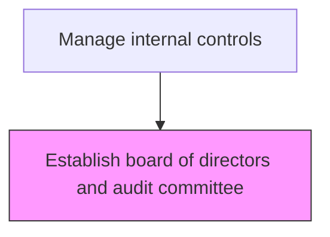
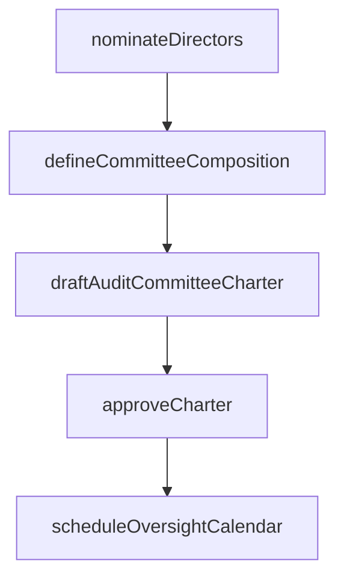

# Establish board of directors and audit committee

> Business-as-Code definition for governance body establishment. Models the formation and chartering of the board of directors and audit committee with defined oversight responsibilities for internal controls.

## Overview

Forming and chartering the board of directors and its audit committee with clearly defined oversight responsibilities for internal financial controls and risk management. This process includes nominating qualified independent directors, defining committee composition requirements such as financial expertise, and drafting charters that specify authority, meeting frequency, and reporting obligations. The audit committee serves as the primary governance body responsible for overseeing the integrity of financial reporting, external audit relationships, and the internal control framework.

## Process Hierarchy



## GraphDL

```yaml
establish:
  object: Board Of Directors And Audit Committee
  actor: CorporateSecretary
  result: BoardCharter
```

## Actions

| Action | Description |
|--------|-------------|
| nominateDirectors | Identify and nominate qualified independent directors for board membership |
| draftAuditCommitteeCharter | Create the audit committee charter defining scope, authority, and responsibilities |
| defineCommitteeComposition | Establish membership requirements including financial expertise and independence |
| approveCharter | Obtain board approval of the audit committee charter and governance structure |
| scheduleOversightCalendar | Set the annual calendar of committee meetings and reporting milestones |

## Events

| Event | Description |
|-------|-------------|
| directorsNominated | Qualified independent directors identified and proposed for board membership |
| auditCommitteeCharterDrafted | Audit committee charter created with defined scope and authority |
| committeeCompositionDefined | Membership requirements and financial expertise criteria established |
| charterApproved | Board approved the audit committee charter and governance structure |
| oversightCalendarScheduled | Annual committee meeting and reporting calendar established |

## Searches

| Search | Description |
|--------|-------------|
| getAuditCommitteeCharter | Retrieve the current audit committee charter and amendments |
| getBoardComposition | Query current board membership, independence status, and committee assignments |
| getCommitteeMeetingSchedule | Retrieve the annual audit committee meeting calendar |

## Process Flow



## RACI Matrix

| Activity | Responsible | Accountable | Consulted | Informed |
|----------|-------------|-------------|-----------|----------|
| nominateDirectors | NominatingCommittee | BoardChair | GeneralCounsel | Shareholders |
| draftAuditCommitteeCharter | CorporateSecretary | CFO | LegalCounsel | ChiefAuditExecutive |
| defineCommitteeComposition | CorporateSecretary | BoardChair | GeneralCounsel | ExternalAuditor |
| approveCharter | BoardChair | Board | AuditCommitteeChair | CFO |

## Related Processes

| Process | Relationship |
|---------|-------------|
| 9.8.1.2 Define and communicate code of ethics | Downstream - board sets tone at the top for ethical conduct |
| 9.8.1.3 Assign roles and responsibility for internal controls | Downstream - audit committee oversees control assignments |
| 9.8.2.2 Monitor control effectiveness | Consumer - audit committee receives control testing results |
| 9.8.1 | Parent - governing process group |

## Related Departments

| Department | Role |
|-----------|------|
| Internal Audit | Contributes to control framework design |
| Compliance | Ensures regulatory alignment |

## Related Occupations

| Occupation | Involvement |
|-----------|-------------|
| Corporate Secretary | Primary executor |

## KPIs

| KPI | Description | Unit |
|-----|-------------|------|
| Board Independence Rate | Percentage of board members classified as independent | % |
| Financial Expert Presence | Number of audit committee members with financial expertise | Count |
| Charter Review Frequency | Number of charter reviews conducted per year | Per Year |
| Committee Meeting Attendance | Average attendance rate at audit committee meetings | % |

## Usage

```typescript
import { establishBoardOfDirectorsAndAuditCommittee } from '@headlessly/establish-board-of-directors-and-audit-committee'

const client = establishBoardOfDirectorsAndAuditCommittee()

// Retrieve the current audit committee charter
const charter = await client.getAuditCommitteeCharter({
  version: 'current',
  includeAmendments: true
})

// Query board composition and independence status
const board = await client.getBoardComposition({
  includeCommitteeAssignments: true,
  includeIndependenceStatus: true
})
```
