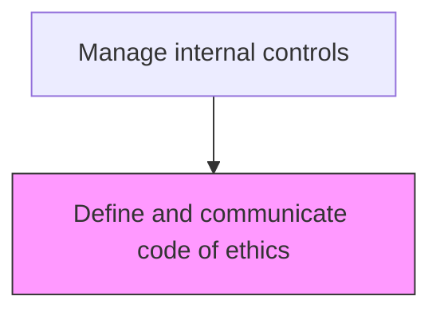
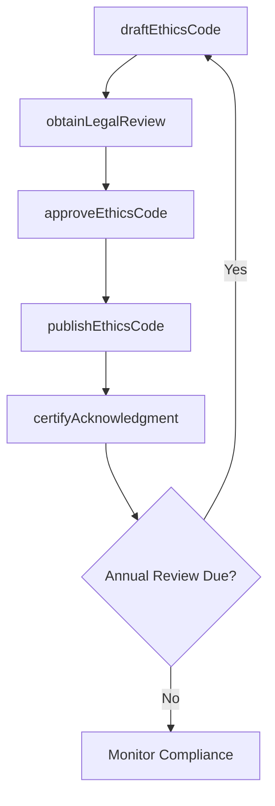

# Define and communicate code of ethics

> Business-as-Code definition for ethics code management. Models the drafting, approval, distribution, and training of the organization's code of ethics and business conduct standards.

## Overview

Drafting, approving, and distributing the organization's code of ethics and business conduct standards to establish the behavioral expectations for all employees, directors, and contractors. This process defines policies on conflicts of interest, anti-bribery, insider trading, confidentiality, and whistleblower protections. The code is communicated through mandatory training, annual acknowledgment certifications, and accessible publication on the corporate intranet, reinforcing the tone at the top set by the board and senior management.

## Process Hierarchy



## GraphDL

```yaml
define:
  object: And Communicate Code Of Ethics
  actor: ComplianceOfficer
  result: EthicsCode
```

## Actions

| Action | Description |
|--------|-------------|
| draftEthicsCode | Create or revise the code of ethics covering conflicts of interest, anti-bribery, and confidentiality |
| obtainLegalReview | Submit the draft code for legal counsel review and regulatory compliance check |
| approveEthicsCode | Secure board and senior management approval of the finalized code |
| publishEthicsCode | Distribute the approved code to all employees via intranet and onboarding materials |
| certifyAcknowledgment | Collect annual attestation from employees confirming they have read and understood the code |

## Events

| Event | Description |
|-------|-------------|
| ethicsCodeDrafted | Code of ethics created or revised with updated policies |
| legalReviewCompleted | Legal counsel reviewed the code for regulatory compliance |
| ethicsCodeApproved | Board and senior management approved the finalized code |
| ethicsCodePublished | Code distributed to all personnel through communication channels |
| acknowledgmentCertified | Employee attestation collected confirming code receipt and understanding |

## Searches

| Search | Description |
|--------|-------------|
| getCurrentEthicsCode | Retrieve the current approved version of the code of ethics |
| getAcknowledgmentStatus | Query employee attestation completion rates by department |
| getEthicsCodeHistory | Retrieve revision history and prior versions of the code |

## Process Flow



## RACI Matrix

| Activity | Responsible | Accountable | Consulted | Informed |
|----------|-------------|-------------|-----------|----------|
| draftEthicsCode | ComplianceOfficer | CFO | LegalCounsel | HRDirector |
| obtainLegalReview | GeneralCounsel | CFO | ExternalCounsel | ComplianceOfficer |
| approveEthicsCode | CFO | Board | AuditCommittee | GeneralCounsel |
| certifyAcknowledgment | HRManager | ComplianceOfficer | DepartmentHeads | AllEmployees |

## Related Processes

| Process | Relationship |
|---------|-------------|
| 9.8.1.1 Establish board of directors and audit committee | Upstream - board sets tone at the top for ethics |
| 9.8.1.3 Assign roles and responsibility for internal controls | Downstream - ethics code informs control responsibilities |
| 9.8.2.5 Operate compliance function | Consumer - compliance function monitors ethics adherence |
| 9.8.1 | Parent - governing process group |

## Related Departments

| Department | Role |
|-----------|------|
| Internal Audit | Contributes to control framework design |
| Compliance | Ensures regulatory alignment |

## Related Occupations

| Occupation | Involvement |
|-----------|-------------|
| Compliance Officer | Primary executor |

## KPIs

| KPI | Description | Unit |
|-----|-------------|------|
| Employee Acknowledgment Rate | Percentage of employees who signed the annual ethics attestation | % |
| Training Completion Rate | Percentage of employees completing ethics training | % |
| Ethics Hotline Reports | Number of ethics concerns reported through official channels | Count |
| Code Review Timeliness | Days from scheduled review date to approved publication | Days |

## Usage

```typescript
import { defineAndCommunicateCodeOfEthics } from '@headlessly/define-and-communicate-code-of-ethics'

const client = defineAndCommunicateCodeOfEthics()

// Retrieve the current ethics code
const code = await client.getCurrentEthicsCode({
  version: 'current',
  includeAmendments: true
})

// Check employee acknowledgment completion rates
const status = await client.getAcknowledgmentStatus({
  year: 2025,
  department: 'all',
  includeOverdue: true
})
```
