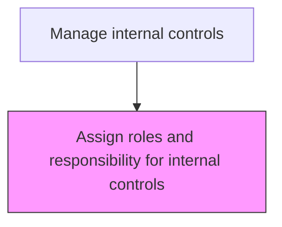
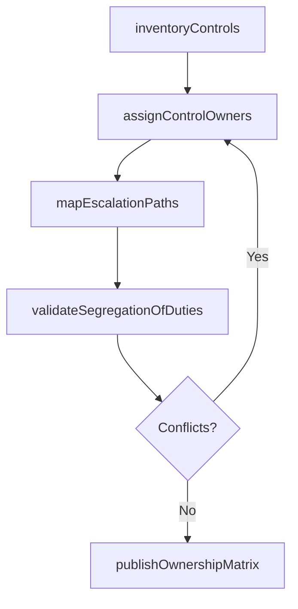

# Assign roles and responsibility for internal controls

> Business-as-Code definition for internal control responsibility assignment. Models the designation of control owners, testers, and escalation authorities for each control activity in the organization.

## Overview

Designating control owners, control testers, and escalation authorities for each internal control activity to ensure clear accountability throughout the organization. This process maps each control to the individual or role responsible for its execution, the manager accountable for its effectiveness, and the parties consulted or informed about results. The output is a comprehensive control ownership matrix that supports segregation of duties, enables timely escalation of deficiencies, and provides external auditors with clear lines of responsibility.

## Process Hierarchy



## GraphDL

```yaml
assign:
  object: Roles And Responsibility For Internal Controls
  actor: ChiefAuditExecutive
  result: ControlOwnershipMatrix
```

## Actions

| Action | Description |
|--------|-------------|
| inventoryControls | Catalog all internal controls requiring ownership assignment |
| assignControlOwners | Designate the responsible individual or role for each control activity |
| mapEscalationPaths | Define escalation routes for control failures and deficiency reporting |
| validateSegregationOfDuties | Verify that control assignments maintain proper segregation of duties |
| publishOwnershipMatrix | Distribute the finalized control ownership matrix to all stakeholders |

## Events

| Event | Description |
|-------|-------------|
| controlsInventoried | All internal controls cataloged for ownership assignment |
| controlOwnersAssigned | Responsible individuals designated for each control activity |
| escalationPathsMapped | Escalation routes defined for control deficiencies |
| segregationOfDutiesValidated | Control assignments verified for proper duty separation |
| ownershipMatrixPublished | Control ownership matrix distributed to stakeholders |

## Searches

| Search | Description |
|--------|-------------|
| getControlOwnershipMatrix | Retrieve the current control-to-owner assignment matrix |
| getUnassignedControls | List controls without designated owners |
| getSegregationConflicts | Query control assignments with potential segregation of duties conflicts |

## Process Flow



## RACI Matrix

| Activity | Responsible | Accountable | Consulted | Informed |
|----------|-------------|-------------|-----------|----------|
| inventoryControls | ChiefAuditExecutive | Controller | ProcessOwners | CFO |
| assignControlOwners | ChiefAuditExecutive | CFO | DepartmentHeads | ExternalAuditor |
| validateSegregationOfDuties | InternalAuditor | ChiefAuditExecutive | ITSecurityManager | Controller |
| publishOwnershipMatrix | ChiefAuditExecutive | CFO | LegalCounsel | AuditCommittee |

## Related Processes

| Process | Relationship |
|---------|-------------|
| 9.8.1.1 Establish board of directors and audit committee | Upstream - audit committee oversees control assignments |
| 9.8.2.1 Design and implement control activities | Downstream - control owners execute assigned controls |
| 9.8.2.2 Monitor control effectiveness | Consumer - ownership matrix defines who is tested |
| 9.8.1 | Parent - governing process group |

## Related Departments

| Department | Role |
|-----------|------|
| Internal Audit | Contributes to control framework design |
| Compliance | Ensures regulatory alignment |

## Related Occupations

| Occupation | Involvement |
|-----------|-------------|
| Chief Audit Executive | Primary executor |

## KPIs

| KPI | Description | Unit |
|-----|-------------|------|
| Control Ownership Coverage | Percentage of controls with designated owners | % |
| Segregation of Duties Compliance | Percentage of control assignments free of duty conflicts | % |
| Ownership Matrix Currency | Days since last ownership matrix review and update | Days |
| Owner Acknowledgment Rate | Percentage of assigned owners who acknowledged their responsibilities | % |

## Usage

```typescript
import { assignRolesAndResponsibilityForInternalControls } from '@headlessly/assign-roles-and-responsibility-for-internal-controls'

const client = assignRolesAndResponsibilityForInternalControls()

// Retrieve the control ownership matrix
const matrix = await client.getControlOwnershipMatrix({
  processArea: 'financialReporting',
  includeEscalationPaths: true
})

// Check for segregation of duties conflicts
const conflicts = await client.getSegregationConflicts({
  department: 'finance',
  includeRecommendations: true
})
```
