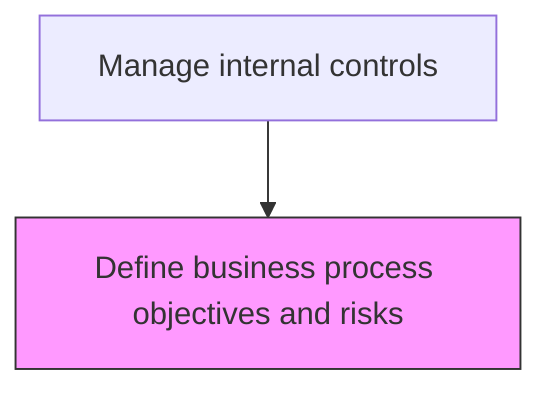
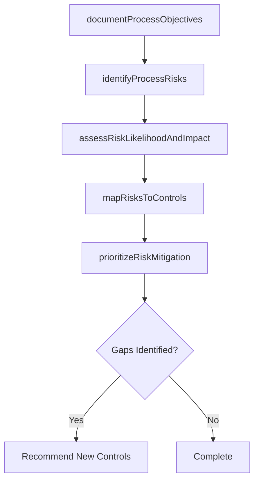

# Define business process objectives and risks

> Business-as-Code definition for process risk assessment. Models the identification of business process objectives, associated risks, and the mapping of risks to control activities.

## Overview

Outlining the objectives and risks associated with a process. Delineate process goals. Determine the risks attached to it. Determine what the process is meant to accomplish, potential issues, a timeline of potential risks, the scope and potential impact of risks, etc.

## Process Hierarchy



## GraphDL

```yaml
define:
  object: Business Process Objectives And Risks
  actor: RiskAssessmentManager
  result: RiskAssessmentReport
```

## Actions

| Action | Description |
|--------|-------------|
| documentProcessObjectives | Articulate the key objectives each business process is designed to achieve |
| identifyProcessRisks | Catalog risks that could prevent business processes from meeting their objectives |
| assessRiskLikelihoodAndImpact | Evaluate the probability and potential severity of each identified risk |
| mapRisksToControls | Link identified risks to the control activities designed to mitigate them |
| prioritizeRiskMitigation | Rank risks by residual exposure to guide control investment decisions |

## Events

| Event | Description |
|-------|-------------|
| processObjectivesDocumented | Key objectives articulated for each business process |
| processRisksIdentified | Risks cataloged that could prevent processes from meeting objectives |
| riskLikelihoodAndImpactAssessed | Probability and severity evaluated for each risk |
| risksToControlsMapped | Risks linked to their mitigating control activities |
| riskMitigationPrioritized | Risks ranked by residual exposure for control investment decisions |

## Searches

| Search | Description |
|--------|-------------|
| getRiskRegister | Retrieve the process risk register by process area and risk category |
| getRiskToControlMapping | Query the mapping between identified risks and mitigating controls |
| getRiskAssessmentHistory | Retrieve historical risk assessments and scoring changes |

## Process Flow



## RACI Matrix

| Activity | Responsible | Accountable | Consulted | Informed |
|----------|-------------|-------------|-----------|----------|
| documentProcessObjectives | RiskAssessmentManager | Controller | ProcessOwners | CFO |
| identifyProcessRisks | RiskAssessmentManager | Controller | InternalAudit | ExternalAuditor |
| assessRiskLikelihoodAndImpact | RiskAssessmentManager | CFO | ChiefAuditExecutive | AuditCommittee |
| mapRisksToControls | RiskAssessmentManager | Controller | ControlDesigner | InternalAuditor |

## Related Processes

| Process | Relationship |
|---------|-------------|
| 9.8.1.5 Define entity/unit risk tolerances | Downstream - risk tolerances guide risk assessment scoring |
| 9.8.2.1 Design and implement control activities | Consumer - risk assessment outputs drive control design |
| 9.8.2.2 Monitor control effectiveness | Related - risk ratings inform testing scope and frequency |
| 9.8.1 | Parent - governing process group |

## Related Departments

| Department | Role |
|-----------|------|
| Internal Audit | Contributes to control framework design |
| Compliance | Ensures regulatory alignment |

## Related Occupations

| Occupation | Involvement |
|-----------|-------------|
| Risk Assessment Manager | Primary executor |

## KPIs

| KPI | Description | Unit |
|-----|-------------|------|
| Risk Coverage Rate | Percentage of business processes with documented risk assessments | % |
| Control Mapping Completeness | Percentage of identified risks linked to at least one mitigating control | % |
| Risk Assessment Currency | Days since last risk assessment update | Days |
| High-Risk Process Coverage | Percentage of high-risk processes with controls in place | % |

## Usage

```typescript
import { defineBusinessProcessObjectivesAndRisks } from '@headlessly/define-business-process-objectives-and-risks'

const client = defineBusinessProcessObjectivesAndRisks()

// Retrieve the risk register for financial processes
const risks = await client.getRiskRegister({
  processArea: 'financialReporting',
  riskLevel: 'high',
  includeControlMappings: true
})

// Assess risk likelihood and impact for a specific process
const assessment = await client.assessRiskLikelihoodAndImpact({
  processId: 'revenueRecognition',
  assessmentDate: '2025-06-30',
  methodology: 'COSO-ERM'
})
```
