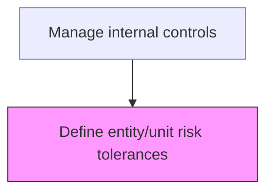
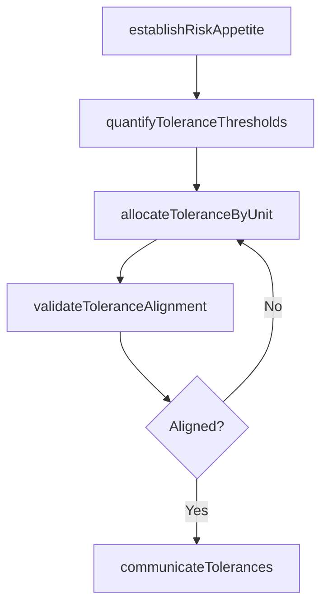

# Define entity/unit risk tolerances

> Business-as-Code definition for risk tolerance definition. Models the establishment of acceptable risk levels by entity, business unit, and risk category to guide control design and monitoring.

## Overview

Outlining the risk tolerance levels of individual units, as well as the organization as a whole. Determine the specific maximum risk to take in quantitative terms for each relevant risk subcategory, including strategic, operational, financial, and compliance risks.

## Process Hierarchy



## GraphDL

```yaml
define:
  object: Entity/unit Risk Tolerances
  actor: RiskManager
  result: RiskToleranceFramework
```

## Actions

| Action | Description |
|--------|-------------|
| establishRiskAppetite | Define the organization-wide risk appetite statement aligned with strategic objectives |
| quantifyToleranceThresholds | Set measurable tolerance limits for each risk category (strategic, operational, financial, compliance) |
| allocateToleranceByUnit | Distribute enterprise risk tolerances across business units based on their risk profile |
| validateToleranceAlignment | Ensure unit-level tolerances aggregate within the enterprise risk appetite |
| communicateTolerances | Distribute approved risk tolerance thresholds to all business unit leaders |

## Events

| Event | Description |
|-------|-------------|
| riskAppetiteEstablished | Organization-wide risk appetite statement defined and approved |
| toleranceThresholdsQuantified | Measurable tolerance limits set for each risk category |
| toleranceAllocatedByUnit | Risk tolerances distributed across business units |
| toleranceAlignmentValidated | Unit-level tolerances confirmed to aggregate within enterprise appetite |
| tolerancesCommunicated | Approved risk tolerance thresholds distributed to business leaders |

## Searches

| Search | Description |
|--------|-------------|
| getRiskAppetiteStatement | Retrieve the current enterprise risk appetite statement |
| getToleranceByUnit | Query risk tolerance thresholds by business unit or entity |
| getToleranceBreaches | List instances where actual risk exposure exceeded defined tolerances |

## Process Flow



## RACI Matrix

| Activity | Responsible | Accountable | Consulted | Informed |
|----------|-------------|-------------|-----------|----------|
| establishRiskAppetite | RiskManager | CFO | Board | AuditCommittee |
| quantifyToleranceThresholds | RiskManager | CFO | Controller | BusinessUnitLeaders |
| allocateToleranceByUnit | RiskManager | CFO | BusinessUnitLeaders | ChiefAuditExecutive |
| communicateTolerances | RiskManager | CFO | GeneralCounsel | AllBusinessUnits |

## Related Processes

| Process | Relationship |
|---------|-------------|
| 9.8.1.4 Define business process objectives and risks | Upstream - process risk assessments inform tolerance setting |
| 9.8.2.1 Design and implement control activities | Consumer - tolerance levels drive control design intensity |
| 9.8.2.2 Monitor control effectiveness | Related - monitoring compares actual exposure to tolerances |
| 9.8.1 | Parent - governing process group |

## Related Departments

| Department | Role |
|-----------|------|
| Internal Audit | Contributes to control framework design |
| Compliance | Ensures regulatory alignment |

## Related Occupations

| Occupation | Involvement |
|-----------|-------------|
| Risk Manager | Primary executor |

## KPIs

| KPI | Description | Unit |
|-----|-------------|------|
| Tolerance Coverage | Percentage of business units with defined risk tolerances | % |
| Tolerance Breach Rate | Number of tolerance threshold breaches per quarter | Count |
| Tolerance Review Frequency | Number of tolerance framework reviews per year | Per Year |
| Appetite Alignment Score | Percentage of unit tolerances aligned with enterprise risk appetite | % |

## Usage

```typescript
import { defineEntityunitRiskTolerances } from '@headlessly/define-entity-unit-risk-tolerances'

const client = defineEntityunitRiskTolerances()

// Retrieve the enterprise risk appetite statement
const appetite = await client.getRiskAppetiteStatement({
  version: 'current',
  includeApprovalHistory: true
})

// Query tolerance thresholds by business unit
const tolerances = await client.getToleranceByUnit({
  businessUnit: 'treasury',
  riskCategory: 'financial',
  includeBreachHistory: true
})
```
