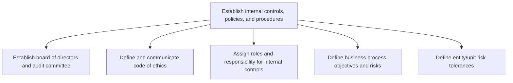
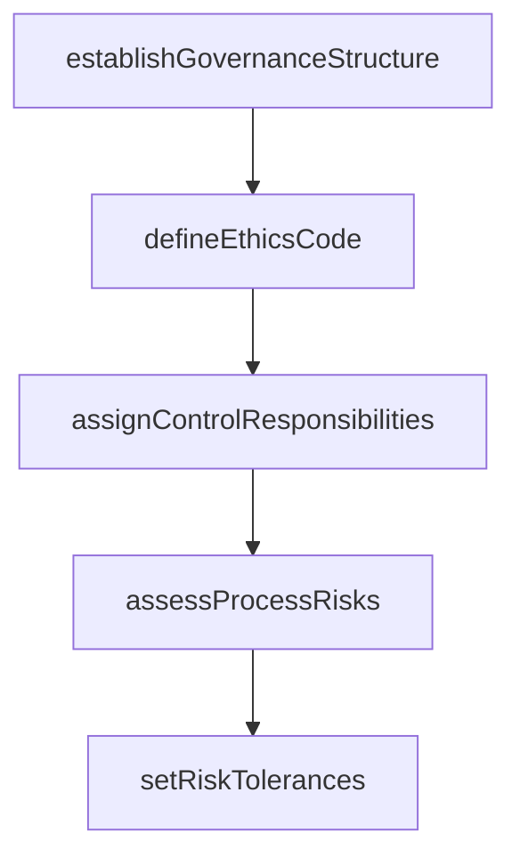

# Establish internal controls, policies, and procedures

> Business-as-Code definition for internal controls establishment. Models the formation of governance structures, ethics codes, role assignments, risk assessments, and tolerance levels that form the foundation of an organization's internal control environment.

## Overview

Forming rules and regulations to ensure the achievement of effectiveness, proficiency of operations, and reliability of financial reporting.

## Process Hierarchy



## GraphDL

```yaml
establish:
  object: Internal Controls, Policies, And Procedures
  actor: ComplianceOfficer
  result: ControlFramework
```

## Actions

| Action | Description |
|--------|-------------|
| establishGovernanceStructure | Form the board of directors and audit committee |
| defineEthicsCode | Draft and communicate the organization's code of ethics |
| assignControlResponsibilities | Designate roles and accountabilities for internal controls |
| assessProcessRisks | Identify objectives and risks for each business process |
| setRiskTolerances | Define acceptable risk levels by entity and business unit |

## Events

| Event | Description |
|-------|-------------|
| governanceStructureEstablished | Board and audit committee formed and chartered |
| ethicsCodeDefined | Code of ethics drafted and communicated |
| controlResponsibilitiesAssigned | Internal control roles formally designated |
| processRisksAssessed | Business process risk assessment completed |
| riskTolerancesSet | Entity and unit risk tolerances documented |

## Searches

| Search | Description |
|--------|-------------|
| getControlFramework | Retrieve current internal control policies and structure |
| getRiskAssessments | List process risk assessments by area and severity |
| getControlOwners | Query designated control owners by process or entity |

## Process Flow



## RACI Matrix

| Activity | Responsible | Accountable | Consulted | Informed |
|----------|-------------|-------------|-----------|----------|
| establishGovernanceStructure | ComplianceOfficer | CFO | LegalCounsel | Board |
| defineEthicsCode | ComplianceOfficer | CEO | HRDirector | AllEmployees |
| assignControlResponsibilities | ChiefAuditExecutive | CFO | ProcessOwners | InternalAudit |
| assessProcessRisks | InternalAuditor | ChiefAuditExecutive | ProcessOwners | Controller |

## Sub-Processes

| ID | Name | Description |
|----|------|-------------|
| 9.8.1.1 | Establish board of directors and audit committee | Establishing board of directors and auditing committee in order to assign roles and responsibilities |
| 9.8.1.2 | Define and communicate code of ethics | Outlining and communicating a code of ethics act responsibly. |
| 9.8.1.3 | Assign roles and responsibility for internal controls | Defining roles, responsibilities, and accountabilities for effectiveness and proficiency of operatio |
| 9.8.1.4 | Define business process objectives and risks | Outlining the objectives and risks associated with a process. Delineate process goals. Determine the |
| 9.8.1.5 | Define entity/unit risk tolerances | Outlining the risk tolerance levels of individual units, as well as the organization as a whole. Det |

## Related Processes

| Process | Relationship |
|---------|-------------|
| 9.8.2 Operate controls and monitor compliance | Downstream - established controls are then operated and monitored |
| 9.8.4 Report on internal controls compliance | Downstream - control framework defines reporting requirements |
| 9.7.1 Manage treasury policies and procedures | Parallel - treasury controls are part of the overall framework |

## Related Departments

| Department | Role |
|-----------|------|
| Compliance | Develops and maintains the control framework |
| Internal Audit | Assesses risks and validates control design |
| Legal | Ensures governance structures meet regulatory requirements |
| Human Resources | Communicates ethics code and control responsibilities |

## Related Occupations

| Occupation | Involvement |
|-----------|-------------|
| Compliance Officer | Leads control framework establishment |
| Chief Audit Executive | Oversees risk assessment and control design |
| Corporate Secretary | Manages board and committee governance |

## KPIs

| KPI | Description | Unit |
|-----|-------------|------|
| Risk Assessment Coverage | Percentage of business processes with documented risk assessments | % |
| Control Owner Assignment Rate | Percentage of key controls with designated owners | % |
| Ethics Training Completion | Percentage of employees completing ethics training | % |

## Usage

```typescript
import { establishInternalControlsPoliciesAndProcedures } from '@headlessly/establish-internal-controls-policies-and-procedures'

const controls = establishInternalControlsPoliciesAndProcedures()

// Assess risks for the revenue cycle
const risks = await controls.assessProcessRisks({
  processArea: 'revenue-cycle',
  framework: 'COSO-2013',
  inherentRiskThreshold: 'medium'
})

// Set risk tolerances for a business unit
const tolerances = await controls.setRiskTolerances({
  entityId: 'BU-Manufacturing',
  riskCategories: ['financial', 'operational', 'compliance'],
  approver: 'CFO'
})
```
