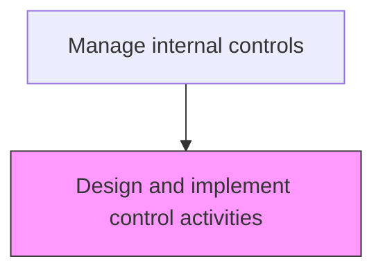
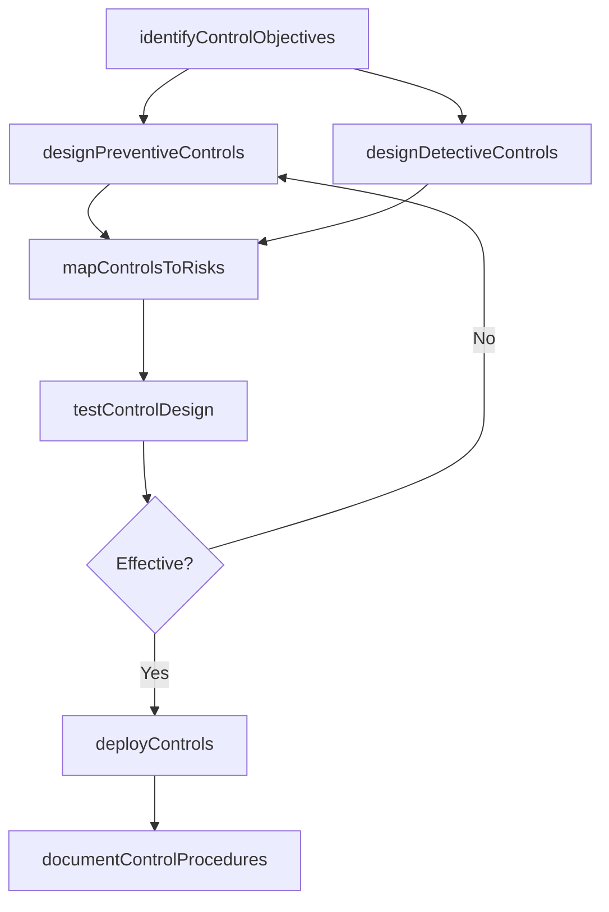

# Design and implement control activities

> Business-as-Code definition for control activity design and implementation. Models the creation, testing, and deployment of preventive and detective control activities to mitigate identified business risks.

## Overview

Designing, testing, and deploying preventive and detective control activities to mitigate identified business risks across the organization's financial and operational processes. This process translates risk assessments into specific control objectives, creates both manual and automated controls to address those objectives, and validates that each control's design is sufficient to mitigate its targeted risk. Controls are mapped to specific risks and financial statement assertions, tested through walkthroughs, and documented with procedures, frequencies, and evidence requirements before operational deployment.

## Process Hierarchy



## GraphDL

```yaml
design:
  object: And Implement Control Activities
  actor: ControlDesigner
  result: ControlActivity
```

## Actions

| Action | Description |
|--------|-------------|
| identifyControlObjectives | Define the objectives each control must achieve based on assessed risks |
| designPreventiveControls | Create controls that prevent errors or fraud before transactions occur |
| designDetectiveControls | Create controls that identify errors or anomalies after transactions occur |
| mapControlsToRisks | Link each control activity to the specific risk or assertion it mitigates |
| testControlDesign | Validate that the control design is sufficient to mitigate the targeted risk |
| deployControls | Implement approved controls into operational processes and systems |
| documentControlProcedures | Record control descriptions, frequencies, evidence requirements, and responsible parties |

## Events

| Event | Description |
|-------|-------------|
| controlObjectivesIdentified | Control objectives have been defined for assessed risks |
| preventiveControlsDesigned | Preventive controls have been created and documented |
| detectiveControlsDesigned | Detective controls have been created and documented |
| controlsToRisksMapped | Controls have been linked to their targeted risks and assertions |
| controlDesignTested | Control design effectiveness has been validated through walkthrough testing |
| controlsDeployed | Approved controls have been implemented in operational processes |
| controlProceduresDocumented | Control descriptions and procedures have been formally recorded |

## Searches

| Search | Description |
|--------|-------------|
| getControlInventory | Retrieve the full inventory of designed controls by process area |
| getControlToRiskMapping | Return the mapping of controls to risks and financial statement assertions |
| getControlDesignTestResults | Retrieve walkthrough testing results for control design validation |
| getControlsByType | List controls filtered by type (preventive, detective, manual, automated) |

## Process Flow



## RACI Matrix

| Activity | Responsible | Accountable | Consulted | Informed |
|----------|-------------|-------------|-----------|----------|
| identifyControlObjectives | ControlDesigner | ChiefAuditExecutive | ProcessOwner | CFO |
| designPreventiveControls | ControlDesigner | Controller | InternalAuditor | ExternalAuditor |
| testControlDesign | InternalAuditor | ChiefAuditExecutive | ExternalAuditor | Controller |
| deployControls | ProcessOwner | Controller | ControlDesigner | AuditCommittee |

## Related Processes

| Process | Relationship |
|---------|-------------|
| 9.8.1.1 Establish internal controls policies and frameworks | Upstream - policies define the control framework |
| 9.8.2.2 Monitor control effectiveness | Downstream - deployed controls are monitored for ongoing effectiveness |
| 9.8.2.3 Remediate control deficiencies | Related - deficiencies trigger control redesign |
| 9.8.4 Report on internal controls | Consumer - control design documentation feeds SOX reporting |

## Related Departments

| Department | Role |
|-----------|------|
| Internal Audit | Tests control design effectiveness and provides independent assurance |
| Compliance | Ensures controls meet regulatory requirements |
| Finance Operations | Implements controls within financial processes |
| Information Technology | Deploys automated controls and system configurations |

## Related Occupations

| Occupation | Involvement |
|-----------|-------------|
| Control Designer | Designs and documents control activities |
| Internal Auditor | Tests control design through walkthroughs |
| Process Owner | Implements and operates controls within their business process |

## KPIs

| KPI | Description | Unit |
|-----|-------------|------|
| Control Coverage Ratio | Percentage of identified risks with at least one mapped control | % |
| Design Effectiveness Rate | Percentage of controls passing design effectiveness testing | % |
| Automation Rate | Percentage of controls that are fully automated vs. manual | % |
| Control Deployment Cycle Time | Average days from control design approval to operational deployment | Days |

## Usage

```typescript
import { designAndImplementControlActivities } from '@headlessly/design-and-implement-control-activities'

const client = designAndImplementControlActivities()

// Get the control inventory for a process area
const controls = await client.getControlInventory({
  processArea: 'revenueRecognition',
  controlType: 'all',
  includeTestResults: true
})

// Map a new control to its targeted risk
const mapping = await client.mapControlsToRisks({
  controlId: 'REV-CTRL-012',
  riskId: 'REV-RISK-003',
  assertion: 'completeness',
  frequency: 'monthly'
})
```
