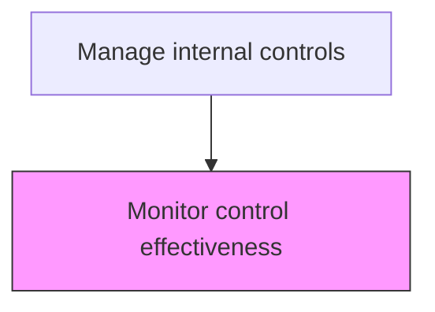
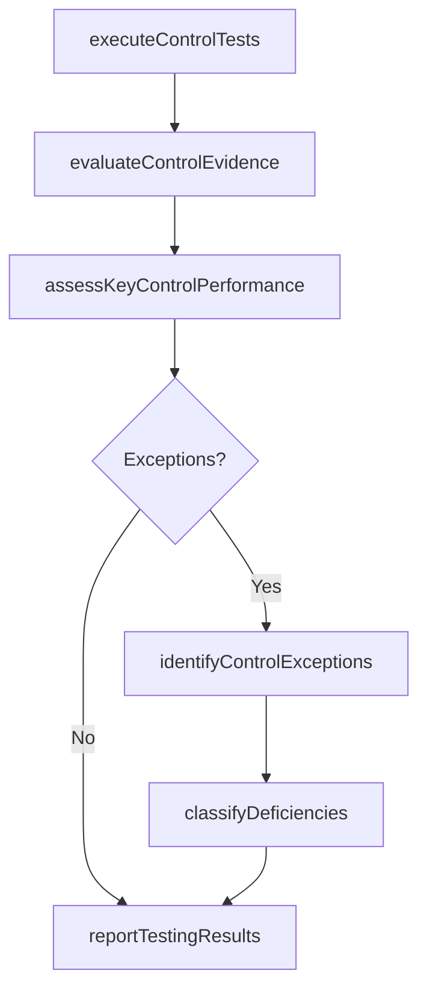

# Monitor control effectiveness

> Business-as-Code definition for control effectiveness monitoring. Models the ongoing testing and evaluation of whether internal controls operate effectively to achieve their intended objectives.

## Overview

Performing ongoing testing and evaluation of whether internal controls operate effectively to achieve their intended objectives throughout the reporting period. This process uses sampling, re-performance, and observation to test operating effectiveness, reviews control evidence such as approvals, reconciliations, and exception logs for adequacy, and classifies any identified issues as deficiencies, significant deficiencies, or material weaknesses. Testing results are communicated to process owners and the audit committee to drive remediation actions and inform management's assessment of internal controls over financial reporting.

## Process Hierarchy



## GraphDL

```yaml
monitor:
  object: Control Effectiveness
  actor: InternalAuditor
  result: EffectivenessAssessment
```

## Actions

| Action | Description |
|--------|-------------|
| executeControlTests | Perform operating effectiveness tests on controls using sampling or re-performance |
| evaluateControlEvidence | Review control evidence (approvals, reconciliations, exception logs) for adequacy |
| assessKeyControlPerformance | Evaluate whether key controls operated as designed throughout the period |
| identifyControlExceptions | Flag instances where controls did not operate as intended |
| classifyDeficiencies | Categorize identified issues as deficiencies, significant deficiencies, or material weaknesses |
| reportTestingResults | Communicate control testing outcomes to process owners and audit committee |

## Events

| Event | Description |
|-------|-------------|
| controlTestsExecuted | Operating effectiveness tests have been performed |
| controlEvidenceEvaluated | Control evidence has been reviewed for adequacy |
| keyControlPerformanceAssessed | Key controls have been evaluated for operating effectiveness |
| controlExceptionsIdentified | Control exceptions have been flagged for follow-up |
| deficienciesClassified | Identified issues have been categorized by severity |
| testingResultsReported | Control testing results have been communicated to stakeholders |

## Searches

| Search | Description |
|--------|-------------|
| getTestingSchedule | Retrieve the control testing schedule by process area and period |
| getControlTestResults | Return operating effectiveness test results for specific controls |
| getExceptionLog | List control exceptions identified during testing |
| getDeficiencySummary | Retrieve a summary of classified deficiencies by severity and process area |
| getControlEffectivenessScorecard | Return the overall control effectiveness scorecard by business unit |

## Process Flow



## RACI Matrix

| Activity | Responsible | Accountable | Consulted | Informed |
|----------|-------------|-------------|-----------|----------|
| executeControlTests | InternalAuditor | ChiefAuditExecutive | ProcessOwner | Controller |
| evaluateControlEvidence | InternalAuditor | ChiefAuditExecutive | ProcessOwner | ExternalAuditor |
| classifyDeficiencies | ChiefAuditExecutive | Controller | ExternalAuditor | AuditCommittee |
| reportTestingResults | ChiefAuditExecutive | CFO | ExternalAuditor | Board |

## Related Processes

| Process | Relationship |
|---------|-------------|
| 9.8.2.1 Design and implement control activities | Upstream - deployed controls are the subject of effectiveness testing |
| 9.8.2.3 Remediate control deficiencies | Downstream - identified deficiencies trigger remediation |
| 9.8.4 Report on internal controls | Consumer - testing results feed internal controls reporting |
| 9.8.1.1 Establish internal controls policies and frameworks | Related - policies define the testing methodology and criteria |

## Related Departments

| Department | Role |
|-----------|------|
| Internal Audit | Performs control testing and evaluates effectiveness |
| Compliance | Monitors regulatory control requirements |
| External Audit | Relies on internal testing and performs independent testing |
| Finance Operations | Operates controls and provides evidence for testing |

## Related Occupations

| Occupation | Involvement |
|-----------|-------------|
| Internal Auditor | Executes control tests and evaluates evidence |
| Chief Audit Executive | Oversees testing program and classifies deficiencies |
| External Auditor | Performs independent testing and reviews internal results |

## KPIs

| KPI | Description | Unit |
|-----|-------------|------|
| Control Test Completion Rate | Percentage of planned control tests completed on schedule | % |
| Operating Effectiveness Rate | Percentage of tested controls rated as operating effectively | % |
| Exception Rate | Number of control exceptions per total tests performed | Ratio |
| Material Weakness Count | Number of identified material weaknesses in the current period | Count |

## Usage

```typescript
import { monitorControlEffectiveness } from '@headlessly/monitor-control-effectiveness'

const client = monitorControlEffectiveness()

// Get control test results for a process area
const results = await client.getControlTestResults({
  processArea: 'accountsPayable',
  period: '2025-Q4',
  includeExceptions: true
})

// Retrieve the overall effectiveness scorecard
const scorecard = await client.getControlEffectivenessScorecard({
  businessUnit: 'all',
  period: '2025-12',
  groupBy: 'processArea'
})
```
