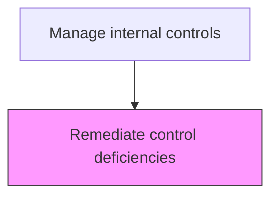
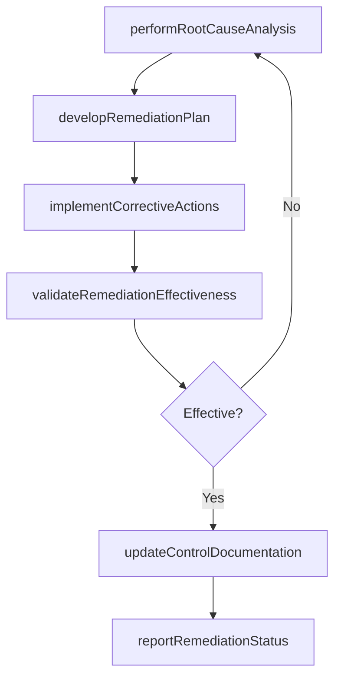

# Remediate control deficiencies

> Business-as-Code definition for control deficiency remediation. Models the corrective action process for identified control weaknesses including root cause analysis, action planning, and validation.

## Overview

Executing the corrective action process for identified control weaknesses, including root cause analysis, remediation planning, implementation of corrective actions, and validation of effectiveness. This process prioritizes deficiencies by severity, developing formal action plans with milestones, owners, and target completion dates for each identified issue. Process owners implement the approved remediation steps while internal audit validates that the remediated control now operates as intended through re-testing, and progress is reported to the audit committee and external auditors.

## Process Hierarchy



## GraphDL

```yaml
remediate:
  object: Control Deficiencies
  actor: ProcessOwner
  result: RemediationPlan
```

## Actions

| Action | Description |
|--------|-------------|
| performRootCauseAnalysis | Investigate the underlying cause of each identified control deficiency |
| developRemediationPlan | Create a corrective action plan with milestones, owners, and target completion dates |
| implementCorrectiveActions | Execute the approved remediation steps to strengthen or replace the deficient control |
| validateRemediationEffectiveness | Test the remediated control to confirm it now operates as intended |
| updateControlDocumentation | Revise control narratives, flowcharts, and risk-control matrices to reflect changes |
| reportRemediationStatus | Communicate remediation progress and outcomes to audit committee and external auditors |

## Events

| Event | Description |
|-------|-------------|
| rootCauseAnalysisCompleted | The underlying cause of the control deficiency has been identified |
| remediationPlanDeveloped | A corrective action plan has been created with owners and milestones |
| correctiveActionsImplemented | Remediation steps have been executed |
| remediationEffectivenessValidated | The remediated control has passed effectiveness testing |
| controlDocumentationUpdated | Control narratives and matrices have been revised |
| remediationStatusReported | Remediation progress has been communicated to stakeholders |

## Searches

| Search | Description |
|--------|-------------|
| getOpenDeficiencies | List all open control deficiencies by severity, process area, and owner |
| getRemediationPlan | Retrieve the corrective action plan for a specific deficiency |
| getRemediationTimeline | Return milestone dates and completion status for active remediation plans |
| getDeficiencyTrendAnalysis | Analyze deficiency trends by type, process area, and period |

## Process Flow



## RACI Matrix

| Activity | Responsible | Accountable | Consulted | Informed |
|----------|-------------|-------------|-----------|----------|
| performRootCauseAnalysis | ProcessOwner | Controller | InternalAuditor | ChiefAuditExecutive |
| developRemediationPlan | ProcessOwner | Controller | ChiefAuditExecutive | CFO |
| validateRemediationEffectiveness | InternalAuditor | ChiefAuditExecutive | ExternalAuditor | AuditCommittee |
| reportRemediationStatus | ChiefAuditExecutive | CFO | ExternalAuditor | Board |

## Related Processes

| Process | Relationship |
|---------|-------------|
| 9.8.2.2 Monitor control effectiveness | Upstream - control testing identifies deficiencies to remediate |
| 9.8.2.1 Design and implement control activities | Related - remediation may require redesigning controls |
| 9.8.4 Report on internal controls | Consumer - remediation status feeds internal controls reporting |
| 9.8.2.6 Implement and maintain controls-related enabling technologies | Related - technology upgrades may be part of remediation |

## Related Departments

| Department | Role |
|-----------|------|
| Internal Audit | Validates remediation effectiveness through re-testing |
| Finance Operations | Implements corrective actions within financial processes |
| Information Technology | Addresses technology-related control deficiencies |
| External Audit | Reviews remediation adequacy for reliance decisions |

## Related Occupations

| Occupation | Involvement |
|-----------|-------------|
| Process Owner | Leads root cause analysis and implements corrective actions |
| Internal Auditor | Validates remediation effectiveness through re-testing |
| Chief Audit Executive | Oversees remediation progress and reports to audit committee |

## KPIs

| KPI | Description | Unit |
|-----|-------------|------|
| Remediation Completion Rate | Percentage of deficiencies remediated by target date | % |
| Average Remediation Cycle Time | Mean days from deficiency identification to validated remediation | Days |
| Repeat Deficiency Rate | Percentage of deficiencies that recur after remediation | % |
| Material Weakness Closure Rate | Percentage of material weaknesses closed within the reporting period | % |

## Usage

```typescript
import { remediateControlDeficiencies } from '@headlessly/remediate-control-deficiencies'

const client = remediateControlDeficiencies()

// Get all open control deficiencies
const deficiencies = await client.getOpenDeficiencies({
  severity: 'materialWeakness',
  processArea: 'all',
  includeRemediationPlan: true
})

// Retrieve the remediation timeline for a specific deficiency
const timeline = await client.getRemediationTimeline({
  deficiencyId: 'DEF-2025-003',
  includeMilestones: true,
  includeTestResults: true
})
```
