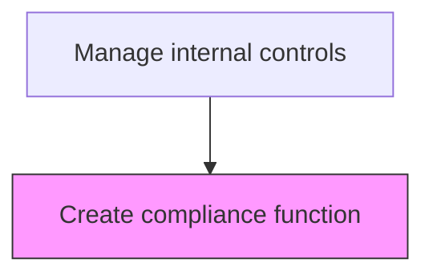
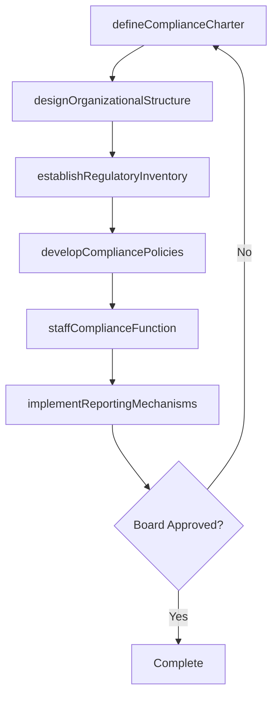

# Create compliance function

> Business-as-Code definition for compliance function creation. Models the establishment of the organizational compliance capability including structure, staffing, charter, and reporting lines.

## Overview

Establishing the organizational compliance function by defining its charter, mandate, organizational structure, staffing requirements, and reporting lines to the audit committee and senior management. This process includes cataloging all applicable laws, regulations, and industry standards, developing compliance policies and escalation procedures, and implementing reporting mechanisms such as whistleblower hotlines and incident management systems. The compliance function serves as the independent second line of defense responsible for monitoring adherence to regulations including anti-money laundering, anti-bribery, conflict of interest, and data privacy requirements.

## Process Hierarchy



## GraphDL

```yaml
create:
  object: Compliance Function
  actor: ChiefComplianceOfficer
  result: ComplianceFunctionCharter
```

## Actions

| Action | Description |
|--------|-------------|
| defineComplianceCharter | Draft the compliance function charter defining mandate, scope, authority, and independence |
| designOrganizationalStructure | Define the compliance team structure, reporting lines, and role responsibilities |
| establishRegulatoryInventory | Catalog all applicable laws, regulations, and industry standards the organization must follow |
| developCompliancePolicies | Create policies and procedures governing compliance activities and escalation paths |
| staffComplianceFunction | Recruit and onboard compliance professionals with appropriate skills and certifications |
| implementReportingMechanisms | Set up whistleblower hotlines, incident reporting channels, and escalation procedures |

## Events

| Event | Description |
|-------|-------------|
| complianceCharterDefined | The compliance function charter has been drafted and approved |
| organizationalStructureDesigned | Compliance team structure and reporting lines have been defined |
| regulatoryInventoryEstablished | Applicable regulations and standards have been cataloged |
| compliancePoliciesDeveloped | Compliance policies and procedures have been created |
| complianceFunctionStaffed | Compliance team members have been recruited and onboarded |
| reportingMechanismsImplemented | Incident reporting channels and escalation procedures are operational |

## Searches

| Search | Description |
|--------|-------------|
| getComplianceCharter | Retrieve the current compliance function charter and mandate |
| getRegulatoryInventory | List all applicable regulations by jurisdiction and domain |
| getComplianceTeamStructure | Return the compliance organization chart and role assignments |
| getReportingChannels | Retrieve available compliance reporting and whistleblower channels |

## Process Flow



## RACI Matrix

| Activity | Responsible | Accountable | Consulted | Informed |
|----------|-------------|-------------|-----------|----------|
| defineComplianceCharter | ChiefComplianceOfficer | CFO | GeneralCounsel | AuditCommittee |
| designOrganizationalStructure | ChiefComplianceOfficer | CFO | HRDirector | ChiefAuditExecutive |
| establishRegulatoryInventory | ComplianceManager | ChiefComplianceOfficer | GeneralCounsel | Controller |
| implementReportingMechanisms | ChiefComplianceOfficer | CFO | GeneralCounsel | Board |

## Related Processes

| Process | Relationship |
|---------|-------------|
| 9.8.2.5 Operate compliance function | Downstream - the created function is then operated on an ongoing basis |
| 9.8.1.1 Establish internal controls policies and frameworks | Upstream - the controls framework defines compliance requirements |
| 9.8.3 Manage and monitor compliance function | Related - ongoing management of the function once established |

## Related Departments

| Department | Role |
|-----------|------|
| Compliance | Primary owner of compliance function creation |
| Legal | Advises on regulatory requirements and charter scope |
| Human Resources | Supports staffing and organizational design |
| Internal Audit | Coordinates independent assurance activities |

## Related Occupations

| Occupation | Involvement |
|-----------|-------------|
| Chief Compliance Officer | Leads the creation and design of the compliance function |
| General Counsel | Advises on regulatory scope and legal obligations |
| Compliance Manager | Assists with regulatory inventory and policy development |

## KPIs

| KPI | Description | Unit |
|-----|-------------|------|
| Charter Approval Timeliness | Days from charter draft to board approval | Days |
| Regulatory Coverage | Percentage of applicable regulations cataloged in the inventory | % |
| Staffing Completion Rate | Percentage of budgeted compliance positions filled | % |
| Reporting Channel Availability | Uptime of whistleblower and incident reporting channels | % |

## Usage

```typescript
import { createComplianceFunction } from '@headlessly/create-compliance-function'

const client = createComplianceFunction()

// Get the regulatory inventory for applicable jurisdictions
const regulations = await client.getRegulatoryInventory({
  jurisdictions: ['US-federal', 'US-CA', 'EU'],
  domains: ['financialReporting', 'dataPrivacy', 'antiMoneyLaundering'],
  status: 'active'
})

// Retrieve the compliance function charter
const charter = await client.getComplianceCharter({
  version: 'current',
  includeApprovalHistory: true
})
```
