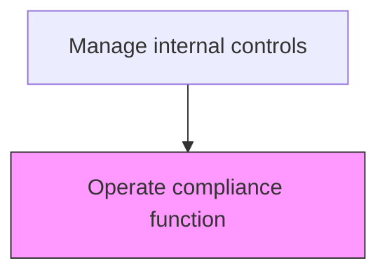
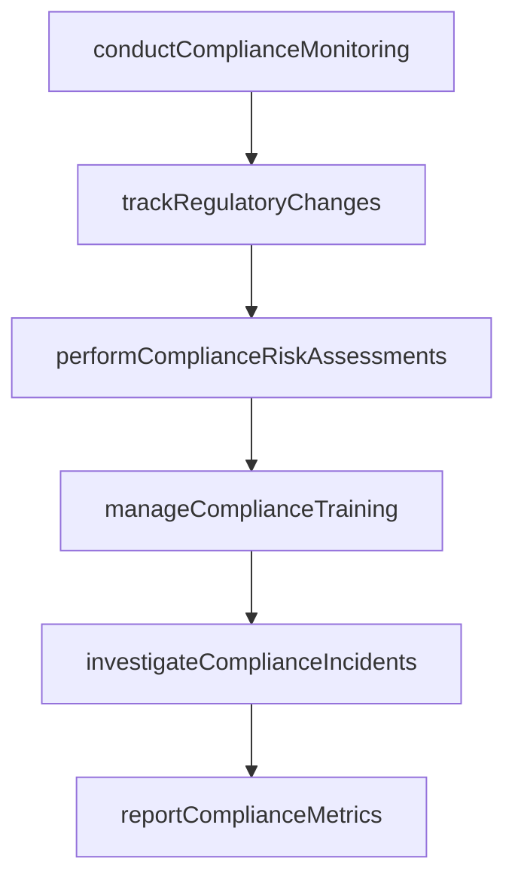

# Operate compliance function

> Business-as-Code definition for compliance function operations. Models the day-to-day execution of compliance monitoring, policy enforcement, training delivery, and regulatory tracking.

## Overview

Executing the day-to-day operations of the compliance function including routine monitoring of business activities, enforcement of compliance policies, delivery and tracking of training programs, investigation of reported incidents, and regulatory change management. This process ensures the organization maintains adherence to applicable laws, regulations, and internal policies through systematic monitoring, risk assessment, and timely response to compliance violations. The compliance function produces periodic dashboards and reports for leadership to demonstrate the effectiveness of the compliance program.

## Process Hierarchy



## GraphDL

```yaml
operate:
  object: Compliance Function
  actor: ComplianceManager
  result: ComplianceOperatingReport
```

## Actions

| Action | Description |
|--------|-------------|
| conductComplianceMonitoring | Perform routine monitoring of business activities against compliance policies |
| manageComplianceTraining | Deliver and track compliance training programs for employees and management |
| investigateComplianceIncidents | Receive, triage, and investigate reported compliance violations or concerns |
| trackRegulatoryChanges | Monitor legislative and regulatory developments and assess their impact |
| performComplianceRiskAssessments | Evaluate compliance risks across business units and prioritize mitigation |
| reportComplianceMetrics | Produce periodic compliance dashboards and reports for leadership and the board |

## Events

| Event | Description |
|-------|-------------|
| complianceMonitoringConducted | Routine compliance monitoring activities have been performed |
| complianceTrainingDelivered | Compliance training has been delivered and completion tracked |
| complianceIncidentInvestigated | A reported compliance concern has been investigated and resolved |
| regulatoryChangesTracked | Regulatory developments have been monitored and impact assessed |
| complianceRiskAssessmentPerformed | Compliance risks have been evaluated across business units |
| complianceMetricsReported | Periodic compliance metrics have been communicated to leadership |

## Searches

| Search | Description |
|--------|-------------|
| getComplianceIncidents | List reported compliance incidents by type, status, and severity |
| getTrainingCompletionRates | Retrieve compliance training completion rates by department and program |
| getRegulatoryChangeLog | Return tracked regulatory changes and their assessed business impact |
| getComplianceRiskHeatMap | Retrieve the compliance risk assessment results by business unit |
| getComplianceDashboard | Return the consolidated compliance metrics dashboard |

## Process Flow



## RACI Matrix

| Activity | Responsible | Accountable | Consulted | Informed |
|----------|-------------|-------------|-----------|----------|
| conductComplianceMonitoring | ComplianceManager | ChiefComplianceOfficer | ProcessOwner | Controller |
| investigateComplianceIncidents | ComplianceManager | ChiefComplianceOfficer | GeneralCounsel | CFO |
| performComplianceRiskAssessments | ComplianceManager | ChiefComplianceOfficer | InternalAuditor | AuditCommittee |
| reportComplianceMetrics | ChiefComplianceOfficer | CFO | ChiefAuditExecutive | Board |

## Related Processes

| Process | Relationship |
|---------|-------------|
| 9.8.2.4 Create compliance function | Upstream - the created function is operated on an ongoing basis |
| 9.8.2.2 Monitor control effectiveness | Related - compliance monitoring complements control testing |
| 9.8.3 Manage and monitor compliance function | Related - governance oversight of compliance operations |
| 9.8.4 Report on internal controls | Consumer - compliance metrics feed internal controls reporting |

## Related Departments

| Department | Role |
|-----------|------|
| Compliance | Primary owner of day-to-day compliance operations |
| Legal | Advises on regulatory interpretation and investigation matters |
| Human Resources | Partners on training delivery and employee conduct matters |
| Internal Audit | Provides independent assurance on compliance program effectiveness |

## Related Occupations

| Occupation | Involvement |
|-----------|-------------|
| Compliance Manager | Executes monitoring, training, and incident investigation |
| Chief Compliance Officer | Oversees function operations and reports to board |
| Compliance Analyst | Performs monitoring procedures and regulatory tracking |

## KPIs

| KPI | Description | Unit |
|-----|-------------|------|
| Training Completion Rate | Percentage of required employees who completed compliance training | % |
| Incident Resolution Time | Average days to investigate and resolve a compliance incident | Days |
| Regulatory Change Response Time | Average days from regulation publication to internal impact assessment | Days |
| Compliance Risk Coverage | Percentage of business units assessed for compliance risk | % |

## Usage

```typescript
import { operateComplianceFunction } from '@headlessly/operate-compliance-function'

const client = operateComplianceFunction()

// Get compliance incidents for investigation
const incidents = await client.getComplianceIncidents({
  status: 'open',
  severity: 'high',
  dateRange: { from: '2025-01-01', to: '2025-12-31' }
})

// Retrieve training completion rates
const training = await client.getTrainingCompletionRates({
  program: 'antiMoneyLaundering',
  department: 'all',
  period: '2025'
})
```
