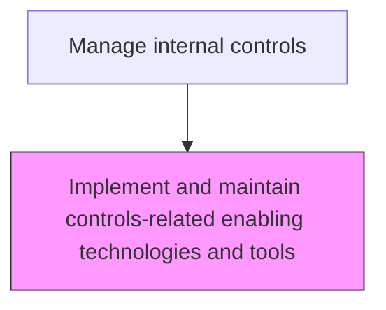
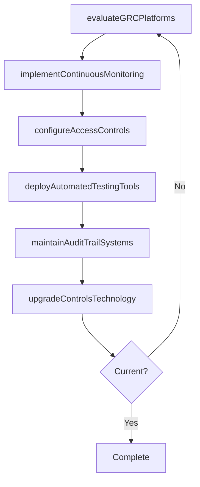

# Implement and maintain controls-related enabling technologies and tools

> Business-as-Code definition for controls technology management. Models the selection, implementation, and maintenance of GRC platforms, automated monitoring tools, and compliance technologies.

## Overview

Selecting, deploying, and maintaining governance, risk, and compliance (GRC) platforms, automated monitoring tools, and compliance technologies that support the internal control framework. This process evaluates technology solutions for automated control testing, continuous transaction monitoring, access control enforcement, and audit trail management. Ongoing maintenance includes applying system upgrades, configuring role-based access controls and segregation of duties rules, and ensuring that audit logging captures all control-relevant transactions across financial systems.

## Process Hierarchy



## GraphDL

```yaml
implement:
  object: And Maintain Controls-related Enabling Technologies And Tools
  actor: GRCSystemsManager
  result: ControlsTechnologyPlatform
```

## Actions

| Action | Description |
|--------|-------------|
| evaluateGRCPlatforms | Assess governance, risk, and compliance platforms for organizational fit |
| implementContinuousMonitoring | Deploy automated monitoring tools for real-time control surveillance |
| configureAccessControls | Set up role-based access controls and segregation of duties in financial systems |
| deployAutomatedTestingTools | Implement tools for automated control testing and evidence collection |
| maintainAuditTrailSystems | Ensure audit logging and trail systems capture all control-relevant transactions |
| upgradeControlsTechnology | Apply patches, upgrades, and enhancements to GRC and monitoring platforms |

## Events

| Event | Description |
|-------|-------------|
| grcPlatformsEvaluated | GRC platforms have been assessed and a selection recommendation made |
| continuousMonitoringImplemented | Automated control monitoring tools have been deployed |
| accessControlsConfigured | Role-based access and segregation of duties have been configured |
| automatedTestingDeployed | Automated control testing tools have been implemented |
| auditTrailSystemsMaintained | Audit logging systems have been verified for completeness |
| controlsTechnologyUpgraded | GRC platform patches and upgrades have been applied |

## Searches

| Search | Description |
|--------|-------------|
| getGRCPlatformInventory | Retrieve the inventory of deployed GRC and compliance technology platforms |
| getMonitoringAlerts | List automated monitoring alerts by severity and control area |
| getAccessControlMatrix | Return the role-based access control and segregation of duties matrix |
| getSystemUpgradeSchedule | Retrieve the planned upgrade and maintenance schedule for controls technology |
| getAuditTrailCoverage | Return the percentage of financial systems with complete audit trail logging |

## Process Flow



## RACI Matrix

| Activity | Responsible | Accountable | Consulted | Informed |
|----------|-------------|-------------|-----------|----------|
| evaluateGRCPlatforms | GRCSystemsManager | ChiefAuditExecutive | ITDirector | CFO |
| implementContinuousMonitoring | GRCSystemsManager | ChiefAuditExecutive | InternalAuditor | Controller |
| configureAccessControls | ITSecurityManager | GRCSystemsManager | InternalAuditor | ProcessOwner |
| upgradeControlsTechnology | GRCSystemsManager | ITDirector | ChiefAuditExecutive | ComplianceManager |

## Related Processes

| Process | Relationship |
|---------|-------------|
| 9.8.2.1 Design and implement control activities | Upstream - control designs determine technology requirements |
| 9.8.2.2 Monitor control effectiveness | Consumer - monitoring tools support continuous effectiveness assessment |
| 8.3 Manage IT resilience | Related - IT infrastructure supports controls technology |
| 9.8.2.3 Remediate control deficiencies | Related - technology upgrades may be part of remediation |

## Related Departments

| Department | Role |
|-----------|------|
| Internal Audit | Specifies technology requirements for control testing and monitoring |
| Information Technology | Deploys and maintains GRC platforms and infrastructure |
| Information Security | Configures access controls and monitors security events |
| Compliance | Uses compliance technology for regulatory tracking and reporting |

## Related Occupations

| Occupation | Involvement |
|-----------|-------------|
| GRC Systems Manager | Evaluates, implements, and maintains controls technology platforms |
| IT Security Manager | Configures access controls and segregation of duties |
| Internal Auditor | Specifies testing tool requirements and validates automation |

## KPIs

| KPI | Description | Unit |
|-----|-------------|------|
| System Uptime | Availability of GRC and monitoring platforms | % |
| Automated Control Coverage | Percentage of key controls monitored through automated tools | % |
| Alert Response Time | Average time to investigate and resolve automated monitoring alerts | Hours |
| Audit Trail Completeness | Percentage of financial systems with verified audit trail logging | % |

## Usage

```typescript
import { implementAndMaintainControlsrelatedEnablingTechnologiesAndTools } from '@headlessly/implement-and-maintain-controls-related-enabling-technologies-and-tools'

const client = implementAndMaintainControlsrelatedEnablingTechnologiesAndTools()

// Get automated monitoring alerts
const alerts = await client.getMonitoringAlerts({
  severity: 'high',
  controlArea: 'segregationOfDuties',
  status: 'unresolved'
})

// Retrieve the access control matrix
const accessMatrix = await client.getAccessControlMatrix({
  system: 'ERP',
  includeConflicts: true,
  department: 'finance'
})
```
