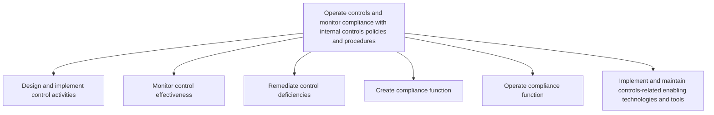
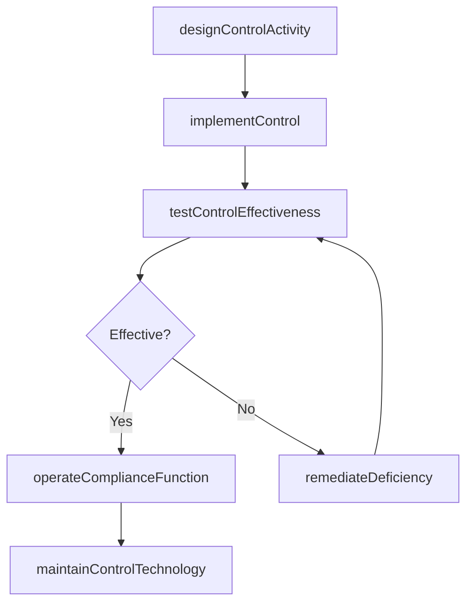

# Operate controls and monitor compliance with internal controls policies and procedures

> Business-as-Code definition for control operations and compliance monitoring. Models the design, implementation, testing, and remediation of control activities along with the creation and operation of the compliance function and enabling technologies.

## Overview

Incorporating planning, management, operations, and monitoring of internal control mechanism policies and procedures in order to manage internal controls. Design and implement control activities. Monitor control effectiveness. Remediate control deficiencies. Create compliance functions. Operate compliance functions. Implement and maintain technologies and tools to enable the internal controls-related activities.

## Process Hierarchy



## GraphDL

```yaml
operate:
  object: Controls And Monitor Compliance With Internal Controls Policies And Procedures
  actor: ControlOperator
  result: ComplianceAssessment
```

## Actions

| Action | Description |
|--------|-------------|
| designControlActivity | Define control procedures, frequency, and evidence requirements |
| implementControl | Deploy the control activity in the operational environment |
| testControlEffectiveness | Execute testing to verify the control operates as designed |
| remediateDeficiency | Correct identified control weaknesses or gaps |
| operateComplianceFunction | Run ongoing compliance monitoring and reporting activities |
| maintainControlTechnology | Manage GRC tools and automated control monitoring systems |

## Events

| Event | Description |
|-------|-------------|
| controlActivityDesigned | Control procedure documented and approved |
| controlImplemented | Control deployed in operational environment |
| controlEffectivenessTested | Control testing cycle completed with results |
| deficiencyRemediated | Control weakness corrected and validated |
| complianceFunctionOperated | Compliance monitoring activities executed |
| controlTechnologyMaintained | GRC system updated or enhanced |

## Searches

| Search | Description |
|--------|-------------|
| getControlTestResults | Retrieve testing results by control, period, or tester |
| getOpenDeficiencies | List unresolved control deficiencies by severity |
| getComplianceMetrics | Query compliance function performance indicators |

## Process Flow



## RACI Matrix

| Activity | Responsible | Accountable | Consulted | Informed |
|----------|-------------|-------------|-----------|----------|
| designControlActivity | InternalAuditor | ChiefAuditExecutive | ProcessOwner | Controller |
| testControlEffectiveness | InternalAuditor | ChiefAuditExecutive | ExternalAuditor | CFO |
| remediateDeficiency | ProcessOwner | Controller | InternalAuditor | ChiefAuditExecutive |
| operateComplianceFunction | ComplianceAnalyst | ComplianceOfficer | LegalCounsel | Board |

## Sub-Processes

| ID | Name | Description |
|----|------|-------------|
| 9.8.2.1 | Design and implement control activities | Defining and executing policies, procedures, techniques, and mechanisms and actions taken to minimiz |
| 9.8.2.2 | Monitor control effectiveness | Overseeing the activities for internal controls. Observe the effectiveness of policies, procedures,  |
| 9.8.2.3 | Remediate control deficiencies | Taking corrective measures for policies, procedures, techniques, and mechanisms actions taken to min |
| 9.8.2.4 | Create compliance function | Developing a compliance function for internal controls. Monitor trading activity. Avoid conflicts of |
| 9.8.2.5 | Operate compliance function | Administering operational activities of a compliance function. |
| 9.8.2.6 | Implement and maintain controls-related enabling technologies and tools | Implementing and maintaining the compliance technological systems or equipment that are control-enab |

## Related Processes

| Process | Relationship |
|---------|-------------|
| 9.8.1 Establish internal controls, policies, and procedures | Upstream - control framework defines what is operated |
| 9.8.3 Manage and monitor compliance function | Parallel - compliance function supports control operations |
| 9.8.4 Report on internal controls compliance | Downstream - testing results feed compliance reporting |

## Related Departments

| Department | Role |
|-----------|------|
| Internal Audit | Tests control effectiveness and identifies deficiencies |
| Compliance | Operates the ongoing compliance monitoring function |
| IT | Maintains GRC tools and automated control systems |
| Business Operations | Executes controls within their processes |

## Related Occupations

| Occupation | Involvement |
|-----------|-------------|
| Internal Auditor | Designs and tests control activities |
| Compliance Analyst | Monitors ongoing compliance with policies |
| GRC Systems Administrator | Maintains control automation tools |

## KPIs

| KPI | Description | Unit |
|-----|-------------|------|
| Control Effectiveness Rate | Percentage of controls operating effectively | % |
| Deficiency Remediation Time | Average days to remediate identified weaknesses | Days |
| Automated Control Coverage | Percentage of key controls with automated monitoring | % |
| Compliance Incident Rate | Number of compliance violations per period | Count |

## Usage

```typescript
import { operateControlsAndMonitorCompliance } from '@headlessly/operate-controls-and-monitor-compliance'

const controls = operateControlsAndMonitorCompliance()

// Test control effectiveness for segregation of duties
const testResult = await controls.testControlEffectiveness({
  controlId: 'SOD-AP-001',
  testType: 'walkthrough',
  sampleSize: 25,
  period: 'Q1-2025'
})

// Remediate an identified deficiency
const remediation = await controls.remediateDeficiency({
  deficiencyId: 'DEF-2025-0042',
  correctiveAction: 'Implement dual approval for payments above threshold',
  targetDate: '2025-04-30'
})
```
