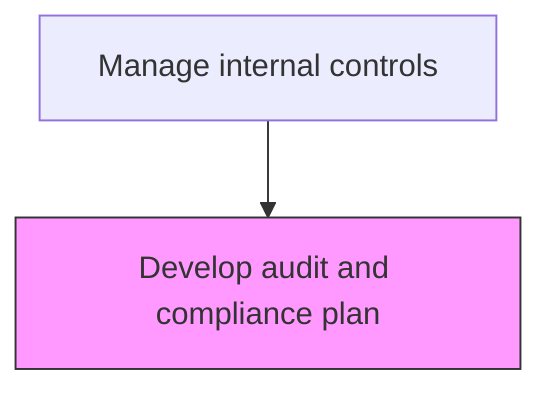
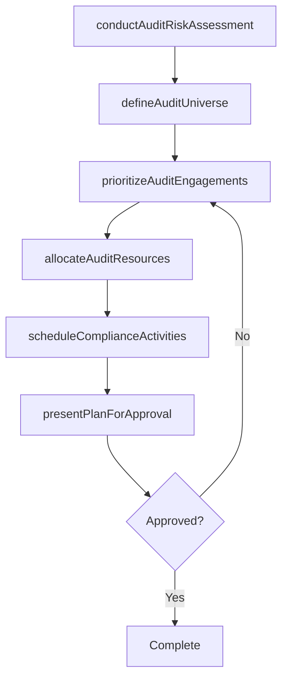

# Develop audit and compliance plan

> Business-as-Code definition for audit and compliance plan development. Models the risk-based planning of annual audit coverage, resource allocation, and compliance activity scheduling.

## Overview

Developing the annual audit and compliance program plan based on risk assessments, regulatory requirements, and organizational priorities. Defining audit scope, resource allocation, and timeline.

## Process Hierarchy



## GraphDL

```yaml
develop:
  object: Audit And Compliance Plan
  actor: ChiefAuditExecutive
  result: AuditCompliancePlan
```

## Actions

| Action | Description |
|--------|-------------|
| conductAuditRiskAssessment | Perform a risk-based assessment to identify high-risk areas requiring audit coverage |
| defineAuditUniverse | Catalog all auditable entities, processes, and systems across the organization |
| prioritizeAuditEngagements | Rank audit engagements by risk level, regulatory requirement, and management request |
| allocateAuditResources | Assign audit staff, external co-source partners, and budget to planned engagements |
| scheduleComplianceActivities | Calendar compliance monitoring activities, certifications, and regulatory filings |
| presentPlanForApproval | Submit the annual audit and compliance plan to the audit committee for approval |

## Events

| Event | Description |
|-------|-------------|
| auditRiskAssessmentConducted | Risk-based assessment of auditable areas has been completed |
| auditUniverseDefined | All auditable entities and processes have been cataloged |
| auditEngagementsPrioritized | Engagements have been ranked and sequenced by risk and priority |
| auditResourcesAllocated | Staff and budget have been assigned to planned engagements |
| complianceActivitiesScheduled | Compliance monitoring activities have been calendared |
| planApproved | The annual audit and compliance plan has been approved by the audit committee |

## Searches

| Search | Description |
|--------|-------------|
| getAuditPlan | Retrieve the approved annual audit and compliance plan |
| getAuditUniverse | Return the complete list of auditable entities and their risk ratings |
| getResourceAllocation | Retrieve staff and budget assignments by engagement |
| getPlanVsActual | Compare planned engagements and timelines against actual progress |

## Process Flow



## RACI Matrix

| Activity | Responsible | Accountable | Consulted | Informed |
|----------|-------------|-------------|-----------|----------|
| conductAuditRiskAssessment | ChiefAuditExecutive | AuditCommittee | CFO | Controller |
| prioritizeAuditEngagements | ChiefAuditExecutive | AuditCommittee | BusinessUnitLeaders | CFO |
| allocateAuditResources | AuditProgramManager | ChiefAuditExecutive | HRDirector | CFO |
| presentPlanForApproval | ChiefAuditExecutive | AuditCommittee | CFO | Board |

## Related Processes

| Process | Relationship |
|---------|-------------|
| 9.8.3.2 Manage activities of audit and compliance function program | Downstream - the approved plan drives engagement execution |
| 9.8.2.2 Monitor control effectiveness | Related - control testing results inform audit risk assessment |
| 9.8.1.1 Establish internal controls policies and frameworks | Upstream - the controls framework defines the audit scope |

## Related Departments

| Department | Role |
|-----------|------|
| Internal Audit | Primary owner of audit plan development and risk assessment |
| Compliance | Co-owner of compliance activity scheduling |
| Finance | Provides financial risk data for audit prioritization |
| External Audit | Coordinates coverage to avoid duplication |

## Related Occupations

| Occupation | Involvement |
|-----------|-------------|
| Chief Audit Executive | Leads risk assessment and plan development |
| Audit Program Manager | Manages resource allocation and engagement scheduling |
| Compliance Manager | Coordinates compliance activity scheduling |

## KPIs

| KPI | Description | Unit |
|-----|-------------|------|
| Audit Plan Completion Rate | Percentage of planned engagements completed within the year | % |
| Risk Coverage Ratio | Percentage of high-risk areas included in the annual audit plan | % |
| Plan Approval Timeliness | Days from draft plan submission to audit committee approval | Days |
| Resource Utilization Rate | Percentage of available audit hours assigned to planned engagements | % |

## Usage

```typescript
import { developAuditAndCompliancePlan } from '@headlessly/develop-audit-and-compliance-plan'

const client = developAuditAndCompliancePlan()

// Get the audit universe with risk ratings
const universe = await client.getAuditUniverse({
  riskRating: 'high',
  entityType: 'all',
  includeLastAuditDate: true
})

// Retrieve plan vs actual progress
const progress = await client.getPlanVsActual({
  fiscalYear: 2025,
  groupBy: 'quarter',
  includeDeferred: true
})
```
