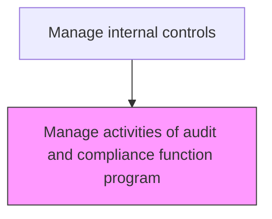
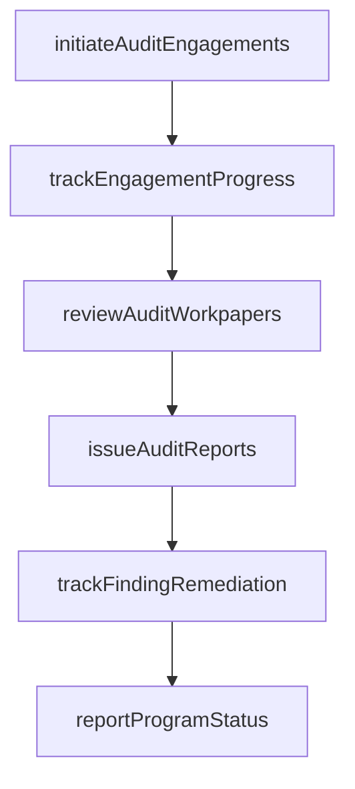

# Manage activities of audit and compliance function program

> Business-as-Code definition for audit program activity management. Models the coordination, tracking, and quality assurance of audit engagements and compliance program deliverables.

## Overview

Coordinating the execution of audit engagements and compliance program activities. Tracking progress against the plan, managing resources, and ensuring quality standards.

## Process Hierarchy



## GraphDL

```yaml
manage:
  object: Activities Of Audit And Compliance Function Program
  actor: AuditProgramManager
  result: ProgramStatusReport
```

## Actions

| Action | Description |
|--------|-------------|
| initiateAuditEngagements | Kick off planned audit engagements with scope letters and entrance meetings |
| trackEngagementProgress | Monitor the status of active engagements against timelines and milestones |
| reviewAuditWorkpapers | Perform quality reviews of audit documentation, testing, and conclusions |
| issueAuditReports | Finalize and distribute audit reports with findings and recommendations |
| trackFindingRemediation | Monitor management action plans for audit findings through closure |
| reportProgramStatus | Provide periodic updates on program execution to the audit committee |

## Events

| Event | Description |
|-------|-------------|
| auditEngagementInitiated | An audit engagement has been kicked off with scope and timeline |
| engagementProgressTracked | Active engagement status has been updated against milestones |
| auditWorkpapersReviewed | Quality review of audit workpapers has been completed |
| auditReportIssued | An audit report has been finalized and distributed |
| findingRemediationTracked | Management action plan status has been updated |
| programStatusReported | Program execution update has been communicated to the audit committee |

## Searches

| Search | Description |
|--------|-------------|
| getActiveEngagements | List all active audit engagements with their current status and timeline |
| getAuditFindings | Retrieve audit findings by engagement, severity, and remediation status |
| getEngagementTimeline | Return the detailed milestone timeline for a specific engagement |
| getProgramDashboard | Retrieve the consolidated audit program execution dashboard |

## Process Flow



## RACI Matrix

| Activity | Responsible | Accountable | Consulted | Informed |
|----------|-------------|-------------|-----------|----------|
| initiateAuditEngagements | AuditProgramManager | ChiefAuditExecutive | ProcessOwner | Controller |
| reviewAuditWorkpapers | ChiefAuditExecutive | AuditCommittee | SeniorAuditor | ExternalAuditor |
| issueAuditReports | ChiefAuditExecutive | AuditCommittee | ProcessOwner | CFO |
| reportProgramStatus | ChiefAuditExecutive | AuditCommittee | CFO | Board |

## Related Processes

| Process | Relationship |
|---------|-------------|
| 9.8.3.1 Develop audit and compliance plan | Upstream - the approved plan drives engagement execution |
| 9.8.2.3 Remediate control deficiencies | Related - audit findings trigger remediation activities |
| 9.8.4 Report on internal controls | Consumer - audit results feed internal controls reporting |

## Related Departments

| Department | Role |
|-----------|------|
| Internal Audit | Primary owner of engagement execution and quality assurance |
| Compliance | Executes compliance monitoring activities within the program |
| Business Units | Provide access, information, and management responses |
| External Audit | Coordinates reliance on internal audit work |

## Related Occupations

| Occupation | Involvement |
|-----------|-------------|
| Audit Program Manager | Coordinates engagement execution and tracks program progress |
| Chief Audit Executive | Reviews workpapers, issues reports, and communicates with the audit committee |
| Senior Internal Auditor | Leads individual audit engagements and performs fieldwork |

## KPIs

| KPI | Description | Unit |
|-----|-------------|------|
| Engagement On-Time Rate | Percentage of engagements completed within planned timeline | % |
| Finding Remediation Rate | Percentage of audit findings with completed management action plans | % |
| Report Issuance Cycle Time | Average days from fieldwork completion to final report issuance | Days |
| Quality Review Pass Rate | Percentage of workpapers passing supervisory review without rework | % |

## Usage

```typescript
import { manageActivitiesOfAuditAndComplianceFunctionProgram } from '@headlessly/manage-activities-of-audit-and-compliance-function-program'

const client = manageActivitiesOfAuditAndComplianceFunctionProgram()

// Get active audit engagements
const engagements = await client.getActiveEngagements({
  status: 'inProgress',
  quarter: 'Q4-2025',
  includeTimeline: true
})

// Retrieve audit findings by severity
const findings = await client.getAuditFindings({
  severity: 'high',
  remediationStatus: 'open',
  engagementYear: 2025
})
```
