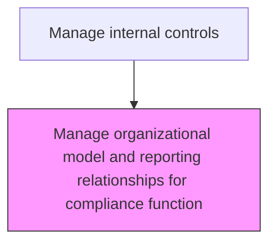
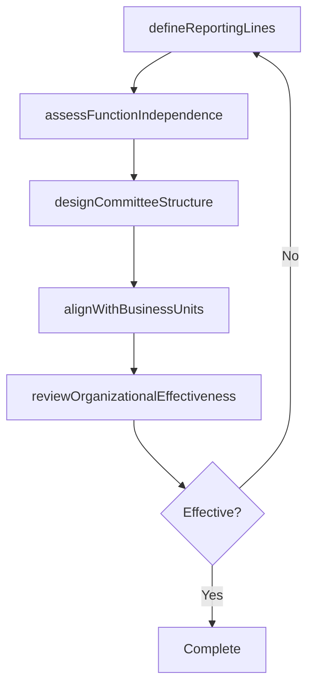

# Manage organizational model and reporting relationships for compliance function

> Business-as-Code definition for compliance organizational structure management. Models the design and maintenance of the compliance function's reporting lines, committee structures, and independence requirements.

## Overview

Designing and maintaining the organizational structure, reporting lines, and committee memberships of the compliance function to ensure it has adequate independence, authority, and business unit coverage. This process defines the compliance function's dual reporting relationships to both executive management and the audit committee, establishes compliance committee charters and meeting cadences, and assigns embedded compliance liaison roles within key business units. Periodic effectiveness reviews assess whether the organizational model supports the compliance function's mandate and identify structural adjustments needed to address evolving risks and regulatory requirements.

## Process Hierarchy



## GraphDL

```yaml
manage:
  object: Organizational Model And Reporting Relationships For Compliance Function
  actor: ChiefComplianceOfficer
  result: ComplianceOrgChart
```

## Actions

| Action | Description |
|--------|-------------|
| defineReportingLines | Establish direct and functional reporting relationships for compliance to the audit committee and management |
| assessFunctionIndependence | Evaluate whether the compliance function maintains adequate independence from business operations |
| designCommitteeStructure | Define compliance committee membership, charters, and meeting cadences |
| alignWithBusinessUnits | Establish embedded compliance liaison roles within key business units |
| reviewOrganizationalEffectiveness | Periodically assess whether the organizational model supports compliance objectives |

## Events

| Event | Description |
|-------|-------------|
| reportingLinesDefined | Compliance reporting relationships have been established |
| functionIndependenceAssessed | Independence of the compliance function has been evaluated |
| committeeStructureDesigned | Compliance committee charters and membership have been defined |
| businessUnitAlignmentCompleted | Embedded compliance liaison roles have been assigned |
| organizationalEffectivenessReviewed | The compliance organizational model has been assessed for effectiveness |

## Searches

| Search | Description |
|--------|-------------|
| getComplianceOrgChart | Retrieve the compliance function organizational structure and reporting lines |
| getCommitteeCharters | Return compliance committee charters and membership details |
| getIndependenceAssessment | Retrieve the most recent compliance function independence evaluation |
| getLiaisonAssignments | List embedded compliance liaison assignments by business unit |

## Process Flow



## RACI Matrix

| Activity | Responsible | Accountable | Consulted | Informed |
|----------|-------------|-------------|-----------|----------|
| defineReportingLines | ChiefComplianceOfficer | AuditCommittee | CFO | Board |
| assessFunctionIndependence | ChiefComplianceOfficer | AuditCommittee | GeneralCounsel | ChiefAuditExecutive |
| designCommitteeStructure | ChiefComplianceOfficer | CFO | HRDirector | AuditCommittee |
| reviewOrganizationalEffectiveness | ChiefComplianceOfficer | AuditCommittee | ExternalAdvisor | Board |

## Related Processes

| Process | Relationship |
|---------|-------------|
| 9.8.2.4 Create compliance function | Upstream - the initial function creation defines the starting structure |
| 9.8.3.4 Manage key capabilities of compliance function | Related - organizational design supports capability requirements |
| 9.8.3.1 Develop audit and compliance plan | Related - organizational model affects resource planning |

## Related Departments

| Department | Role |
|-----------|------|
| Compliance | Primary owner of organizational model design |
| Human Resources | Supports organizational design and role definitions |
| Legal | Advises on regulatory requirements for independence |
| Internal Audit | Coordinates dual reporting to audit committee |

## Related Occupations

| Occupation | Involvement |
|-----------|-------------|
| Chief Compliance Officer | Designs and maintains the compliance organizational model |
| General Counsel | Advises on regulatory expectations for independence and structure |
| HR Director | Supports role definitions, leveling, and organizational changes |

## KPIs

| KPI | Description | Unit |
|-----|-------------|------|
| Independence Rating | External assessment score of compliance function independence | Score (1-5) |
| Committee Meeting Cadence | Percentage of scheduled compliance committee meetings held | % |
| Business Unit Coverage | Percentage of key business units with an embedded compliance liaison | % |
| Organizational Review Frequency | Number of organizational model effectiveness reviews per year | Per Year |

## Usage

```typescript
import { manageOrganizationalModelAndReportingRelationshipsForComplianceFunction } from '@headlessly/manage-organizational-model-and-reporting-relationships-for-compliance-function'

const client = manageOrganizationalModelAndReportingRelationshipsForComplianceFunction()

// Get the compliance organizational chart
const orgChart = await client.getComplianceOrgChart({
  includeReportingLines: true,
  includeCommittees: true,
  effectiveDate: '2025-01-01'
})

// Retrieve embedded compliance liaison assignments
const liaisons = await client.getLiaisonAssignments({
  businessUnit: 'all',
  status: 'active'
})
```
