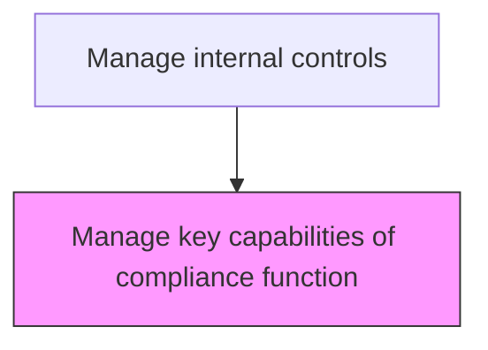
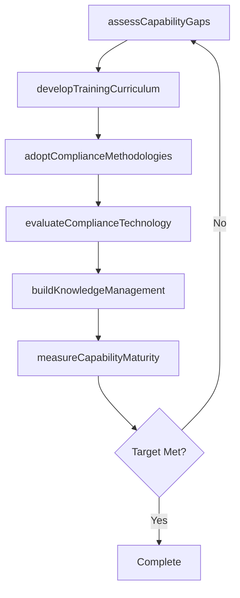

# Manage key capabilities of compliance function

> Business-as-Code definition for compliance capability management. Models the development and maintenance of key skills, methodologies, and tools required for effective compliance program execution.

## Overview

Building and maintaining the core competencies, tools, and methodologies required for the compliance function to operate effectively, including professional development, technology adoption, and knowledge management. This process assesses capability gaps against required competencies, designs continuing education programs for compliance certifications and regulatory knowledge, and evaluates technology tools for monitoring and reporting. Maturity benchmarking against industry standards provides an objective measure of the function's effectiveness and identifies areas for targeted investment.

## Process Hierarchy



## GraphDL

```yaml
manage:
  object: Key Capabilities Of Compliance Function
  actor: ComplianceManager
  result: CapabilityAssessment
```

## Actions

| Action | Description |
|--------|-------------|
| assessCapabilityGaps | Evaluate current compliance staff skills against required competencies |
| developTrainingCurriculum | Design continuing education programs for compliance certifications and regulatory knowledge |
| adoptComplianceMethodologies | Select and implement standardized audit and compliance testing methodologies |
| evaluateComplianceTechnology | Assess and recommend technology tools for compliance monitoring and reporting |
| buildKnowledgeManagement | Create and maintain a repository of compliance guidance, precedents, and regulatory interpretations |
| measureCapabilityMaturity | Benchmark the compliance function's maturity against industry standards |

## Events

| Event | Description |
|-------|-------------|
| capabilityGapsAssessed | Compliance skill gaps have been identified against required competencies |
| trainingCurriculumDeveloped | Continuing education programs have been designed and scheduled |
| complianceMethodologiesAdopted | Standardized testing methodologies have been implemented |
| complianceTechnologyEvaluated | Technology tools have been assessed and recommendations made |
| knowledgeManagementBuilt | Compliance knowledge repository has been created or updated |
| capabilityMaturityMeasured | Function maturity has been benchmarked against industry standards |

## Searches

| Search | Description |
|--------|-------------|
| getCapabilityGapAnalysis | Retrieve the skills gap assessment for compliance team members |
| getTrainingPlan | Return the compliance training curriculum and completion status |
| getMethodologyInventory | List adopted compliance methodologies and their application areas |
| getMaturityScorecard | Retrieve the compliance function maturity benchmark scorecard |

## Process Flow



## RACI Matrix

| Activity | Responsible | Accountable | Consulted | Informed |
|----------|-------------|-------------|-----------|----------|
| assessCapabilityGaps | ComplianceManager | ChiefComplianceOfficer | HRDirector | ChiefAuditExecutive |
| developTrainingCurriculum | ComplianceManager | ChiefComplianceOfficer | LearningAndDevelopment | AuditCommittee |
| adoptComplianceMethodologies | ChiefComplianceOfficer | CFO | ExternalAdvisor | InternalAuditor |
| measureCapabilityMaturity | ChiefComplianceOfficer | AuditCommittee | ExternalAdvisor | Board |

## Related Processes

| Process | Relationship |
|---------|-------------|
| 9.8.3.3 Manage organizational model and reporting relationships | Related - organizational design affects capability requirements |
| 9.8.2.6 Implement and maintain controls-related enabling technologies | Related - technology capabilities support compliance operations |
| 9.8.3.1 Develop audit and compliance plan | Related - capability levels inform plan scope and resourcing |

## Related Departments

| Department | Role |
|-----------|------|
| Compliance | Primary owner of capability development and maturity assessment |
| Human Resources | Supports training program design and talent management |
| Learning and Development | Delivers professional development programs |
| Information Technology | Provides technology tools for compliance capabilities |

## Related Occupations

| Occupation | Involvement |
|-----------|-------------|
| Compliance Manager | Assesses gaps, develops training, and manages knowledge repository |
| Chief Compliance Officer | Sets capability strategy and measures function maturity |
| Learning and Development Specialist | Designs and delivers compliance training programs |

## KPIs

| KPI | Description | Unit |
|-----|-------------|------|
| Certification Rate | Percentage of compliance staff holding relevant professional certifications | % |
| Training Hours Per Staff | Average annual continuing education hours per compliance team member | Hours |
| Capability Maturity Score | Overall compliance function maturity rating against industry benchmark | Score (1-5) |
| Knowledge Repository Currency | Percentage of guidance documents updated within the past 12 months | % |

## Usage

```typescript
import { manageKeyCapabilitiesOfComplianceFunction } from '@headlessly/manage-key-capabilities-of-compliance-function'

const client = manageKeyCapabilitiesOfComplianceFunction()

// Get the capability gap analysis
const gaps = await client.getCapabilityGapAnalysis({
  department: 'compliance',
  competencyArea: 'all',
  includeTrainingRecommendations: true
})

// Retrieve the function maturity scorecard
const maturity = await client.getMaturityScorecard({
  framework: 'IIA',
  benchmarkPeerGroup: 'financialServices',
  assessmentDate: '2025-06-30'
})
```
