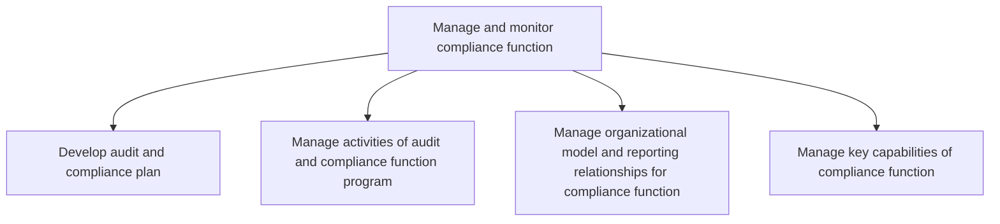
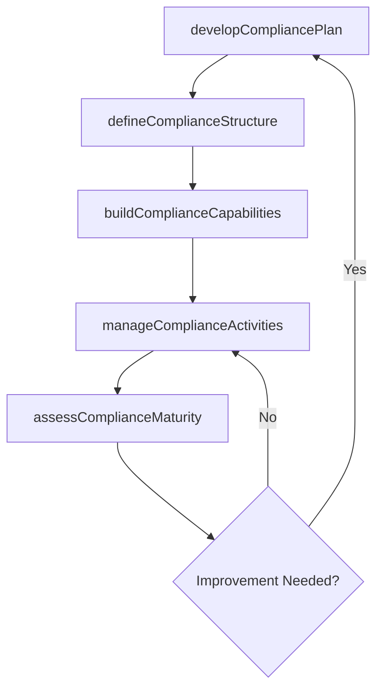

# Manage and monitor compliance function

> Business-as-Code definition for compliance function management. Models the planning, organization, capability development, and ongoing management of the audit and compliance function including staffing, reporting structures, and program activities.

## Overview

Overseeing the organization's compliance function, including developing the audit and compliance plan, managing program activities, defining the organizational model and reporting relationships, and building key capabilities to ensure the compliance function operates effectively.

## Process Hierarchy



## GraphDL

```yaml
manage:
  object: And Monitor Compliance Function
  actor: ChiefComplianceOfficer
  result: ComplianceProgramStatus
```

## Actions

| Action | Description |
|--------|-------------|
| developCompliancePlan | Create the annual audit and compliance program plan |
| manageComplianceActivities | Coordinate and oversee compliance program execution |
| defineComplianceStructure | Establish organizational model and reporting lines for compliance |
| buildComplianceCapabilities | Develop staff skills, tools, and methodologies for compliance |
| assessComplianceMaturity | Evaluate the maturity level of the compliance program |

## Events

| Event | Description |
|-------|-------------|
| compliancePlanDeveloped | Annual compliance plan approved and published |
| complianceActivitiesManaged | Compliance program activities coordinated |
| complianceStructureDefined | Organizational model and reporting lines established |
| complianceCapabilitiesBuilt | Staff training and methodology enhancements completed |
| complianceMaturityAssessed | Compliance program maturity evaluation finalized |

## Searches

| Search | Description |
|--------|-------------|
| getCompliancePlan | Retrieve current compliance plan and milestone status |
| getComplianceStaffing | Query compliance function headcount and capabilities |
| getComplianceMaturityScores | List maturity assessment scores by domain |

## Process Flow



## RACI Matrix

| Activity | Responsible | Accountable | Consulted | Informed |
|----------|-------------|-------------|-----------|----------|
| developCompliancePlan | ChiefComplianceOfficer | CFO | AuditCommittee | Board |
| manageComplianceActivities | ComplianceManager | ChiefComplianceOfficer | ProcessOwners | Controller |
| defineComplianceStructure | ChiefComplianceOfficer | CEO | HRDirector | AllStaff |
| buildComplianceCapabilities | ComplianceManager | ChiefComplianceOfficer | TrainingDepartment | ComplianceStaff |

## Sub-Processes

| ID | Name | Description |
|----|------|-------------|
| 9.8.3.1 | Develop audit and compliance plan | Creating the annual audit plan and compliance monitoring schedule aligned with risk priorities. |
| 9.8.3.2 | Manage activities of audit and compliance function program | Coordinating and overseeing audit engagements, compliance reviews, and remediation tracking. |
| 9.8.3.3 | Manage organizational model and reporting relationships for compliance function | Defining reporting lines, independence requirements, and organizational structure for compliance. |
| 9.8.3.4 | Manage key capabilities of compliance function | Developing and maintaining the skills, tools, and methodologies required for effective compliance. |

## Related Processes

| Process | Relationship |
|---------|-------------|
| 9.8.1 Establish internal controls, policies, and procedures | Upstream - control framework informs compliance program scope |
| 9.8.2 Operate controls and monitor compliance | Parallel - compliance function supports control monitoring |
| 9.8.4 Report on internal controls compliance | Downstream - compliance activities generate reporting content |

## Related Departments

| Department | Role |
|-----------|------|
| Compliance | Primary owner of compliance program management |
| Internal Audit | Partners on audit planning and execution |
| Human Resources | Supports staffing and training of compliance personnel |
| Legal | Advises on regulatory requirements and compliance scope |

## Related Occupations

| Occupation | Involvement |
|-----------|-------------|
| Chief Compliance Officer | Strategic oversight of the compliance program |
| Compliance Manager | Day-to-day management of compliance activities |
| Audit Program Manager | Coordinates audit planning and execution |

## KPIs

| KPI | Description | Unit |
|-----|-------------|------|
| Compliance Plan Completion | Percentage of planned compliance activities completed on schedule | % |
| Compliance Staff Utilization | Percentage of compliance team capacity deployed on planned work | % |
| Compliance Training Hours | Average annual training hours per compliance team member | Hours |
| Program Maturity Score | Composite maturity score across compliance domains | Score (1-5) |

## Usage

```typescript
import { manageAndMonitorComplianceFunction } from '@headlessly/manage-and-monitor-compliance-function'

const compliance = manageAndMonitorComplianceFunction()

// Develop annual compliance plan
const plan = await compliance.developCompliancePlan({
  fiscalYear: 2025,
  riskAreas: ['financial-reporting', 'data-privacy', 'anti-corruption'],
  auditCoverage: 0.8
})

// Assess compliance program maturity
const maturity = await compliance.assessComplianceMaturity({
  framework: 'compliance-maturity-model',
  domains: ['governance', 'risk-assessment', 'monitoring', 'reporting']
})
```
